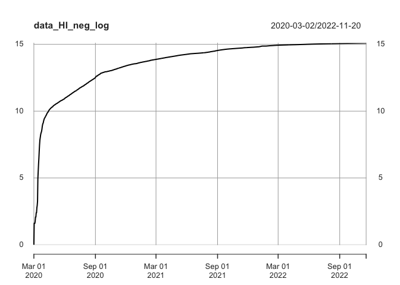

Has Hawaii’s Public Health Measures Triumped over Covid? Forecasting
Hawaii’s Covid Cases
================

-   <a href="#status-working-document"
    id="toc-status-working-document">Status: Working Document</a>
    -   <a href="#introduction" id="toc-introduction">Introduction</a>
    -   <a href="#loading-the-libraries" id="toc-loading-the-libraries">Loading
        the Libraries</a>
    -   <a href="#cleaning-the-data" id="toc-cleaning-the-data">Cleaning the
        Data</a>
    -   <a href="#exploratory-data-analysis"
        id="toc-exploratory-data-analysis">Exploratory Data Analysis</a>
    -   <a href="#forecasting-arima" id="toc-forecasting-arima">Forecasting:
        ARIMA</a>
-   <a href="#forecasting-prophet" id="toc-forecasting-prophet">Forecasting:
    Prophet</a>
    -   <a href="#limitations" id="toc-limitations">Limitations</a>
    -   <a href="#conclusion" id="toc-conclusion">Conclusion</a>
    -   <a href="#appendix" id="toc-appendix">Appendix</a>

## Status: Working Document

Hi everyone. I’m continuing building my data analysis and R skills. As
such, I would love feedback to better improve this project via
<rexmanglicmot@gmail.com>. Any mistakes and misrepresentation of the
data are my own.

Things still need to do:

1.  Forecast negative cases in ARIMA and Prophet
2.  Ask for feedback on models for additonal analysis
3.  Fill in missing sections to round out project
4.  Check grammar

### Introduction

</n>
<center>


</center>

</n> </n>

Since the dawn of the pandemic in early March 2020, the world
experienced an unprecedented pandemic. With the sudden appearance of
Covid, many countries reacted swiftly on past pubic health protocols to
help slowdown the spread of Covid. Some of these protocols were
government lock downs, encouragement of praticing health hygiene
(i.e. wear masks), stay in-doors, etc. Further, news outlets, brochures,
and highly educated public health officials advocated the implementation
of such protocols. As result, 3 years after, it would seem that the
world has weathered the storm and move on from this pandemic. Many news
stories have focused their topcis on other issues, which implies that
the Covid pandemic is under control.

But, is there a way to quantitatively measure this? Has the world truly
overcome the Covid pandemic? This projects aims to understand if Covid
still exists, more specifically, in the context of the Hawaiian Islands
by measuring the number of positive and negative cases. By measuring the
aforementioned, 1) we can indirectly surmise if Hawaii’s public safety
protocols had any effects and 2) make adjustments to protocols for
better health outcomes.

This project will forecast based on two models: ARIMA and Prophet. By
comparing and contrasting these two models, we can determine if the
forecasts project upward, downward, or parralll. Having this provides
public health officials ample time to plan health initiatives
(i.e. testing centers) and procure necessary medical in the future
(needles, gauzes, bandages, etc.).

This project is structured in the following chapters:

1.  Loading the Libraries
2.  Cleaning the Data
3.  Exploratory Data Analysis
4.  Forecasting: ARIMA
5.  Forecasting: Prophet
6.  Limitations
7.  Conclusion
8.  Appendix: ACF and PACF Concepts and Plots

Special acknowledgement to Healthdata.gov[^1] providing the dataset to
the public. This dataset includes COVID-19 Laboratory test (PCR) results
from over 1,000 US labs and testing locations (public and private). Data
are reported to state departments which are then reported to federal
departments per the CARES Act. Each state is represented.

The variables of the dataset are as follows:

1.  state (string) - Abbreviation of state associated with the test.
2.  state_name (string) - Name of state associated with the test.
3.  state_fips (string) - Numerical identifier of state associated with
    the test.
4.  fema_region (string) - Region associated with the test.
5.  overall_outcome (string) - Outcome of test – Positive, Negative or
    Inconclusive.
6.  date (date) - Typically the date the test completed or the date that
    the result was reported back to the patient. If neither are
    available, it can be the date the specimen was collected, arrived at
    the testing facility, or the date the test was ordered.
    7.new_results_reported (long) - The number of tests completed with
    the specified outcome in the specified state on the listed date.
    (Large spikes may result from states submitting tests for several
    proceeding days at once with a single date).
7.  total_results_reported (long) - The cumulative number of tests
    completed with the specified outcome in the specified state up
    through the listed date.
8.  geocoded_state - indiscernible

### Loading the Libraries

``` r
#install.packages('jsonlite') #installed on 11/24/22
#install.packages('data.table') #installed on 11/24/22
#install.packages('httr') #installed on 11/24/22
#install.packages('timetk') #installed on 11/25/22

library(tidyverse)
library(xts) 
library(timetk)
library(forecast)

#read data from CSV file from U.S. Government website
data <- read.csv('COVID-19_Diagnostic_Laboratory_Testing__PCR_Testing__Time_Series.csv')
```

### Cleaning the Data

Now that we have loaded the libraries and uploaded the data, it is time
look at the structure of the data to understand how the data is
organized.

``` r
#check structure of the dataset
str(data)
```

    ## 'data.frame':    162225 obs. of  9 variables:
    ##  $ state                 : chr  "AL" "AL" "AL" "AL" ...
    ##  $ state_name            : chr  "Alabama" "Alabama" "Alabama" "Alabama" ...
    ##  $ state_fips            : int  1 1 1 1 1 1 1 1 1 1 ...
    ##  $ fema_region           : chr  "Region 4" "Region 4" "Region 4" "Region 4" ...
    ##  $ overall_outcome       : chr  "Negative" "Positive" "Negative" "Positive" ...
    ##  $ date                  : chr  "2020/03/01" "2020/03/01" "2020/03/02" "2020/03/02" ...
    ##  $ new_results_reported  : int  96 16 72 6 94 9 0 2 61 6 ...
    ##  $ total_results_reported: int  96 16 168 22 262 31 262 33 323 39 ...
    ##  $ geocoded_state        : logi  NA NA NA NA NA NA ...

``` r
#check the class of the dataset; it is a dataframe class
class(data)
```

    ## [1] "data.frame"

With a high-level overview, we see that are dealing with a large dataset
that contains over \>100K observations with 9 variables. Each of these
observations pertain to the U.S. States. Some of the variables are
character strings like the state variable while others are integers like
new_results_reported. Also we see that the date frequency is daily,
knowing this helps us build the forecasting models.

Moving forward with the scope of the project, we want to do a time
series analysis and as such, we see that the date column is a character
and needs to be formated to a Date class.

``` r
#change column from a character string to a date column
data$date <- as.Date(data$date)

#check data now
str(data)
```

    ## 'data.frame':    162225 obs. of  9 variables:
    ##  $ state                 : chr  "AL" "AL" "AL" "AL" ...
    ##  $ state_name            : chr  "Alabama" "Alabama" "Alabama" "Alabama" ...
    ##  $ state_fips            : int  1 1 1 1 1 1 1 1 1 1 ...
    ##  $ fema_region           : chr  "Region 4" "Region 4" "Region 4" "Region 4" ...
    ##  $ overall_outcome       : chr  "Negative" "Positive" "Negative" "Positive" ...
    ##  $ date                  : Date, format: "2020-03-01" "2020-03-01" ...
    ##  $ new_results_reported  : int  96 16 72 6 94 9 0 2 61 6 ...
    ##  $ total_results_reported: int  96 16 168 22 262 31 262 33 323 39 ...
    ##  $ geocoded_state        : logi  NA NA NA NA NA NA ...

We see that the date column has been converted to the proper universal
date format.

Now, we want filter the dataset in this order:

1.  Filter for the state of Hawaii.
2.  Arrange the number of cases of both positive and negative outcomes
    and erase of the inconclusive value.
3.  Then remove unnecessary variables such as state, state_name,
    state_flips, fema_region, and geocoded_state
4.  Store this into a new object.

``` r
#filter for hawaii state now
data_HI <- data %>%
  filter(state == 'HI') %>%
  filter(overall_outcome != 'Inconclusive') %>%
  arrange(overall_outcome) %>%
  dplyr::select(-c(1:4,9))

head(data_HI, 5)
```

    ##   overall_outcome       date new_results_reported total_results_reported
    ## 1        Negative 2020-03-02                    1                      1
    ## 2        Negative 2020-03-03                    4                      5
    ## 3        Negative 2020-03-04                    0                      5
    ## 4        Negative 2020-03-05                    0                      5
    ## 5        Negative 2020-03-06                    1                      6

Now, let’s filter some more.

1.  Create two objects of both positive and negative cases.
2.  Remove the new_results_reported since we are only interested in the
    total reported cases since it is additive.
3.  Convert the remain columns, total results_reported, to a time
    series.
4.  Store this into a new object.

``` r
#filter for positve and delete unnessary variables and
#create a timeseries for forecasting
data_HI_pos <- data_HI %>%
  filter(overall_outcome == 'Positive') %>%
  dplyr::select(-c(1,3)) %>%
  tk_xts(select = total_results_reported)
```

Now, let’s check if the filtering work and if we have a time series.

``` r
#check class for positive cases
head(data_HI_pos, 5)
```

    ##            total_results_reported
    ## 2020-03-13                      1
    ## 2020-03-14                      3
    ## 2020-03-15                      6
    ## 2020-03-16                      6
    ## 2020-03-17                     10

``` r
class(data_HI_pos)
```

    ## [1] "xts" "zoo"

It look’s good. Now, let’s repeat the same process for the negative
cases

``` r
#filter for negative and delete unnessary variables and
#create a timeseries for forecasting
data_HI_neg <- data_HI %>%
  filter(overall_outcome == 'Negative') %>%
  dplyr::select(-c(1,3)) %>%
    tk_xts(select = total_results_reported)
```

``` r
#check class for negative cases
head(data_HI_neg, 5)
```

    ##            total_results_reported
    ## 2020-03-02                      1
    ## 2020-03-03                      5
    ## 2020-03-04                      5
    ## 2020-03-05                      5
    ## 2020-03-06                      6

``` r
class(data_HI_neg)
```

    ## [1] "xts" "zoo"

Great! Now, that the data have been cleaned and filtered, it is time to
explore the two datasets which we created: data_HI_pos and data_HI_neg.

### Exploratory Data Analysis

Let’s plot the positive cases.

``` r
#Plot positive cases
plot(data_HI_pos)
```

<!-- -->

Yikes! Based on the count alone, it seems that this plot is showing that
the number of positive cases are increasing. However, because there is a
big gap of counts, there is a need to log it. Logging the count will
provide a better context to see the trend of positive cases.

``` r
#log and plot again
data_HI_pos_log <-log(data_HI_pos)
plot(data_HI_pos_log)
```

<!-- -->

This is a much better plot. From this, let’s gather a few insights.

1.  We see from the beginning of the pandemic there there was a sudden
    surge of positive cases in March 2020 (this was expected). Then,
    during the months of the following summer we see that the slope
    drastically increased until Sept 202.
2.  From Sept 2020, we see that the slope is still positive, trending
    upward, but not as pronounced as the March 2020. We see a similar
    trend from from Feb 2022 onward.
3.  A key insight from this plot is that Covid might follow a seasonal
    trend such that it may come every year.

Now, let’s plot the negative cases.

``` r
#Plot negative cases
plot(data_HI_neg)
```

<!-- -->

Again, from this plot wee see that the cases are increasing and paints
the picture that because we are having a high number of negative cases,
it could convey that Hawaii covid incidence is low. However, we must log
the negatve cases to get a better idea of what the data is trying to
convey.

``` r
#log and plot again
data_HI_neg_log <-log(data_HI_neg)
plot(data_HI_neg_log)
```

<!-- -->

This is a much better plot. From this, let’s gather a few insights.

1.  The number of negative cases increased dramatically from March 2020
    tp Sept 2020. Again, this expected. Covid during this time was still
    being researched and not much was known about the virus, how it
    spreads, etc. Many people knew that it was highly contagious and if
    you had a fever and were coughing it was best to get tests. As such,
    during this time people were getting sick and wanted to take tests
    to see if there were positive for Covid.
2.  From Sept 2020 to March 2021, we see that the number of cases were
    increasing but the slope is not as pronounced.
3.  From March 2022 to 11 2022, the slope all but parallel.

Now, based on these trends, let’s forecast both datasets. But first,
let’s dive deeper into conceptual knowledge of ARIMA.

### Forecasting: ARIMA

ARIMA is used in many forecasting models such predicting stock prices,
average income, inflation. Autoregressive integrated moving average
(ARIMA) is a model used to predict future values based on past values.
ARIMA is used to describe the autocorrelation in the data. It measures
the correlation of the same variable over different time periods. In the
most basic of laymen terms, ARIMA is used to describe a pattern.

Like all modeling, there is a need to fit. The function, auto.ARIMA,
does exactly this by automating the process. It takes into account AIC
(Akaike Information Criterion) and BIC (Bayesian Information Criterion)
values of each model. Out of the set of models it chooses one and in
general, the lower the AIC abd BIC values, the better the model. Both
AIC abd BIC are used to score a model based on log-likelihood and
complexity. (AIC and BIC tests how well the models fits the data without
overfitting.)

With this in mind, let’s create the ARIMA model for the positive cases
in Hawaii.

``` r
#ARIMA
#give us the best model based AIC of BIC value
arima_model_pos <- auto.arima(data_HI_pos_log)

#let's take a look into the model
arima_model_pos
```

    ## Series: data_HI_pos_log 
    ## ARIMA(4,2,1) 
    ## 
    ## Coefficients:
    ##           ar1      ar2      ar3      ar4     ma1
    ##       -1.0653  -1.3135  -1.0286  -0.5913  0.6911
    ## s.e.   0.0556   0.0592   0.0723   0.0618  0.0469
    ## 
    ## sigma^2 = 0.0006949:  log likelihood = 2175.27
    ## AIC=-4338.54   AICc=-4338.45   BIC=-4309.21

The numbers in the ARIMA (4, 2, 1) stands for the p (AR order), d
(degree of difference), and q (Moving Average order).

Now, let’s forecast.

``` r
#forecast model we created with 3 years which is 36 months
forecast_HI_pos <-forecast(arima_model_pos, 36)

#plot model
autoplot(forecast_HI_pos)
```

<!-- -->

From this plot, we can see that the slope looks almost zero. However,
more analysis is needed.

## Forecasting: Prophet

Prophet is a R/Python package created by Facebook’s Core Data Science
team to forecast time series.[^2] Further, Prophet works well with data
that have strong seasonal effects and have periods of long historical
data.

Prophet works best with daily data for at least one year.[^3] Because
our data consists of daily records for the past 3 years, Prophet is an
excellent model to work with.

``` r
#install.packages('prophet') #installed on 11/25/22
library(prophet)
```

In this model, we will forecast the number of positive and negative
cases like we did above. The prophet functions has very specific
instructions when calling it. It takes only two columns that needs to
have specific names, “ds” and “y”.

We will take the data_HI object and filter it into two objects with just
the ds and y variables.

``` r
#filter data_HI dataset
data_HI_pos_prophet<- data_HI %>%
  filter(overall_outcome == 'Positive') %>%
  dplyr::select(-c(1,3))

#changle variable names
colnames(data_HI_pos_prophet) <-c('ds','y')

#check if filter worked and str
head(data_HI_pos_prophet, 5)
```

    ##           ds  y
    ## 1 2020-03-13  1
    ## 2 2020-03-14  3
    ## 3 2020-03-15  6
    ## 4 2020-03-16  6
    ## 5 2020-03-17 10

``` r
str(data_HI_pos_prophet)
```

    ## 'data.frame':    983 obs. of  2 variables:
    ##  $ ds: Date, format: "2020-03-13" "2020-03-14" ...
    ##  $ y : int  1 3 6 6 10 20 31 48 56 70 ...

It looks good. We can build the model and forecast it. Like the above
model, let’s forecast 3 years into the future.

``` r
#use the prophet function and set the frequency to daily
prophet1 <-prophet(data_HI_pos_prophet, daily.seasonality = TRUE)

#make a dataframe that would hold 3-years worth of predicted values
future1 <- make_future_dataframe(prophet1, periods = 1095)

#use predict function using the phrophet1 model to predict future1 values
#store this into an object
forecast1 <- predict(prophet1, future1)
```

Now, let’s plot.

``` r
#plot forecast
dyplot.prophet(prophet1, forecast1)
```

    ## Warning: `select_()` was deprecated in dplyr 0.7.0.
    ## ℹ Please use `select()` instead.
    ## ℹ The deprecated feature was likely used in the dplyr package.
    ##   Please report the issue at <]8;;https://github.com/tidyverse/dplyr/issueshttps://github.com/tidyverse/dplyr/issues]8;;>.

<div id="htmlwidget-92c627cce27b62106751" style="width:672px;height:480px;" class="dygraphs html-widget"></div>
<script type="application/json" data-for="htmlwidget-92c627cce27b62106751">{"x":{"attrs":{"labels":["day","Actual","Predicted"],"legend":"auto","retainDateWindow":false,"axes":{"x":{"pixelsPerLabel":60}},"colors":["black","blue"],"series":{"Actual":{"axis":"y","drawPoints":true,"strokeWidth":0},"Predicted":{"axis":"y"}},"customBars":true,"showRangeSelector":true,"rangeSelectorHeight":40,"rangeSelectorPlotFillColor":" #A7B1C4","rangeSelectorPlotStrokeColor":"#808FAB","interactionModel":"Dygraph.Interaction.defaultModel"},"scale":"daily","annotations":[],"shadings":[],"events":[],"format":"date","data":[["2020-03-13T00:00:00.000Z","2020-03-14T00:00:00.000Z","2020-03-15T00:00:00.000Z","2020-03-16T00:00:00.000Z","2020-03-17T00:00:00.000Z","2020-03-18T00:00:00.000Z","2020-03-19T00:00:00.000Z","2020-03-20T00:00:00.000Z","2020-03-21T00:00:00.000Z","2020-03-22T00:00:00.000Z","2020-03-23T00:00:00.000Z","2020-03-24T00:00:00.000Z","2020-03-25T00:00:00.000Z","2020-03-26T00:00:00.000Z","2020-03-27T00:00:00.000Z","2020-03-28T00:00:00.000Z","2020-03-29T00:00:00.000Z","2020-03-30T00:00:00.000Z","2020-03-31T00:00:00.000Z","2020-04-01T00:00:00.000Z","2020-04-02T00:00:00.000Z","2020-04-03T00:00:00.000Z","2020-04-04T00:00:00.000Z","2020-04-05T00:00:00.000Z","2020-04-06T00:00:00.000Z","2020-04-07T00:00:00.000Z","2020-04-08T00:00:00.000Z","2020-04-09T00:00:00.000Z","2020-04-10T00:00:00.000Z","2020-04-11T00:00:00.000Z","2020-04-12T00:00:00.000Z","2020-04-13T00:00:00.000Z","2020-04-14T00:00:00.000Z","2020-04-15T00:00:00.000Z","2020-04-16T00:00:00.000Z","2020-04-17T00:00:00.000Z","2020-04-18T00:00:00.000Z","2020-04-19T00:00:00.000Z","2020-04-20T00:00:00.000Z","2020-04-21T00:00:00.000Z","2020-04-22T00:00:00.000Z","2020-04-23T00:00:00.000Z","2020-04-24T00:00:00.000Z","2020-04-25T00:00:00.000Z","2020-04-26T00:00:00.000Z","2020-04-27T00:00:00.000Z","2020-04-28T00:00:00.000Z","2020-04-29T00:00:00.000Z","2020-04-30T00:00:00.000Z","2020-05-01T00:00:00.000Z","2020-05-02T00:00:00.000Z","2020-05-03T00:00:00.000Z","2020-05-04T00:00:00.000Z","2020-05-05T00:00:00.000Z","2020-05-06T00:00:00.000Z","2020-05-07T00:00:00.000Z","2020-05-08T00:00:00.000Z","2020-05-09T00:00:00.000Z","2020-05-10T00:00:00.000Z","2020-05-11T00:00:00.000Z","2020-05-12T00:00:00.000Z","2020-05-13T00:00:00.000Z","2020-05-14T00:00:00.000Z","2020-05-15T00:00:00.000Z","2020-05-16T00:00:00.000Z","2020-05-17T00:00:00.000Z","2020-05-18T00:00:00.000Z","2020-05-19T00:00:00.000Z","2020-05-20T00:00:00.000Z","2020-05-21T00:00:00.000Z","2020-05-22T00:00:00.000Z","2020-05-23T00:00:00.000Z","2020-05-24T00:00:00.000Z","2020-05-25T00:00:00.000Z","2020-05-26T00:00:00.000Z","2020-05-27T00:00:00.000Z","2020-05-28T00:00:00.000Z","2020-05-29T00:00:00.000Z","2020-05-30T00:00:00.000Z","2020-05-31T00:00:00.000Z","2020-06-01T00:00:00.000Z","2020-06-02T00:00:00.000Z","2020-06-03T00:00:00.000Z","2020-06-04T00:00:00.000Z","2020-06-05T00:00:00.000Z","2020-06-06T00:00:00.000Z","2020-06-07T00:00:00.000Z","2020-06-08T00:00:00.000Z","2020-06-09T00:00:00.000Z","2020-06-10T00:00:00.000Z","2020-06-11T00:00:00.000Z","2020-06-12T00:00:00.000Z","2020-06-13T00:00:00.000Z","2020-06-14T00:00:00.000Z","2020-06-15T00:00:00.000Z","2020-06-16T00:00:00.000Z","2020-06-17T00:00:00.000Z","2020-06-18T00:00:00.000Z","2020-06-19T00:00:00.000Z","2020-06-20T00:00:00.000Z","2020-06-21T00:00:00.000Z","2020-06-22T00:00:00.000Z","2020-06-23T00:00:00.000Z","2020-06-24T00:00:00.000Z","2020-06-25T00:00:00.000Z","2020-06-26T00:00:00.000Z","2020-06-27T00:00:00.000Z","2020-06-28T00:00:00.000Z","2020-06-29T00:00:00.000Z","2020-06-30T00:00:00.000Z","2020-07-01T00:00:00.000Z","2020-07-02T00:00:00.000Z","2020-07-03T00:00:00.000Z","2020-07-04T00:00:00.000Z","2020-07-05T00:00:00.000Z","2020-07-06T00:00:00.000Z","2020-07-07T00:00:00.000Z","2020-07-08T00:00:00.000Z","2020-07-09T00:00:00.000Z","2020-07-10T00:00:00.000Z","2020-07-11T00:00:00.000Z","2020-07-12T00:00:00.000Z","2020-07-13T00:00:00.000Z","2020-07-14T00:00:00.000Z","2020-07-15T00:00:00.000Z","2020-07-16T00:00:00.000Z","2020-07-17T00:00:00.000Z","2020-07-18T00:00:00.000Z","2020-07-19T00:00:00.000Z","2020-07-20T00:00:00.000Z","2020-07-21T00:00:00.000Z","2020-07-22T00:00:00.000Z","2020-07-23T00:00:00.000Z","2020-07-24T00:00:00.000Z","2020-07-25T00:00:00.000Z","2020-07-26T00:00:00.000Z","2020-07-27T00:00:00.000Z","2020-07-28T00:00:00.000Z","2020-07-29T00:00:00.000Z","2020-07-30T00:00:00.000Z","2020-07-31T00:00:00.000Z","2020-08-01T00:00:00.000Z","2020-08-02T00:00:00.000Z","2020-08-03T00:00:00.000Z","2020-08-04T00:00:00.000Z","2020-08-05T00:00:00.000Z","2020-08-06T00:00:00.000Z","2020-08-07T00:00:00.000Z","2020-08-08T00:00:00.000Z","2020-08-09T00:00:00.000Z","2020-08-10T00:00:00.000Z","2020-08-11T00:00:00.000Z","2020-08-12T00:00:00.000Z","2020-08-13T00:00:00.000Z","2020-08-14T00:00:00.000Z","2020-08-15T00:00:00.000Z","2020-08-16T00:00:00.000Z","2020-08-17T00:00:00.000Z","2020-08-18T00:00:00.000Z","2020-08-19T00:00:00.000Z","2020-08-20T00:00:00.000Z","2020-08-21T00:00:00.000Z","2020-08-22T00:00:00.000Z","2020-08-23T00:00:00.000Z","2020-08-24T00:00:00.000Z","2020-08-25T00:00:00.000Z","2020-08-26T00:00:00.000Z","2020-08-27T00:00:00.000Z","2020-08-28T00:00:00.000Z","2020-08-29T00:00:00.000Z","2020-08-30T00:00:00.000Z","2020-08-31T00:00:00.000Z","2020-09-01T00:00:00.000Z","2020-09-02T00:00:00.000Z","2020-09-03T00:00:00.000Z","2020-09-04T00:00:00.000Z","2020-09-05T00:00:00.000Z","2020-09-06T00:00:00.000Z","2020-09-07T00:00:00.000Z","2020-09-08T00:00:00.000Z","2020-09-09T00:00:00.000Z","2020-09-10T00:00:00.000Z","2020-09-11T00:00:00.000Z","2020-09-12T00:00:00.000Z","2020-09-13T00:00:00.000Z","2020-09-14T00:00:00.000Z","2020-09-15T00:00:00.000Z","2020-09-16T00:00:00.000Z","2020-09-17T00:00:00.000Z","2020-09-18T00:00:00.000Z","2020-09-19T00:00:00.000Z","2020-09-20T00:00:00.000Z","2020-09-21T00:00:00.000Z","2020-09-22T00:00:00.000Z","2020-09-23T00:00:00.000Z","2020-09-24T00:00:00.000Z","2020-09-25T00:00:00.000Z","2020-09-26T00:00:00.000Z","2020-09-27T00:00:00.000Z","2020-09-28T00:00:00.000Z","2020-09-29T00:00:00.000Z","2020-09-30T00:00:00.000Z","2020-10-01T00:00:00.000Z","2020-10-02T00:00:00.000Z","2020-10-03T00:00:00.000Z","2020-10-04T00:00:00.000Z","2020-10-05T00:00:00.000Z","2020-10-06T00:00:00.000Z","2020-10-07T00:00:00.000Z","2020-10-08T00:00:00.000Z","2020-10-09T00:00:00.000Z","2020-10-10T00:00:00.000Z","2020-10-11T00:00:00.000Z","2020-10-12T00:00:00.000Z","2020-10-13T00:00:00.000Z","2020-10-14T00:00:00.000Z","2020-10-15T00:00:00.000Z","2020-10-16T00:00:00.000Z","2020-10-17T00:00:00.000Z","2020-10-18T00:00:00.000Z","2020-10-19T00:00:00.000Z","2020-10-20T00:00:00.000Z","2020-10-21T00:00:00.000Z","2020-10-22T00:00:00.000Z","2020-10-23T00:00:00.000Z","2020-10-24T00:00:00.000Z","2020-10-25T00:00:00.000Z","2020-10-26T00:00:00.000Z","2020-10-27T00:00:00.000Z","2020-10-28T00:00:00.000Z","2020-10-29T00:00:00.000Z","2020-10-30T00:00:00.000Z","2020-10-31T00:00:00.000Z","2020-11-01T00:00:00.000Z","2020-11-02T00:00:00.000Z","2020-11-03T00:00:00.000Z","2020-11-04T00:00:00.000Z","2020-11-05T00:00:00.000Z","2020-11-06T00:00:00.000Z","2020-11-07T00:00:00.000Z","2020-11-08T00:00:00.000Z","2020-11-09T00:00:00.000Z","2020-11-10T00:00:00.000Z","2020-11-11T00:00:00.000Z","2020-11-12T00:00:00.000Z","2020-11-13T00:00:00.000Z","2020-11-14T00:00:00.000Z","2020-11-15T00:00:00.000Z","2020-11-16T00:00:00.000Z","2020-11-17T00:00:00.000Z","2020-11-18T00:00:00.000Z","2020-11-19T00:00:00.000Z","2020-11-20T00:00:00.000Z","2020-11-21T00:00:00.000Z","2020-11-22T00:00:00.000Z","2020-11-23T00:00:00.000Z","2020-11-24T00:00:00.000Z","2020-11-25T00:00:00.000Z","2020-11-26T00:00:00.000Z","2020-11-27T00:00:00.000Z","2020-11-28T00:00:00.000Z","2020-11-29T00:00:00.000Z","2020-11-30T00:00:00.000Z","2020-12-01T00:00:00.000Z","2020-12-02T00:00:00.000Z","2020-12-03T00:00:00.000Z","2020-12-04T00:00:00.000Z","2020-12-05T00:00:00.000Z","2020-12-06T00:00:00.000Z","2020-12-07T00:00:00.000Z","2020-12-08T00:00:00.000Z","2020-12-09T00:00:00.000Z","2020-12-10T00:00:00.000Z","2020-12-11T00:00:00.000Z","2020-12-12T00:00:00.000Z","2020-12-13T00:00:00.000Z","2020-12-14T00:00:00.000Z","2020-12-15T00:00:00.000Z","2020-12-16T00:00:00.000Z","2020-12-17T00:00:00.000Z","2020-12-18T00:00:00.000Z","2020-12-19T00:00:00.000Z","2020-12-20T00:00:00.000Z","2020-12-21T00:00:00.000Z","2020-12-22T00:00:00.000Z","2020-12-23T00:00:00.000Z","2020-12-24T00:00:00.000Z","2020-12-25T00:00:00.000Z","2020-12-26T00:00:00.000Z","2020-12-27T00:00:00.000Z","2020-12-28T00:00:00.000Z","2020-12-29T00:00:00.000Z","2020-12-30T00:00:00.000Z","2020-12-31T00:00:00.000Z","2021-01-01T00:00:00.000Z","2021-01-02T00:00:00.000Z","2021-01-03T00:00:00.000Z","2021-01-04T00:00:00.000Z","2021-01-05T00:00:00.000Z","2021-01-06T00:00:00.000Z","2021-01-07T00:00:00.000Z","2021-01-08T00:00:00.000Z","2021-01-09T00:00:00.000Z","2021-01-10T00:00:00.000Z","2021-01-11T00:00:00.000Z","2021-01-12T00:00:00.000Z","2021-01-13T00:00:00.000Z","2021-01-14T00:00:00.000Z","2021-01-15T00:00:00.000Z","2021-01-16T00:00:00.000Z","2021-01-17T00:00:00.000Z","2021-01-18T00:00:00.000Z","2021-01-19T00:00:00.000Z","2021-01-20T00:00:00.000Z","2021-01-21T00:00:00.000Z","2021-01-22T00:00:00.000Z","2021-01-23T00:00:00.000Z","2021-01-24T00:00:00.000Z","2021-01-25T00:00:00.000Z","2021-01-26T00:00:00.000Z","2021-01-27T00:00:00.000Z","2021-01-28T00:00:00.000Z","2021-01-29T00:00:00.000Z","2021-01-30T00:00:00.000Z","2021-01-31T00:00:00.000Z","2021-02-01T00:00:00.000Z","2021-02-02T00:00:00.000Z","2021-02-03T00:00:00.000Z","2021-02-04T00:00:00.000Z","2021-02-05T00:00:00.000Z","2021-02-06T00:00:00.000Z","2021-02-07T00:00:00.000Z","2021-02-08T00:00:00.000Z","2021-02-09T00:00:00.000Z","2021-02-10T00:00:00.000Z","2021-02-11T00:00:00.000Z","2021-02-12T00:00:00.000Z","2021-02-13T00:00:00.000Z","2021-02-14T00:00:00.000Z","2021-02-15T00:00:00.000Z","2021-02-16T00:00:00.000Z","2021-02-17T00:00:00.000Z","2021-02-18T00:00:00.000Z","2021-02-19T00:00:00.000Z","2021-02-20T00:00:00.000Z","2021-02-21T00:00:00.000Z","2021-02-22T00:00:00.000Z","2021-02-23T00:00:00.000Z","2021-02-24T00:00:00.000Z","2021-02-25T00:00:00.000Z","2021-02-26T00:00:00.000Z","2021-02-27T00:00:00.000Z","2021-02-28T00:00:00.000Z","2021-03-01T00:00:00.000Z","2021-03-02T00:00:00.000Z","2021-03-03T00:00:00.000Z","2021-03-04T00:00:00.000Z","2021-03-05T00:00:00.000Z","2021-03-06T00:00:00.000Z","2021-03-07T00:00:00.000Z","2021-03-08T00:00:00.000Z","2021-03-09T00:00:00.000Z","2021-03-10T00:00:00.000Z","2021-03-11T00:00:00.000Z","2021-03-12T00:00:00.000Z","2021-03-13T00:00:00.000Z","2021-03-14T00:00:00.000Z","2021-03-15T00:00:00.000Z","2021-03-16T00:00:00.000Z","2021-03-17T00:00:00.000Z","2021-03-18T00:00:00.000Z","2021-03-19T00:00:00.000Z","2021-03-20T00:00:00.000Z","2021-03-21T00:00:00.000Z","2021-03-22T00:00:00.000Z","2021-03-23T00:00:00.000Z","2021-03-24T00:00:00.000Z","2021-03-25T00:00:00.000Z","2021-03-26T00:00:00.000Z","2021-03-27T00:00:00.000Z","2021-03-28T00:00:00.000Z","2021-03-29T00:00:00.000Z","2021-03-30T00:00:00.000Z","2021-03-31T00:00:00.000Z","2021-04-01T00:00:00.000Z","2021-04-02T00:00:00.000Z","2021-04-03T00:00:00.000Z","2021-04-04T00:00:00.000Z","2021-04-05T00:00:00.000Z","2021-04-06T00:00:00.000Z","2021-04-07T00:00:00.000Z","2021-04-08T00:00:00.000Z","2021-04-09T00:00:00.000Z","2021-04-10T00:00:00.000Z","2021-04-11T00:00:00.000Z","2021-04-12T00:00:00.000Z","2021-04-13T00:00:00.000Z","2021-04-14T00:00:00.000Z","2021-04-15T00:00:00.000Z","2021-04-16T00:00:00.000Z","2021-04-17T00:00:00.000Z","2021-04-18T00:00:00.000Z","2021-04-19T00:00:00.000Z","2021-04-20T00:00:00.000Z","2021-04-21T00:00:00.000Z","2021-04-22T00:00:00.000Z","2021-04-23T00:00:00.000Z","2021-04-24T00:00:00.000Z","2021-04-25T00:00:00.000Z","2021-04-26T00:00:00.000Z","2021-04-27T00:00:00.000Z","2021-04-28T00:00:00.000Z","2021-04-29T00:00:00.000Z","2021-04-30T00:00:00.000Z","2021-05-01T00:00:00.000Z","2021-05-02T00:00:00.000Z","2021-05-03T00:00:00.000Z","2021-05-04T00:00:00.000Z","2021-05-05T00:00:00.000Z","2021-05-06T00:00:00.000Z","2021-05-07T00:00:00.000Z","2021-05-08T00:00:00.000Z","2021-05-09T00:00:00.000Z","2021-05-10T00:00:00.000Z","2021-05-11T00:00:00.000Z","2021-05-12T00:00:00.000Z","2021-05-13T00:00:00.000Z","2021-05-14T00:00:00.000Z","2021-05-15T00:00:00.000Z","2021-05-16T00:00:00.000Z","2021-05-17T00:00:00.000Z","2021-05-18T00:00:00.000Z","2021-05-19T00:00:00.000Z","2021-05-20T00:00:00.000Z","2021-05-21T00:00:00.000Z","2021-05-22T00:00:00.000Z","2021-05-23T00:00:00.000Z","2021-05-24T00:00:00.000Z","2021-05-25T00:00:00.000Z","2021-05-26T00:00:00.000Z","2021-05-27T00:00:00.000Z","2021-05-28T00:00:00.000Z","2021-05-29T00:00:00.000Z","2021-05-30T00:00:00.000Z","2021-05-31T00:00:00.000Z","2021-06-01T00:00:00.000Z","2021-06-02T00:00:00.000Z","2021-06-03T00:00:00.000Z","2021-06-04T00:00:00.000Z","2021-06-05T00:00:00.000Z","2021-06-06T00:00:00.000Z","2021-06-07T00:00:00.000Z","2021-06-08T00:00:00.000Z","2021-06-09T00:00:00.000Z","2021-06-10T00:00:00.000Z","2021-06-11T00:00:00.000Z","2021-06-12T00:00:00.000Z","2021-06-13T00:00:00.000Z","2021-06-14T00:00:00.000Z","2021-06-15T00:00:00.000Z","2021-06-16T00:00:00.000Z","2021-06-17T00:00:00.000Z","2021-06-18T00:00:00.000Z","2021-06-19T00:00:00.000Z","2021-06-20T00:00:00.000Z","2021-06-21T00:00:00.000Z","2021-06-22T00:00:00.000Z","2021-06-23T00:00:00.000Z","2021-06-24T00:00:00.000Z","2021-06-25T00:00:00.000Z","2021-06-26T00:00:00.000Z","2021-06-27T00:00:00.000Z","2021-06-28T00:00:00.000Z","2021-06-29T00:00:00.000Z","2021-06-30T00:00:00.000Z","2021-07-01T00:00:00.000Z","2021-07-02T00:00:00.000Z","2021-07-03T00:00:00.000Z","2021-07-04T00:00:00.000Z","2021-07-05T00:00:00.000Z","2021-07-06T00:00:00.000Z","2021-07-07T00:00:00.000Z","2021-07-08T00:00:00.000Z","2021-07-09T00:00:00.000Z","2021-07-10T00:00:00.000Z","2021-07-11T00:00:00.000Z","2021-07-12T00:00:00.000Z","2021-07-13T00:00:00.000Z","2021-07-14T00:00:00.000Z","2021-07-15T00:00:00.000Z","2021-07-16T00:00:00.000Z","2021-07-17T00:00:00.000Z","2021-07-18T00:00:00.000Z","2021-07-19T00:00:00.000Z","2021-07-20T00:00:00.000Z","2021-07-21T00:00:00.000Z","2021-07-22T00:00:00.000Z","2021-07-23T00:00:00.000Z","2021-07-24T00:00:00.000Z","2021-07-25T00:00:00.000Z","2021-07-26T00:00:00.000Z","2021-07-27T00:00:00.000Z","2021-07-28T00:00:00.000Z","2021-07-29T00:00:00.000Z","2021-07-30T00:00:00.000Z","2021-07-31T00:00:00.000Z","2021-08-01T00:00:00.000Z","2021-08-02T00:00:00.000Z","2021-08-03T00:00:00.000Z","2021-08-04T00:00:00.000Z","2021-08-05T00:00:00.000Z","2021-08-06T00:00:00.000Z","2021-08-07T00:00:00.000Z","2021-08-08T00:00:00.000Z","2021-08-09T00:00:00.000Z","2021-08-10T00:00:00.000Z","2021-08-11T00:00:00.000Z","2021-08-12T00:00:00.000Z","2021-08-13T00:00:00.000Z","2021-08-14T00:00:00.000Z","2021-08-15T00:00:00.000Z","2021-08-16T00:00:00.000Z","2021-08-17T00:00:00.000Z","2021-08-18T00:00:00.000Z","2021-08-19T00:00:00.000Z","2021-08-20T00:00:00.000Z","2021-08-21T00:00:00.000Z","2021-08-22T00:00:00.000Z","2021-08-23T00:00:00.000Z","2021-08-24T00:00:00.000Z","2021-08-25T00:00:00.000Z","2021-08-26T00:00:00.000Z","2021-08-27T00:00:00.000Z","2021-08-28T00:00:00.000Z","2021-08-29T00:00:00.000Z","2021-08-30T00:00:00.000Z","2021-08-31T00:00:00.000Z","2021-09-01T00:00:00.000Z","2021-09-02T00:00:00.000Z","2021-09-03T00:00:00.000Z","2021-09-04T00:00:00.000Z","2021-09-05T00:00:00.000Z","2021-09-06T00:00:00.000Z","2021-09-07T00:00:00.000Z","2021-09-08T00:00:00.000Z","2021-09-09T00:00:00.000Z","2021-09-10T00:00:00.000Z","2021-09-11T00:00:00.000Z","2021-09-12T00:00:00.000Z","2021-09-13T00:00:00.000Z","2021-09-14T00:00:00.000Z","2021-09-15T00:00:00.000Z","2021-09-16T00:00:00.000Z","2021-09-17T00:00:00.000Z","2021-09-18T00:00:00.000Z","2021-09-19T00:00:00.000Z","2021-09-20T00:00:00.000Z","2021-09-21T00:00:00.000Z","2021-09-22T00:00:00.000Z","2021-09-23T00:00:00.000Z","2021-09-24T00:00:00.000Z","2021-09-25T00:00:00.000Z","2021-09-26T00:00:00.000Z","2021-09-27T00:00:00.000Z","2021-09-28T00:00:00.000Z","2021-09-29T00:00:00.000Z","2021-09-30T00:00:00.000Z","2021-10-01T00:00:00.000Z","2021-10-02T00:00:00.000Z","2021-10-03T00:00:00.000Z","2021-10-04T00:00:00.000Z","2021-10-05T00:00:00.000Z","2021-10-06T00:00:00.000Z","2021-10-07T00:00:00.000Z","2021-10-08T00:00:00.000Z","2021-10-09T00:00:00.000Z","2021-10-10T00:00:00.000Z","2021-10-11T00:00:00.000Z","2021-10-12T00:00:00.000Z","2021-10-13T00:00:00.000Z","2021-10-14T00:00:00.000Z","2021-10-15T00:00:00.000Z","2021-10-16T00:00:00.000Z","2021-10-17T00:00:00.000Z","2021-10-18T00:00:00.000Z","2021-10-19T00:00:00.000Z","2021-10-20T00:00:00.000Z","2021-10-21T00:00:00.000Z","2021-10-22T00:00:00.000Z","2021-10-23T00:00:00.000Z","2021-10-24T00:00:00.000Z","2021-10-25T00:00:00.000Z","2021-10-26T00:00:00.000Z","2021-10-27T00:00:00.000Z","2021-10-28T00:00:00.000Z","2021-10-29T00:00:00.000Z","2021-10-30T00:00:00.000Z","2021-10-31T00:00:00.000Z","2021-11-01T00:00:00.000Z","2021-11-02T00:00:00.000Z","2021-11-03T00:00:00.000Z","2021-11-04T00:00:00.000Z","2021-11-05T00:00:00.000Z","2021-11-06T00:00:00.000Z","2021-11-07T00:00:00.000Z","2021-11-08T00:00:00.000Z","2021-11-09T00:00:00.000Z","2021-11-10T00:00:00.000Z","2021-11-11T00:00:00.000Z","2021-11-12T00:00:00.000Z","2021-11-13T00:00:00.000Z","2021-11-14T00:00:00.000Z","2021-11-15T00:00:00.000Z","2021-11-16T00:00:00.000Z","2021-11-17T00:00:00.000Z","2021-11-18T00:00:00.000Z","2021-11-19T00:00:00.000Z","2021-11-20T00:00:00.000Z","2021-11-21T00:00:00.000Z","2021-11-22T00:00:00.000Z","2021-11-23T00:00:00.000Z","2021-11-24T00:00:00.000Z","2021-11-25T00:00:00.000Z","2021-11-26T00:00:00.000Z","2021-11-27T00:00:00.000Z","2021-11-28T00:00:00.000Z","2021-11-29T00:00:00.000Z","2021-11-30T00:00:00.000Z","2021-12-01T00:00:00.000Z","2021-12-02T00:00:00.000Z","2021-12-03T00:00:00.000Z","2021-12-04T00:00:00.000Z","2021-12-05T00:00:00.000Z","2021-12-06T00:00:00.000Z","2021-12-07T00:00:00.000Z","2021-12-08T00:00:00.000Z","2021-12-09T00:00:00.000Z","2021-12-10T00:00:00.000Z","2021-12-11T00:00:00.000Z","2021-12-12T00:00:00.000Z","2021-12-13T00:00:00.000Z","2021-12-14T00:00:00.000Z","2021-12-15T00:00:00.000Z","2021-12-16T00:00:00.000Z","2021-12-17T00:00:00.000Z","2021-12-18T00:00:00.000Z","2021-12-19T00:00:00.000Z","2021-12-20T00:00:00.000Z","2021-12-21T00:00:00.000Z","2021-12-22T00:00:00.000Z","2021-12-23T00:00:00.000Z","2021-12-24T00:00:00.000Z","2021-12-25T00:00:00.000Z","2021-12-26T00:00:00.000Z","2021-12-27T00:00:00.000Z","2021-12-28T00:00:00.000Z","2021-12-29T00:00:00.000Z","2021-12-30T00:00:00.000Z","2021-12-31T00:00:00.000Z","2022-01-01T00:00:00.000Z","2022-01-02T00:00:00.000Z","2022-01-03T00:00:00.000Z","2022-01-04T00:00:00.000Z","2022-01-05T00:00:00.000Z","2022-01-06T00:00:00.000Z","2022-01-07T00:00:00.000Z","2022-01-08T00:00:00.000Z","2022-01-09T00:00:00.000Z","2022-01-10T00:00:00.000Z","2022-01-11T00:00:00.000Z","2022-01-12T00:00:00.000Z","2022-01-13T00:00:00.000Z","2022-01-14T00:00:00.000Z","2022-01-15T00:00:00.000Z","2022-01-16T00:00:00.000Z","2022-01-17T00:00:00.000Z","2022-01-18T00:00:00.000Z","2022-01-19T00:00:00.000Z","2022-01-20T00:00:00.000Z","2022-01-21T00:00:00.000Z","2022-01-22T00:00:00.000Z","2022-01-23T00:00:00.000Z","2022-01-24T00:00:00.000Z","2022-01-25T00:00:00.000Z","2022-01-26T00:00:00.000Z","2022-01-27T00:00:00.000Z","2022-01-28T00:00:00.000Z","2022-01-29T00:00:00.000Z","2022-01-30T00:00:00.000Z","2022-01-31T00:00:00.000Z","2022-02-01T00:00:00.000Z","2022-02-02T00:00:00.000Z","2022-02-03T00:00:00.000Z","2022-02-04T00:00:00.000Z","2022-02-05T00:00:00.000Z","2022-02-06T00:00:00.000Z","2022-02-07T00:00:00.000Z","2022-02-08T00:00:00.000Z","2022-02-09T00:00:00.000Z","2022-02-10T00:00:00.000Z","2022-02-11T00:00:00.000Z","2022-02-12T00:00:00.000Z","2022-02-13T00:00:00.000Z","2022-02-14T00:00:00.000Z","2022-02-15T00:00:00.000Z","2022-02-16T00:00:00.000Z","2022-02-17T00:00:00.000Z","2022-02-18T00:00:00.000Z","2022-02-19T00:00:00.000Z","2022-02-20T00:00:00.000Z","2022-02-21T00:00:00.000Z","2022-02-22T00:00:00.000Z","2022-02-23T00:00:00.000Z","2022-02-24T00:00:00.000Z","2022-02-25T00:00:00.000Z","2022-02-26T00:00:00.000Z","2022-02-27T00:00:00.000Z","2022-02-28T00:00:00.000Z","2022-03-01T00:00:00.000Z","2022-03-02T00:00:00.000Z","2022-03-03T00:00:00.000Z","2022-03-04T00:00:00.000Z","2022-03-05T00:00:00.000Z","2022-03-06T00:00:00.000Z","2022-03-07T00:00:00.000Z","2022-03-08T00:00:00.000Z","2022-03-09T00:00:00.000Z","2022-03-10T00:00:00.000Z","2022-03-11T00:00:00.000Z","2022-03-12T00:00:00.000Z","2022-03-13T00:00:00.000Z","2022-03-14T00:00:00.000Z","2022-03-15T00:00:00.000Z","2022-03-16T00:00:00.000Z","2022-03-17T00:00:00.000Z","2022-03-18T00:00:00.000Z","2022-03-19T00:00:00.000Z","2022-03-20T00:00:00.000Z","2022-03-21T00:00:00.000Z","2022-03-22T00:00:00.000Z","2022-03-23T00:00:00.000Z","2022-03-24T00:00:00.000Z","2022-03-25T00:00:00.000Z","2022-03-26T00:00:00.000Z","2022-03-27T00:00:00.000Z","2022-03-28T00:00:00.000Z","2022-03-29T00:00:00.000Z","2022-03-30T00:00:00.000Z","2022-03-31T00:00:00.000Z","2022-04-01T00:00:00.000Z","2022-04-02T00:00:00.000Z","2022-04-03T00:00:00.000Z","2022-04-04T00:00:00.000Z","2022-04-05T00:00:00.000Z","2022-04-06T00:00:00.000Z","2022-04-07T00:00:00.000Z","2022-04-08T00:00:00.000Z","2022-04-09T00:00:00.000Z","2022-04-10T00:00:00.000Z","2022-04-11T00:00:00.000Z","2022-04-12T00:00:00.000Z","2022-04-13T00:00:00.000Z","2022-04-14T00:00:00.000Z","2022-04-15T00:00:00.000Z","2022-04-16T00:00:00.000Z","2022-04-17T00:00:00.000Z","2022-04-18T00:00:00.000Z","2022-04-19T00:00:00.000Z","2022-04-20T00:00:00.000Z","2022-04-21T00:00:00.000Z","2022-04-22T00:00:00.000Z","2022-04-23T00:00:00.000Z","2022-04-24T00:00:00.000Z","2022-04-25T00:00:00.000Z","2022-04-26T00:00:00.000Z","2022-04-27T00:00:00.000Z","2022-04-28T00:00:00.000Z","2022-04-29T00:00:00.000Z","2022-04-30T00:00:00.000Z","2022-05-01T00:00:00.000Z","2022-05-02T00:00:00.000Z","2022-05-03T00:00:00.000Z","2022-05-04T00:00:00.000Z","2022-05-05T00:00:00.000Z","2022-05-06T00:00:00.000Z","2022-05-07T00:00:00.000Z","2022-05-08T00:00:00.000Z","2022-05-09T00:00:00.000Z","2022-05-10T00:00:00.000Z","2022-05-11T00:00:00.000Z","2022-05-12T00:00:00.000Z","2022-05-13T00:00:00.000Z","2022-05-14T00:00:00.000Z","2022-05-15T00:00:00.000Z","2022-05-16T00:00:00.000Z","2022-05-17T00:00:00.000Z","2022-05-18T00:00:00.000Z","2022-05-19T00:00:00.000Z","2022-05-20T00:00:00.000Z","2022-05-21T00:00:00.000Z","2022-05-22T00:00:00.000Z","2022-05-23T00:00:00.000Z","2022-05-24T00:00:00.000Z","2022-05-25T00:00:00.000Z","2022-05-26T00:00:00.000Z","2022-05-27T00:00:00.000Z","2022-05-28T00:00:00.000Z","2022-05-29T00:00:00.000Z","2022-05-30T00:00:00.000Z","2022-05-31T00:00:00.000Z","2022-06-01T00:00:00.000Z","2022-06-02T00:00:00.000Z","2022-06-03T00:00:00.000Z","2022-06-04T00:00:00.000Z","2022-06-05T00:00:00.000Z","2022-06-06T00:00:00.000Z","2022-06-07T00:00:00.000Z","2022-06-08T00:00:00.000Z","2022-06-09T00:00:00.000Z","2022-06-10T00:00:00.000Z","2022-06-11T00:00:00.000Z","2022-06-12T00:00:00.000Z","2022-06-13T00:00:00.000Z","2022-06-14T00:00:00.000Z","2022-06-15T00:00:00.000Z","2022-06-16T00:00:00.000Z","2022-06-17T00:00:00.000Z","2022-06-18T00:00:00.000Z","2022-06-19T00:00:00.000Z","2022-06-20T00:00:00.000Z","2022-06-21T00:00:00.000Z","2022-06-22T00:00:00.000Z","2022-06-23T00:00:00.000Z","2022-06-24T00:00:00.000Z","2022-06-25T00:00:00.000Z","2022-06-26T00:00:00.000Z","2022-06-27T00:00:00.000Z","2022-06-28T00:00:00.000Z","2022-06-29T00:00:00.000Z","2022-06-30T00:00:00.000Z","2022-07-01T00:00:00.000Z","2022-07-02T00:00:00.000Z","2022-07-03T00:00:00.000Z","2022-07-04T00:00:00.000Z","2022-07-05T00:00:00.000Z","2022-07-06T00:00:00.000Z","2022-07-07T00:00:00.000Z","2022-07-08T00:00:00.000Z","2022-07-09T00:00:00.000Z","2022-07-10T00:00:00.000Z","2022-07-11T00:00:00.000Z","2022-07-12T00:00:00.000Z","2022-07-13T00:00:00.000Z","2022-07-14T00:00:00.000Z","2022-07-15T00:00:00.000Z","2022-07-16T00:00:00.000Z","2022-07-17T00:00:00.000Z","2022-07-18T00:00:00.000Z","2022-07-19T00:00:00.000Z","2022-07-20T00:00:00.000Z","2022-07-21T00:00:00.000Z","2022-07-22T00:00:00.000Z","2022-07-23T00:00:00.000Z","2022-07-24T00:00:00.000Z","2022-07-25T00:00:00.000Z","2022-07-26T00:00:00.000Z","2022-07-27T00:00:00.000Z","2022-07-28T00:00:00.000Z","2022-07-29T00:00:00.000Z","2022-07-30T00:00:00.000Z","2022-07-31T00:00:00.000Z","2022-08-01T00:00:00.000Z","2022-08-02T00:00:00.000Z","2022-08-03T00:00:00.000Z","2022-08-04T00:00:00.000Z","2022-08-05T00:00:00.000Z","2022-08-06T00:00:00.000Z","2022-08-07T00:00:00.000Z","2022-08-08T00:00:00.000Z","2022-08-09T00:00:00.000Z","2022-08-10T00:00:00.000Z","2022-08-11T00:00:00.000Z","2022-08-12T00:00:00.000Z","2022-08-13T00:00:00.000Z","2022-08-14T00:00:00.000Z","2022-08-15T00:00:00.000Z","2022-08-16T00:00:00.000Z","2022-08-17T00:00:00.000Z","2022-08-18T00:00:00.000Z","2022-08-19T00:00:00.000Z","2022-08-20T00:00:00.000Z","2022-08-21T00:00:00.000Z","2022-08-22T00:00:00.000Z","2022-08-23T00:00:00.000Z","2022-08-24T00:00:00.000Z","2022-08-25T00:00:00.000Z","2022-08-26T00:00:00.000Z","2022-08-27T00:00:00.000Z","2022-08-28T00:00:00.000Z","2022-08-29T00:00:00.000Z","2022-08-30T00:00:00.000Z","2022-08-31T00:00:00.000Z","2022-09-01T00:00:00.000Z","2022-09-02T00:00:00.000Z","2022-09-03T00:00:00.000Z","2022-09-04T00:00:00.000Z","2022-09-05T00:00:00.000Z","2022-09-06T00:00:00.000Z","2022-09-07T00:00:00.000Z","2022-09-08T00:00:00.000Z","2022-09-09T00:00:00.000Z","2022-09-10T00:00:00.000Z","2022-09-11T00:00:00.000Z","2022-09-12T00:00:00.000Z","2022-09-13T00:00:00.000Z","2022-09-14T00:00:00.000Z","2022-09-15T00:00:00.000Z","2022-09-16T00:00:00.000Z","2022-09-17T00:00:00.000Z","2022-09-18T00:00:00.000Z","2022-09-19T00:00:00.000Z","2022-09-20T00:00:00.000Z","2022-09-21T00:00:00.000Z","2022-09-22T00:00:00.000Z","2022-09-23T00:00:00.000Z","2022-09-24T00:00:00.000Z","2022-09-25T00:00:00.000Z","2022-09-26T00:00:00.000Z","2022-09-27T00:00:00.000Z","2022-09-28T00:00:00.000Z","2022-09-29T00:00:00.000Z","2022-09-30T00:00:00.000Z","2022-10-01T00:00:00.000Z","2022-10-02T00:00:00.000Z","2022-10-03T00:00:00.000Z","2022-10-04T00:00:00.000Z","2022-10-05T00:00:00.000Z","2022-10-06T00:00:00.000Z","2022-10-07T00:00:00.000Z","2022-10-08T00:00:00.000Z","2022-10-09T00:00:00.000Z","2022-10-10T00:00:00.000Z","2022-10-11T00:00:00.000Z","2022-10-12T00:00:00.000Z","2022-10-13T00:00:00.000Z","2022-10-14T00:00:00.000Z","2022-10-15T00:00:00.000Z","2022-10-16T00:00:00.000Z","2022-10-17T00:00:00.000Z","2022-10-18T00:00:00.000Z","2022-10-19T00:00:00.000Z","2022-10-20T00:00:00.000Z","2022-10-21T00:00:00.000Z","2022-10-22T00:00:00.000Z","2022-10-23T00:00:00.000Z","2022-10-24T00:00:00.000Z","2022-10-25T00:00:00.000Z","2022-10-26T00:00:00.000Z","2022-10-27T00:00:00.000Z","2022-10-28T00:00:00.000Z","2022-10-29T00:00:00.000Z","2022-10-30T00:00:00.000Z","2022-10-31T00:00:00.000Z","2022-11-01T00:00:00.000Z","2022-11-02T00:00:00.000Z","2022-11-03T00:00:00.000Z","2022-11-04T00:00:00.000Z","2022-11-05T00:00:00.000Z","2022-11-06T00:00:00.000Z","2022-11-07T00:00:00.000Z","2022-11-08T00:00:00.000Z","2022-11-09T00:00:00.000Z","2022-11-10T00:00:00.000Z","2022-11-11T00:00:00.000Z","2022-11-12T00:00:00.000Z","2022-11-13T00:00:00.000Z","2022-11-14T00:00:00.000Z","2022-11-15T00:00:00.000Z","2022-11-16T00:00:00.000Z","2022-11-17T00:00:00.000Z","2022-11-18T00:00:00.000Z","2022-11-19T00:00:00.000Z","2022-11-20T00:00:00.000Z","2022-11-21T00:00:00.000Z","2022-11-22T00:00:00.000Z","2022-11-23T00:00:00.000Z","2022-11-24T00:00:00.000Z","2022-11-25T00:00:00.000Z","2022-11-26T00:00:00.000Z","2022-11-27T00:00:00.000Z","2022-11-28T00:00:00.000Z","2022-11-29T00:00:00.000Z","2022-11-30T00:00:00.000Z","2022-12-01T00:00:00.000Z","2022-12-02T00:00:00.000Z","2022-12-03T00:00:00.000Z","2022-12-04T00:00:00.000Z","2022-12-05T00:00:00.000Z","2022-12-06T00:00:00.000Z","2022-12-07T00:00:00.000Z","2022-12-08T00:00:00.000Z","2022-12-09T00:00:00.000Z","2022-12-10T00:00:00.000Z","2022-12-11T00:00:00.000Z","2022-12-12T00:00:00.000Z","2022-12-13T00:00:00.000Z","2022-12-14T00:00:00.000Z","2022-12-15T00:00:00.000Z","2022-12-16T00:00:00.000Z","2022-12-17T00:00:00.000Z","2022-12-18T00:00:00.000Z","2022-12-19T00:00:00.000Z","2022-12-20T00:00:00.000Z","2022-12-21T00:00:00.000Z","2022-12-22T00:00:00.000Z","2022-12-23T00:00:00.000Z","2022-12-24T00:00:00.000Z","2022-12-25T00:00:00.000Z","2022-12-26T00:00:00.000Z","2022-12-27T00:00:00.000Z","2022-12-28T00:00:00.000Z","2022-12-29T00:00:00.000Z","2022-12-30T00:00:00.000Z","2022-12-31T00:00:00.000Z","2023-01-01T00:00:00.000Z","2023-01-02T00:00:00.000Z","2023-01-03T00:00:00.000Z","2023-01-04T00:00:00.000Z","2023-01-05T00:00:00.000Z","2023-01-06T00:00:00.000Z","2023-01-07T00:00:00.000Z","2023-01-08T00:00:00.000Z","2023-01-09T00:00:00.000Z","2023-01-10T00:00:00.000Z","2023-01-11T00:00:00.000Z","2023-01-12T00:00:00.000Z","2023-01-13T00:00:00.000Z","2023-01-14T00:00:00.000Z","2023-01-15T00:00:00.000Z","2023-01-16T00:00:00.000Z","2023-01-17T00:00:00.000Z","2023-01-18T00:00:00.000Z","2023-01-19T00:00:00.000Z","2023-01-20T00:00:00.000Z","2023-01-21T00:00:00.000Z","2023-01-22T00:00:00.000Z","2023-01-23T00:00:00.000Z","2023-01-24T00:00:00.000Z","2023-01-25T00:00:00.000Z","2023-01-26T00:00:00.000Z","2023-01-27T00:00:00.000Z","2023-01-28T00:00:00.000Z","2023-01-29T00:00:00.000Z","2023-01-30T00:00:00.000Z","2023-01-31T00:00:00.000Z","2023-02-01T00:00:00.000Z","2023-02-02T00:00:00.000Z","2023-02-03T00:00:00.000Z","2023-02-04T00:00:00.000Z","2023-02-05T00:00:00.000Z","2023-02-06T00:00:00.000Z","2023-02-07T00:00:00.000Z","2023-02-08T00:00:00.000Z","2023-02-09T00:00:00.000Z","2023-02-10T00:00:00.000Z","2023-02-11T00:00:00.000Z","2023-02-12T00:00:00.000Z","2023-02-13T00:00:00.000Z","2023-02-14T00:00:00.000Z","2023-02-15T00:00:00.000Z","2023-02-16T00:00:00.000Z","2023-02-17T00:00:00.000Z","2023-02-18T00:00:00.000Z","2023-02-19T00:00:00.000Z","2023-02-20T00:00:00.000Z","2023-02-21T00:00:00.000Z","2023-02-22T00:00:00.000Z","2023-02-23T00:00:00.000Z","2023-02-24T00:00:00.000Z","2023-02-25T00:00:00.000Z","2023-02-26T00:00:00.000Z","2023-02-27T00:00:00.000Z","2023-02-28T00:00:00.000Z","2023-03-01T00:00:00.000Z","2023-03-02T00:00:00.000Z","2023-03-03T00:00:00.000Z","2023-03-04T00:00:00.000Z","2023-03-05T00:00:00.000Z","2023-03-06T00:00:00.000Z","2023-03-07T00:00:00.000Z","2023-03-08T00:00:00.000Z","2023-03-09T00:00:00.000Z","2023-03-10T00:00:00.000Z","2023-03-11T00:00:00.000Z","2023-03-12T00:00:00.000Z","2023-03-13T00:00:00.000Z","2023-03-14T00:00:00.000Z","2023-03-15T00:00:00.000Z","2023-03-16T00:00:00.000Z","2023-03-17T00:00:00.000Z","2023-03-18T00:00:00.000Z","2023-03-19T00:00:00.000Z","2023-03-20T00:00:00.000Z","2023-03-21T00:00:00.000Z","2023-03-22T00:00:00.000Z","2023-03-23T00:00:00.000Z","2023-03-24T00:00:00.000Z","2023-03-25T00:00:00.000Z","2023-03-26T00:00:00.000Z","2023-03-27T00:00:00.000Z","2023-03-28T00:00:00.000Z","2023-03-29T00:00:00.000Z","2023-03-30T00:00:00.000Z","2023-03-31T00:00:00.000Z","2023-04-01T00:00:00.000Z","2023-04-02T00:00:00.000Z","2023-04-03T00:00:00.000Z","2023-04-04T00:00:00.000Z","2023-04-05T00:00:00.000Z","2023-04-06T00:00:00.000Z","2023-04-07T00:00:00.000Z","2023-04-08T00:00:00.000Z","2023-04-09T00:00:00.000Z","2023-04-10T00:00:00.000Z","2023-04-11T00:00:00.000Z","2023-04-12T00:00:00.000Z","2023-04-13T00:00:00.000Z","2023-04-14T00:00:00.000Z","2023-04-15T00:00:00.000Z","2023-04-16T00:00:00.000Z","2023-04-17T00:00:00.000Z","2023-04-18T00:00:00.000Z","2023-04-19T00:00:00.000Z","2023-04-20T00:00:00.000Z","2023-04-21T00:00:00.000Z","2023-04-22T00:00:00.000Z","2023-04-23T00:00:00.000Z","2023-04-24T00:00:00.000Z","2023-04-25T00:00:00.000Z","2023-04-26T00:00:00.000Z","2023-04-27T00:00:00.000Z","2023-04-28T00:00:00.000Z","2023-04-29T00:00:00.000Z","2023-04-30T00:00:00.000Z","2023-05-01T00:00:00.000Z","2023-05-02T00:00:00.000Z","2023-05-03T00:00:00.000Z","2023-05-04T00:00:00.000Z","2023-05-05T00:00:00.000Z","2023-05-06T00:00:00.000Z","2023-05-07T00:00:00.000Z","2023-05-08T00:00:00.000Z","2023-05-09T00:00:00.000Z","2023-05-10T00:00:00.000Z","2023-05-11T00:00:00.000Z","2023-05-12T00:00:00.000Z","2023-05-13T00:00:00.000Z","2023-05-14T00:00:00.000Z","2023-05-15T00:00:00.000Z","2023-05-16T00:00:00.000Z","2023-05-17T00:00:00.000Z","2023-05-18T00:00:00.000Z","2023-05-19T00:00:00.000Z","2023-05-20T00:00:00.000Z","2023-05-21T00:00:00.000Z","2023-05-22T00:00:00.000Z","2023-05-23T00:00:00.000Z","2023-05-24T00:00:00.000Z","2023-05-25T00:00:00.000Z","2023-05-26T00:00:00.000Z","2023-05-27T00:00:00.000Z","2023-05-28T00:00:00.000Z","2023-05-29T00:00:00.000Z","2023-05-30T00:00:00.000Z","2023-05-31T00:00:00.000Z","2023-06-01T00:00:00.000Z","2023-06-02T00:00:00.000Z","2023-06-03T00:00:00.000Z","2023-06-04T00:00:00.000Z","2023-06-05T00:00:00.000Z","2023-06-06T00:00:00.000Z","2023-06-07T00:00:00.000Z","2023-06-08T00:00:00.000Z","2023-06-09T00:00:00.000Z","2023-06-10T00:00:00.000Z","2023-06-11T00:00:00.000Z","2023-06-12T00:00:00.000Z","2023-06-13T00:00:00.000Z","2023-06-14T00:00:00.000Z","2023-06-15T00:00:00.000Z","2023-06-16T00:00:00.000Z","2023-06-17T00:00:00.000Z","2023-06-18T00:00:00.000Z","2023-06-19T00:00:00.000Z","2023-06-20T00:00:00.000Z","2023-06-21T00:00:00.000Z","2023-06-22T00:00:00.000Z","2023-06-23T00:00:00.000Z","2023-06-24T00:00:00.000Z","2023-06-25T00:00:00.000Z","2023-06-26T00:00:00.000Z","2023-06-27T00:00:00.000Z","2023-06-28T00:00:00.000Z","2023-06-29T00:00:00.000Z","2023-06-30T00:00:00.000Z","2023-07-01T00:00:00.000Z","2023-07-02T00:00:00.000Z","2023-07-03T00:00:00.000Z","2023-07-04T00:00:00.000Z","2023-07-05T00:00:00.000Z","2023-07-06T00:00:00.000Z","2023-07-07T00:00:00.000Z","2023-07-08T00:00:00.000Z","2023-07-09T00:00:00.000Z","2023-07-10T00:00:00.000Z","2023-07-11T00:00:00.000Z","2023-07-12T00:00:00.000Z","2023-07-13T00:00:00.000Z","2023-07-14T00:00:00.000Z","2023-07-15T00:00:00.000Z","2023-07-16T00:00:00.000Z","2023-07-17T00:00:00.000Z","2023-07-18T00:00:00.000Z","2023-07-19T00:00:00.000Z","2023-07-20T00:00:00.000Z","2023-07-21T00:00:00.000Z","2023-07-22T00:00:00.000Z","2023-07-23T00:00:00.000Z","2023-07-24T00:00:00.000Z","2023-07-25T00:00:00.000Z","2023-07-26T00:00:00.000Z","2023-07-27T00:00:00.000Z","2023-07-28T00:00:00.000Z","2023-07-29T00:00:00.000Z","2023-07-30T00:00:00.000Z","2023-07-31T00:00:00.000Z","2023-08-01T00:00:00.000Z","2023-08-02T00:00:00.000Z","2023-08-03T00:00:00.000Z","2023-08-04T00:00:00.000Z","2023-08-05T00:00:00.000Z","2023-08-06T00:00:00.000Z","2023-08-07T00:00:00.000Z","2023-08-08T00:00:00.000Z","2023-08-09T00:00:00.000Z","2023-08-10T00:00:00.000Z","2023-08-11T00:00:00.000Z","2023-08-12T00:00:00.000Z","2023-08-13T00:00:00.000Z","2023-08-14T00:00:00.000Z","2023-08-15T00:00:00.000Z","2023-08-16T00:00:00.000Z","2023-08-17T00:00:00.000Z","2023-08-18T00:00:00.000Z","2023-08-19T00:00:00.000Z","2023-08-20T00:00:00.000Z","2023-08-21T00:00:00.000Z","2023-08-22T00:00:00.000Z","2023-08-23T00:00:00.000Z","2023-08-24T00:00:00.000Z","2023-08-25T00:00:00.000Z","2023-08-26T00:00:00.000Z","2023-08-27T00:00:00.000Z","2023-08-28T00:00:00.000Z","2023-08-29T00:00:00.000Z","2023-08-30T00:00:00.000Z","2023-08-31T00:00:00.000Z","2023-09-01T00:00:00.000Z","2023-09-02T00:00:00.000Z","2023-09-03T00:00:00.000Z","2023-09-04T00:00:00.000Z","2023-09-05T00:00:00.000Z","2023-09-06T00:00:00.000Z","2023-09-07T00:00:00.000Z","2023-09-08T00:00:00.000Z","2023-09-09T00:00:00.000Z","2023-09-10T00:00:00.000Z","2023-09-11T00:00:00.000Z","2023-09-12T00:00:00.000Z","2023-09-13T00:00:00.000Z","2023-09-14T00:00:00.000Z","2023-09-15T00:00:00.000Z","2023-09-16T00:00:00.000Z","2023-09-17T00:00:00.000Z","2023-09-18T00:00:00.000Z","2023-09-19T00:00:00.000Z","2023-09-20T00:00:00.000Z","2023-09-21T00:00:00.000Z","2023-09-22T00:00:00.000Z","2023-09-23T00:00:00.000Z","2023-09-24T00:00:00.000Z","2023-09-25T00:00:00.000Z","2023-09-26T00:00:00.000Z","2023-09-27T00:00:00.000Z","2023-09-28T00:00:00.000Z","2023-09-29T00:00:00.000Z","2023-09-30T00:00:00.000Z","2023-10-01T00:00:00.000Z","2023-10-02T00:00:00.000Z","2023-10-03T00:00:00.000Z","2023-10-04T00:00:00.000Z","2023-10-05T00:00:00.000Z","2023-10-06T00:00:00.000Z","2023-10-07T00:00:00.000Z","2023-10-08T00:00:00.000Z","2023-10-09T00:00:00.000Z","2023-10-10T00:00:00.000Z","2023-10-11T00:00:00.000Z","2023-10-12T00:00:00.000Z","2023-10-13T00:00:00.000Z","2023-10-14T00:00:00.000Z","2023-10-15T00:00:00.000Z","2023-10-16T00:00:00.000Z","2023-10-17T00:00:00.000Z","2023-10-18T00:00:00.000Z","2023-10-19T00:00:00.000Z","2023-10-20T00:00:00.000Z","2023-10-21T00:00:00.000Z","2023-10-22T00:00:00.000Z","2023-10-23T00:00:00.000Z","2023-10-24T00:00:00.000Z","2023-10-25T00:00:00.000Z","2023-10-26T00:00:00.000Z","2023-10-27T00:00:00.000Z","2023-10-28T00:00:00.000Z","2023-10-29T00:00:00.000Z","2023-10-30T00:00:00.000Z","2023-10-31T00:00:00.000Z","2023-11-01T00:00:00.000Z","2023-11-02T00:00:00.000Z","2023-11-03T00:00:00.000Z","2023-11-04T00:00:00.000Z","2023-11-05T00:00:00.000Z","2023-11-06T00:00:00.000Z","2023-11-07T00:00:00.000Z","2023-11-08T00:00:00.000Z","2023-11-09T00:00:00.000Z","2023-11-10T00:00:00.000Z","2023-11-11T00:00:00.000Z","2023-11-12T00:00:00.000Z","2023-11-13T00:00:00.000Z","2023-11-14T00:00:00.000Z","2023-11-15T00:00:00.000Z","2023-11-16T00:00:00.000Z","2023-11-17T00:00:00.000Z","2023-11-18T00:00:00.000Z","2023-11-19T00:00:00.000Z","2023-11-20T00:00:00.000Z","2023-11-21T00:00:00.000Z","2023-11-22T00:00:00.000Z","2023-11-23T00:00:00.000Z","2023-11-24T00:00:00.000Z","2023-11-25T00:00:00.000Z","2023-11-26T00:00:00.000Z","2023-11-27T00:00:00.000Z","2023-11-28T00:00:00.000Z","2023-11-29T00:00:00.000Z","2023-11-30T00:00:00.000Z","2023-12-01T00:00:00.000Z","2023-12-02T00:00:00.000Z","2023-12-03T00:00:00.000Z","2023-12-04T00:00:00.000Z","2023-12-05T00:00:00.000Z","2023-12-06T00:00:00.000Z","2023-12-07T00:00:00.000Z","2023-12-08T00:00:00.000Z","2023-12-09T00:00:00.000Z","2023-12-10T00:00:00.000Z","2023-12-11T00:00:00.000Z","2023-12-12T00:00:00.000Z","2023-12-13T00:00:00.000Z","2023-12-14T00:00:00.000Z","2023-12-15T00:00:00.000Z","2023-12-16T00:00:00.000Z","2023-12-17T00:00:00.000Z","2023-12-18T00:00:00.000Z","2023-12-19T00:00:00.000Z","2023-12-20T00:00:00.000Z","2023-12-21T00:00:00.000Z","2023-12-22T00:00:00.000Z","2023-12-23T00:00:00.000Z","2023-12-24T00:00:00.000Z","2023-12-25T00:00:00.000Z","2023-12-26T00:00:00.000Z","2023-12-27T00:00:00.000Z","2023-12-28T00:00:00.000Z","2023-12-29T00:00:00.000Z","2023-12-30T00:00:00.000Z","2023-12-31T00:00:00.000Z","2024-01-01T00:00:00.000Z","2024-01-02T00:00:00.000Z","2024-01-03T00:00:00.000Z","2024-01-04T00:00:00.000Z","2024-01-05T00:00:00.000Z","2024-01-06T00:00:00.000Z","2024-01-07T00:00:00.000Z","2024-01-08T00:00:00.000Z","2024-01-09T00:00:00.000Z","2024-01-10T00:00:00.000Z","2024-01-11T00:00:00.000Z","2024-01-12T00:00:00.000Z","2024-01-13T00:00:00.000Z","2024-01-14T00:00:00.000Z","2024-01-15T00:00:00.000Z","2024-01-16T00:00:00.000Z","2024-01-17T00:00:00.000Z","2024-01-18T00:00:00.000Z","2024-01-19T00:00:00.000Z","2024-01-20T00:00:00.000Z","2024-01-21T00:00:00.000Z","2024-01-22T00:00:00.000Z","2024-01-23T00:00:00.000Z","2024-01-24T00:00:00.000Z","2024-01-25T00:00:00.000Z","2024-01-26T00:00:00.000Z","2024-01-27T00:00:00.000Z","2024-01-28T00:00:00.000Z","2024-01-29T00:00:00.000Z","2024-01-30T00:00:00.000Z","2024-01-31T00:00:00.000Z","2024-02-01T00:00:00.000Z","2024-02-02T00:00:00.000Z","2024-02-03T00:00:00.000Z","2024-02-04T00:00:00.000Z","2024-02-05T00:00:00.000Z","2024-02-06T00:00:00.000Z","2024-02-07T00:00:00.000Z","2024-02-08T00:00:00.000Z","2024-02-09T00:00:00.000Z","2024-02-10T00:00:00.000Z","2024-02-11T00:00:00.000Z","2024-02-12T00:00:00.000Z","2024-02-13T00:00:00.000Z","2024-02-14T00:00:00.000Z","2024-02-15T00:00:00.000Z","2024-02-16T00:00:00.000Z","2024-02-17T00:00:00.000Z","2024-02-18T00:00:00.000Z","2024-02-19T00:00:00.000Z","2024-02-20T00:00:00.000Z","2024-02-21T00:00:00.000Z","2024-02-22T00:00:00.000Z","2024-02-23T00:00:00.000Z","2024-02-24T00:00:00.000Z","2024-02-25T00:00:00.000Z","2024-02-26T00:00:00.000Z","2024-02-27T00:00:00.000Z","2024-02-28T00:00:00.000Z","2024-02-29T00:00:00.000Z","2024-03-01T00:00:00.000Z","2024-03-02T00:00:00.000Z","2024-03-03T00:00:00.000Z","2024-03-04T00:00:00.000Z","2024-03-05T00:00:00.000Z","2024-03-06T00:00:00.000Z","2024-03-07T00:00:00.000Z","2024-03-08T00:00:00.000Z","2024-03-09T00:00:00.000Z","2024-03-10T00:00:00.000Z","2024-03-11T00:00:00.000Z","2024-03-12T00:00:00.000Z","2024-03-13T00:00:00.000Z","2024-03-14T00:00:00.000Z","2024-03-15T00:00:00.000Z","2024-03-16T00:00:00.000Z","2024-03-17T00:00:00.000Z","2024-03-18T00:00:00.000Z","2024-03-19T00:00:00.000Z","2024-03-20T00:00:00.000Z","2024-03-21T00:00:00.000Z","2024-03-22T00:00:00.000Z","2024-03-23T00:00:00.000Z","2024-03-24T00:00:00.000Z","2024-03-25T00:00:00.000Z","2024-03-26T00:00:00.000Z","2024-03-27T00:00:00.000Z","2024-03-28T00:00:00.000Z","2024-03-29T00:00:00.000Z","2024-03-30T00:00:00.000Z","2024-03-31T00:00:00.000Z","2024-04-01T00:00:00.000Z","2024-04-02T00:00:00.000Z","2024-04-03T00:00:00.000Z","2024-04-04T00:00:00.000Z","2024-04-05T00:00:00.000Z","2024-04-06T00:00:00.000Z","2024-04-07T00:00:00.000Z","2024-04-08T00:00:00.000Z","2024-04-09T00:00:00.000Z","2024-04-10T00:00:00.000Z","2024-04-11T00:00:00.000Z","2024-04-12T00:00:00.000Z","2024-04-13T00:00:00.000Z","2024-04-14T00:00:00.000Z","2024-04-15T00:00:00.000Z","2024-04-16T00:00:00.000Z","2024-04-17T00:00:00.000Z","2024-04-18T00:00:00.000Z","2024-04-19T00:00:00.000Z","2024-04-20T00:00:00.000Z","2024-04-21T00:00:00.000Z","2024-04-22T00:00:00.000Z","2024-04-23T00:00:00.000Z","2024-04-24T00:00:00.000Z","2024-04-25T00:00:00.000Z","2024-04-26T00:00:00.000Z","2024-04-27T00:00:00.000Z","2024-04-28T00:00:00.000Z","2024-04-29T00:00:00.000Z","2024-04-30T00:00:00.000Z","2024-05-01T00:00:00.000Z","2024-05-02T00:00:00.000Z","2024-05-03T00:00:00.000Z","2024-05-04T00:00:00.000Z","2024-05-05T00:00:00.000Z","2024-05-06T00:00:00.000Z","2024-05-07T00:00:00.000Z","2024-05-08T00:00:00.000Z","2024-05-09T00:00:00.000Z","2024-05-10T00:00:00.000Z","2024-05-11T00:00:00.000Z","2024-05-12T00:00:00.000Z","2024-05-13T00:00:00.000Z","2024-05-14T00:00:00.000Z","2024-05-15T00:00:00.000Z","2024-05-16T00:00:00.000Z","2024-05-17T00:00:00.000Z","2024-05-18T00:00:00.000Z","2024-05-19T00:00:00.000Z","2024-05-20T00:00:00.000Z","2024-05-21T00:00:00.000Z","2024-05-22T00:00:00.000Z","2024-05-23T00:00:00.000Z","2024-05-24T00:00:00.000Z","2024-05-25T00:00:00.000Z","2024-05-26T00:00:00.000Z","2024-05-27T00:00:00.000Z","2024-05-28T00:00:00.000Z","2024-05-29T00:00:00.000Z","2024-05-30T00:00:00.000Z","2024-05-31T00:00:00.000Z","2024-06-01T00:00:00.000Z","2024-06-02T00:00:00.000Z","2024-06-03T00:00:00.000Z","2024-06-04T00:00:00.000Z","2024-06-05T00:00:00.000Z","2024-06-06T00:00:00.000Z","2024-06-07T00:00:00.000Z","2024-06-08T00:00:00.000Z","2024-06-09T00:00:00.000Z","2024-06-10T00:00:00.000Z","2024-06-11T00:00:00.000Z","2024-06-12T00:00:00.000Z","2024-06-13T00:00:00.000Z","2024-06-14T00:00:00.000Z","2024-06-15T00:00:00.000Z","2024-06-16T00:00:00.000Z","2024-06-17T00:00:00.000Z","2024-06-18T00:00:00.000Z","2024-06-19T00:00:00.000Z","2024-06-20T00:00:00.000Z","2024-06-21T00:00:00.000Z","2024-06-22T00:00:00.000Z","2024-06-23T00:00:00.000Z","2024-06-24T00:00:00.000Z","2024-06-25T00:00:00.000Z","2024-06-26T00:00:00.000Z","2024-06-27T00:00:00.000Z","2024-06-28T00:00:00.000Z","2024-06-29T00:00:00.000Z","2024-06-30T00:00:00.000Z","2024-07-01T00:00:00.000Z","2024-07-02T00:00:00.000Z","2024-07-03T00:00:00.000Z","2024-07-04T00:00:00.000Z","2024-07-05T00:00:00.000Z","2024-07-06T00:00:00.000Z","2024-07-07T00:00:00.000Z","2024-07-08T00:00:00.000Z","2024-07-09T00:00:00.000Z","2024-07-10T00:00:00.000Z","2024-07-11T00:00:00.000Z","2024-07-12T00:00:00.000Z","2024-07-13T00:00:00.000Z","2024-07-14T00:00:00.000Z","2024-07-15T00:00:00.000Z","2024-07-16T00:00:00.000Z","2024-07-17T00:00:00.000Z","2024-07-18T00:00:00.000Z","2024-07-19T00:00:00.000Z","2024-07-20T00:00:00.000Z","2024-07-21T00:00:00.000Z","2024-07-22T00:00:00.000Z","2024-07-23T00:00:00.000Z","2024-07-24T00:00:00.000Z","2024-07-25T00:00:00.000Z","2024-07-26T00:00:00.000Z","2024-07-27T00:00:00.000Z","2024-07-28T00:00:00.000Z","2024-07-29T00:00:00.000Z","2024-07-30T00:00:00.000Z","2024-07-31T00:00:00.000Z","2024-08-01T00:00:00.000Z","2024-08-02T00:00:00.000Z","2024-08-03T00:00:00.000Z","2024-08-04T00:00:00.000Z","2024-08-05T00:00:00.000Z","2024-08-06T00:00:00.000Z","2024-08-07T00:00:00.000Z","2024-08-08T00:00:00.000Z","2024-08-09T00:00:00.000Z","2024-08-10T00:00:00.000Z","2024-08-11T00:00:00.000Z","2024-08-12T00:00:00.000Z","2024-08-13T00:00:00.000Z","2024-08-14T00:00:00.000Z","2024-08-15T00:00:00.000Z","2024-08-16T00:00:00.000Z","2024-08-17T00:00:00.000Z","2024-08-18T00:00:00.000Z","2024-08-19T00:00:00.000Z","2024-08-20T00:00:00.000Z","2024-08-21T00:00:00.000Z","2024-08-22T00:00:00.000Z","2024-08-23T00:00:00.000Z","2024-08-24T00:00:00.000Z","2024-08-25T00:00:00.000Z","2024-08-26T00:00:00.000Z","2024-08-27T00:00:00.000Z","2024-08-28T00:00:00.000Z","2024-08-29T00:00:00.000Z","2024-08-30T00:00:00.000Z","2024-08-31T00:00:00.000Z","2024-09-01T00:00:00.000Z","2024-09-02T00:00:00.000Z","2024-09-03T00:00:00.000Z","2024-09-04T00:00:00.000Z","2024-09-05T00:00:00.000Z","2024-09-06T00:00:00.000Z","2024-09-07T00:00:00.000Z","2024-09-08T00:00:00.000Z","2024-09-09T00:00:00.000Z","2024-09-10T00:00:00.000Z","2024-09-11T00:00:00.000Z","2024-09-12T00:00:00.000Z","2024-09-13T00:00:00.000Z","2024-09-14T00:00:00.000Z","2024-09-15T00:00:00.000Z","2024-09-16T00:00:00.000Z","2024-09-17T00:00:00.000Z","2024-09-18T00:00:00.000Z","2024-09-19T00:00:00.000Z","2024-09-20T00:00:00.000Z","2024-09-21T00:00:00.000Z","2024-09-22T00:00:00.000Z","2024-09-23T00:00:00.000Z","2024-09-24T00:00:00.000Z","2024-09-25T00:00:00.000Z","2024-09-26T00:00:00.000Z","2024-09-27T00:00:00.000Z","2024-09-28T00:00:00.000Z","2024-09-29T00:00:00.000Z","2024-09-30T00:00:00.000Z","2024-10-01T00:00:00.000Z","2024-10-02T00:00:00.000Z","2024-10-03T00:00:00.000Z","2024-10-04T00:00:00.000Z","2024-10-05T00:00:00.000Z","2024-10-06T00:00:00.000Z","2024-10-07T00:00:00.000Z","2024-10-08T00:00:00.000Z","2024-10-09T00:00:00.000Z","2024-10-10T00:00:00.000Z","2024-10-11T00:00:00.000Z","2024-10-12T00:00:00.000Z","2024-10-13T00:00:00.000Z","2024-10-14T00:00:00.000Z","2024-10-15T00:00:00.000Z","2024-10-16T00:00:00.000Z","2024-10-17T00:00:00.000Z","2024-10-18T00:00:00.000Z","2024-10-19T00:00:00.000Z","2024-10-20T00:00:00.000Z","2024-10-21T00:00:00.000Z","2024-10-22T00:00:00.000Z","2024-10-23T00:00:00.000Z","2024-10-24T00:00:00.000Z","2024-10-25T00:00:00.000Z","2024-10-26T00:00:00.000Z","2024-10-27T00:00:00.000Z","2024-10-28T00:00:00.000Z","2024-10-29T00:00:00.000Z","2024-10-30T00:00:00.000Z","2024-10-31T00:00:00.000Z","2024-11-01T00:00:00.000Z","2024-11-02T00:00:00.000Z","2024-11-03T00:00:00.000Z","2024-11-04T00:00:00.000Z","2024-11-05T00:00:00.000Z","2024-11-06T00:00:00.000Z","2024-11-07T00:00:00.000Z","2024-11-08T00:00:00.000Z","2024-11-09T00:00:00.000Z","2024-11-10T00:00:00.000Z","2024-11-11T00:00:00.000Z","2024-11-12T00:00:00.000Z","2024-11-13T00:00:00.000Z","2024-11-14T00:00:00.000Z","2024-11-15T00:00:00.000Z","2024-11-16T00:00:00.000Z","2024-11-17T00:00:00.000Z","2024-11-18T00:00:00.000Z","2024-11-19T00:00:00.000Z","2024-11-20T00:00:00.000Z","2024-11-21T00:00:00.000Z","2024-11-22T00:00:00.000Z","2024-11-23T00:00:00.000Z","2024-11-24T00:00:00.000Z","2024-11-25T00:00:00.000Z","2024-11-26T00:00:00.000Z","2024-11-27T00:00:00.000Z","2024-11-28T00:00:00.000Z","2024-11-29T00:00:00.000Z","2024-11-30T00:00:00.000Z","2024-12-01T00:00:00.000Z","2024-12-02T00:00:00.000Z","2024-12-03T00:00:00.000Z","2024-12-04T00:00:00.000Z","2024-12-05T00:00:00.000Z","2024-12-06T00:00:00.000Z","2024-12-07T00:00:00.000Z","2024-12-08T00:00:00.000Z","2024-12-09T00:00:00.000Z","2024-12-10T00:00:00.000Z","2024-12-11T00:00:00.000Z","2024-12-12T00:00:00.000Z","2024-12-13T00:00:00.000Z","2024-12-14T00:00:00.000Z","2024-12-15T00:00:00.000Z","2024-12-16T00:00:00.000Z","2024-12-17T00:00:00.000Z","2024-12-18T00:00:00.000Z","2024-12-19T00:00:00.000Z","2024-12-20T00:00:00.000Z","2024-12-21T00:00:00.000Z","2024-12-22T00:00:00.000Z","2024-12-23T00:00:00.000Z","2024-12-24T00:00:00.000Z","2024-12-25T00:00:00.000Z","2024-12-26T00:00:00.000Z","2024-12-27T00:00:00.000Z","2024-12-28T00:00:00.000Z","2024-12-29T00:00:00.000Z","2024-12-30T00:00:00.000Z","2024-12-31T00:00:00.000Z","2025-01-01T00:00:00.000Z","2025-01-02T00:00:00.000Z","2025-01-03T00:00:00.000Z","2025-01-04T00:00:00.000Z","2025-01-05T00:00:00.000Z","2025-01-06T00:00:00.000Z","2025-01-07T00:00:00.000Z","2025-01-08T00:00:00.000Z","2025-01-09T00:00:00.000Z","2025-01-10T00:00:00.000Z","2025-01-11T00:00:00.000Z","2025-01-12T00:00:00.000Z","2025-01-13T00:00:00.000Z","2025-01-14T00:00:00.000Z","2025-01-15T00:00:00.000Z","2025-01-16T00:00:00.000Z","2025-01-17T00:00:00.000Z","2025-01-18T00:00:00.000Z","2025-01-19T00:00:00.000Z","2025-01-20T00:00:00.000Z","2025-01-21T00:00:00.000Z","2025-01-22T00:00:00.000Z","2025-01-23T00:00:00.000Z","2025-01-24T00:00:00.000Z","2025-01-25T00:00:00.000Z","2025-01-26T00:00:00.000Z","2025-01-27T00:00:00.000Z","2025-01-28T00:00:00.000Z","2025-01-29T00:00:00.000Z","2025-01-30T00:00:00.000Z","2025-01-31T00:00:00.000Z","2025-02-01T00:00:00.000Z","2025-02-02T00:00:00.000Z","2025-02-03T00:00:00.000Z","2025-02-04T00:00:00.000Z","2025-02-05T00:00:00.000Z","2025-02-06T00:00:00.000Z","2025-02-07T00:00:00.000Z","2025-02-08T00:00:00.000Z","2025-02-09T00:00:00.000Z","2025-02-10T00:00:00.000Z","2025-02-11T00:00:00.000Z","2025-02-12T00:00:00.000Z","2025-02-13T00:00:00.000Z","2025-02-14T00:00:00.000Z","2025-02-15T00:00:00.000Z","2025-02-16T00:00:00.000Z","2025-02-17T00:00:00.000Z","2025-02-18T00:00:00.000Z","2025-02-19T00:00:00.000Z","2025-02-20T00:00:00.000Z","2025-02-21T00:00:00.000Z","2025-02-22T00:00:00.000Z","2025-02-23T00:00:00.000Z","2025-02-24T00:00:00.000Z","2025-02-25T00:00:00.000Z","2025-02-26T00:00:00.000Z","2025-02-27T00:00:00.000Z","2025-02-28T00:00:00.000Z","2025-03-01T00:00:00.000Z","2025-03-02T00:00:00.000Z","2025-03-03T00:00:00.000Z","2025-03-04T00:00:00.000Z","2025-03-05T00:00:00.000Z","2025-03-06T00:00:00.000Z","2025-03-07T00:00:00.000Z","2025-03-08T00:00:00.000Z","2025-03-09T00:00:00.000Z","2025-03-10T00:00:00.000Z","2025-03-11T00:00:00.000Z","2025-03-12T00:00:00.000Z","2025-03-13T00:00:00.000Z","2025-03-14T00:00:00.000Z","2025-03-15T00:00:00.000Z","2025-03-16T00:00:00.000Z","2025-03-17T00:00:00.000Z","2025-03-18T00:00:00.000Z","2025-03-19T00:00:00.000Z","2025-03-20T00:00:00.000Z","2025-03-21T00:00:00.000Z","2025-03-22T00:00:00.000Z","2025-03-23T00:00:00.000Z","2025-03-24T00:00:00.000Z","2025-03-25T00:00:00.000Z","2025-03-26T00:00:00.000Z","2025-03-27T00:00:00.000Z","2025-03-28T00:00:00.000Z","2025-03-29T00:00:00.000Z","2025-03-30T00:00:00.000Z","2025-03-31T00:00:00.000Z","2025-04-01T00:00:00.000Z","2025-04-02T00:00:00.000Z","2025-04-03T00:00:00.000Z","2025-04-04T00:00:00.000Z","2025-04-05T00:00:00.000Z","2025-04-06T00:00:00.000Z","2025-04-07T00:00:00.000Z","2025-04-08T00:00:00.000Z","2025-04-09T00:00:00.000Z","2025-04-10T00:00:00.000Z","2025-04-11T00:00:00.000Z","2025-04-12T00:00:00.000Z","2025-04-13T00:00:00.000Z","2025-04-14T00:00:00.000Z","2025-04-15T00:00:00.000Z","2025-04-16T00:00:00.000Z","2025-04-17T00:00:00.000Z","2025-04-18T00:00:00.000Z","2025-04-19T00:00:00.000Z","2025-04-20T00:00:00.000Z","2025-04-21T00:00:00.000Z","2025-04-22T00:00:00.000Z","2025-04-23T00:00:00.000Z","2025-04-24T00:00:00.000Z","2025-04-25T00:00:00.000Z","2025-04-26T00:00:00.000Z","2025-04-27T00:00:00.000Z","2025-04-28T00:00:00.000Z","2025-04-29T00:00:00.000Z","2025-04-30T00:00:00.000Z","2025-05-01T00:00:00.000Z","2025-05-02T00:00:00.000Z","2025-05-03T00:00:00.000Z","2025-05-04T00:00:00.000Z","2025-05-05T00:00:00.000Z","2025-05-06T00:00:00.000Z","2025-05-07T00:00:00.000Z","2025-05-08T00:00:00.000Z","2025-05-09T00:00:00.000Z","2025-05-10T00:00:00.000Z","2025-05-11T00:00:00.000Z","2025-05-12T00:00:00.000Z","2025-05-13T00:00:00.000Z","2025-05-14T00:00:00.000Z","2025-05-15T00:00:00.000Z","2025-05-16T00:00:00.000Z","2025-05-17T00:00:00.000Z","2025-05-18T00:00:00.000Z","2025-05-19T00:00:00.000Z","2025-05-20T00:00:00.000Z","2025-05-21T00:00:00.000Z","2025-05-22T00:00:00.000Z","2025-05-23T00:00:00.000Z","2025-05-24T00:00:00.000Z","2025-05-25T00:00:00.000Z","2025-05-26T00:00:00.000Z","2025-05-27T00:00:00.000Z","2025-05-28T00:00:00.000Z","2025-05-29T00:00:00.000Z","2025-05-30T00:00:00.000Z","2025-05-31T00:00:00.000Z","2025-06-01T00:00:00.000Z","2025-06-02T00:00:00.000Z","2025-06-03T00:00:00.000Z","2025-06-04T00:00:00.000Z","2025-06-05T00:00:00.000Z","2025-06-06T00:00:00.000Z","2025-06-07T00:00:00.000Z","2025-06-08T00:00:00.000Z","2025-06-09T00:00:00.000Z","2025-06-10T00:00:00.000Z","2025-06-11T00:00:00.000Z","2025-06-12T00:00:00.000Z","2025-06-13T00:00:00.000Z","2025-06-14T00:00:00.000Z","2025-06-15T00:00:00.000Z","2025-06-16T00:00:00.000Z","2025-06-17T00:00:00.000Z","2025-06-18T00:00:00.000Z","2025-06-19T00:00:00.000Z","2025-06-20T00:00:00.000Z","2025-06-21T00:00:00.000Z","2025-06-22T00:00:00.000Z","2025-06-23T00:00:00.000Z","2025-06-24T00:00:00.000Z","2025-06-25T00:00:00.000Z","2025-06-26T00:00:00.000Z","2025-06-27T00:00:00.000Z","2025-06-28T00:00:00.000Z","2025-06-29T00:00:00.000Z","2025-06-30T00:00:00.000Z","2025-07-01T00:00:00.000Z","2025-07-02T00:00:00.000Z","2025-07-03T00:00:00.000Z","2025-07-04T00:00:00.000Z","2025-07-05T00:00:00.000Z","2025-07-06T00:00:00.000Z","2025-07-07T00:00:00.000Z","2025-07-08T00:00:00.000Z","2025-07-09T00:00:00.000Z","2025-07-10T00:00:00.000Z","2025-07-11T00:00:00.000Z","2025-07-12T00:00:00.000Z","2025-07-13T00:00:00.000Z","2025-07-14T00:00:00.000Z","2025-07-15T00:00:00.000Z","2025-07-16T00:00:00.000Z","2025-07-17T00:00:00.000Z","2025-07-18T00:00:00.000Z","2025-07-19T00:00:00.000Z","2025-07-20T00:00:00.000Z","2025-07-21T00:00:00.000Z","2025-07-22T00:00:00.000Z","2025-07-23T00:00:00.000Z","2025-07-24T00:00:00.000Z","2025-07-25T00:00:00.000Z","2025-07-26T00:00:00.000Z","2025-07-27T00:00:00.000Z","2025-07-28T00:00:00.000Z","2025-07-29T00:00:00.000Z","2025-07-30T00:00:00.000Z","2025-07-31T00:00:00.000Z","2025-08-01T00:00:00.000Z","2025-08-02T00:00:00.000Z","2025-08-03T00:00:00.000Z","2025-08-04T00:00:00.000Z","2025-08-05T00:00:00.000Z","2025-08-06T00:00:00.000Z","2025-08-07T00:00:00.000Z","2025-08-08T00:00:00.000Z","2025-08-09T00:00:00.000Z","2025-08-10T00:00:00.000Z","2025-08-11T00:00:00.000Z","2025-08-12T00:00:00.000Z","2025-08-13T00:00:00.000Z","2025-08-14T00:00:00.000Z","2025-08-15T00:00:00.000Z","2025-08-16T00:00:00.000Z","2025-08-17T00:00:00.000Z","2025-08-18T00:00:00.000Z","2025-08-19T00:00:00.000Z","2025-08-20T00:00:00.000Z","2025-08-21T00:00:00.000Z","2025-08-22T00:00:00.000Z","2025-08-23T00:00:00.000Z","2025-08-24T00:00:00.000Z","2025-08-25T00:00:00.000Z","2025-08-26T00:00:00.000Z","2025-08-27T00:00:00.000Z","2025-08-28T00:00:00.000Z","2025-08-29T00:00:00.000Z","2025-08-30T00:00:00.000Z","2025-08-31T00:00:00.000Z","2025-09-01T00:00:00.000Z","2025-09-02T00:00:00.000Z","2025-09-03T00:00:00.000Z","2025-09-04T00:00:00.000Z","2025-09-05T00:00:00.000Z","2025-09-06T00:00:00.000Z","2025-09-07T00:00:00.000Z","2025-09-08T00:00:00.000Z","2025-09-09T00:00:00.000Z","2025-09-10T00:00:00.000Z","2025-09-11T00:00:00.000Z","2025-09-12T00:00:00.000Z","2025-09-13T00:00:00.000Z","2025-09-14T00:00:00.000Z","2025-09-15T00:00:00.000Z","2025-09-16T00:00:00.000Z","2025-09-17T00:00:00.000Z","2025-09-18T00:00:00.000Z","2025-09-19T00:00:00.000Z","2025-09-20T00:00:00.000Z","2025-09-21T00:00:00.000Z","2025-09-22T00:00:00.000Z","2025-09-23T00:00:00.000Z","2025-09-24T00:00:00.000Z","2025-09-25T00:00:00.000Z","2025-09-26T00:00:00.000Z","2025-09-27T00:00:00.000Z","2025-09-28T00:00:00.000Z","2025-09-29T00:00:00.000Z","2025-09-30T00:00:00.000Z","2025-10-01T00:00:00.000Z","2025-10-02T00:00:00.000Z","2025-10-03T00:00:00.000Z","2025-10-04T00:00:00.000Z","2025-10-05T00:00:00.000Z","2025-10-06T00:00:00.000Z","2025-10-07T00:00:00.000Z","2025-10-08T00:00:00.000Z","2025-10-09T00:00:00.000Z","2025-10-10T00:00:00.000Z","2025-10-11T00:00:00.000Z","2025-10-12T00:00:00.000Z","2025-10-13T00:00:00.000Z","2025-10-14T00:00:00.000Z","2025-10-15T00:00:00.000Z","2025-10-16T00:00:00.000Z","2025-10-17T00:00:00.000Z","2025-10-18T00:00:00.000Z","2025-10-19T00:00:00.000Z","2025-10-20T00:00:00.000Z","2025-10-21T00:00:00.000Z","2025-10-22T00:00:00.000Z","2025-10-23T00:00:00.000Z","2025-10-24T00:00:00.000Z","2025-10-25T00:00:00.000Z","2025-10-26T00:00:00.000Z","2025-10-27T00:00:00.000Z","2025-10-28T00:00:00.000Z","2025-10-29T00:00:00.000Z","2025-10-30T00:00:00.000Z","2025-10-31T00:00:00.000Z","2025-11-01T00:00:00.000Z","2025-11-02T00:00:00.000Z","2025-11-03T00:00:00.000Z","2025-11-04T00:00:00.000Z","2025-11-05T00:00:00.000Z","2025-11-06T00:00:00.000Z","2025-11-07T00:00:00.000Z","2025-11-08T00:00:00.000Z","2025-11-09T00:00:00.000Z","2025-11-10T00:00:00.000Z","2025-11-11T00:00:00.000Z","2025-11-12T00:00:00.000Z","2025-11-13T00:00:00.000Z","2025-11-14T00:00:00.000Z","2025-11-15T00:00:00.000Z","2025-11-16T00:00:00.000Z","2025-11-17T00:00:00.000Z","2025-11-18T00:00:00.000Z","2025-11-19T00:00:00.000Z"],[[1,1,1],[3,3,3],[6,6,6],[6,6,6],[10,10,10],[20,20,20],[31,31,31],[48,48,48],[56,56,56],[70,70,70],[85,85,85],[91,91,91],[105,105,105],[120,120,120],[150,150,150],[174,174,174],[205,205,205],[228,228,228],[258,258,258],[290,290,290],[321,321,321],[340,340,340],[352,352,352],[370,370,370],[401,401,401],[433,433,433],[441,441,441],[454,454,454],[471,471,471],[478,478,478],[481,481,481],[488,488,488],[503,503,503],[518,518,518],[533,533,533],[549,549,549],[559,559,559],[568,568,568],[595,595,595],[613,613,613],[624,624,624],[639,639,639],[672,672,672],[675,675,675],[680,680,680],[695,695,695],[710,710,710],[722,722,722],[727,727,727],[730,730,730],[734,734,734],[736,736,736],[747,747,747],[760,760,760],[765,765,765],[768,768,768],[775,775,775],[777,777,777],[780,780,780],[781,781,781],[787,787,787],[794,794,794],[795,795,795],[799,799,799],[803,803,803],[804,804,804],[817,817,817],[821,821,821],[832,832,832],[833,833,833],[834,834,834],[835,835,835],[835,835,835],[835,835,835],[839,839,839],[841,841,841],[845,845,845],[848,848,848],[856,856,856],[858,858,858],[859,859,859],[860,860,860],[861,861,861],[885,885,885],[895,895,895],[896,896,896],[898,898,898],[904,904,904],[910,910,910],[916,916,916],[920,920,920],[937,937,937],[952,952,952],[964,964,964],[969,969,969],[975,975,975],[990,990,990],[1027,1027,1027],[1045,1045,1045],[1053,1053,1053],[1064,1064,1064],[1069,1069,1069],[1084,1084,1084],[1115,1115,1115],[1134,1134,1134],[1143,1143,1143],[1166,1166,1166],[1180,1180,1180],[1200,1200,1200],[1213,1213,1213],[1241,1241,1241],[1267,1267,1267],[1286,1286,1286],[1319,1319,1319],[1337,1337,1337],[1377,1377,1377],[1416,1416,1416],[1460,1460,1460],[1498,1498,1498],[1547,1547,1547],[1569,1569,1569],[1609,1609,1609],[1642,1642,1642],[1674,1674,1674],[1715,1715,1715],[1753,1753,1753],[1785,1785,1785],[1826,1826,1826],[1845,1845,1845],[1878,1878,1878],[1907,1907,1907],[1979,1979,1979],[2042,2042,2042],[2123,2123,2123],[2195,2195,2195],[2242,2242,2242],[2290,2290,2290],[2404,2404,2404],[2519,2519,2519],[2662,2662,2662],[2796,2796,2796],[2854,2854,2854],[3058,3058,3058],[3204,3204,3204],[3377,3377,3377],[3451,3451,3451],[3787,3787,3787],[4067,4067,4067],[4226,4226,4226],[4374,4374,4374],[4507,4507,4507],[4737,4737,4737],[5121,5121,5121],[5378,5378,5378],[5685,5685,5685],[5922,5922,5922],[6111,6111,6111],[6265,6265,6265],[6550,6550,6550],[6831,6831,6831],[7107,7107,7107],[7432,7432,7432],[7735,7735,7735],[7919,7919,7919],[8185,8185,8185],[8485,8485,8485],[8868,8868,8868],[9178,9178,9178],[9527,9527,9527],[9760,9760,9760],[9910,9910,9910],[10117,10117,10117],[10402,10402,10402],[10649,10649,10649],[10965,10965,10965],[11215,11215,11215],[11413,11413,11413],[11527,11527,11527],[11606,11606,11606],[11730,11730,11730],[11938,11938,11938],[12160,12160,12160],[12403,12403,12403],[12511,12511,12511],[12609,12609,12609],[12722,12722,12722],[12828,12828,12828],[13328,13328,13328],[13471,13471,13471],[13826,13826,13826],[13934,13934,13934],[14004,14004,14004],[14083,14083,14083],[14442,14442,14442],[14785,14785,14785],[14922,14922,14922],[15079,15079,15079],[15199,15199,15199],[15264,15264,15264],[15359,15359,15359],[15501,15501,15501],[15627,15627,15627],[15709,15709,15709],[15813,15813,15813],[15813,15813,15813],[15860,15860,15860],[15920,15920,15920],[15920,15920,15920],[16050,16050,16050],[16237,16237,16237],[16317,16317,16317],[16392,16392,16392],[16441,16441,16441],[16504,16504,16504],[16611,16611,16611],[16718,16718,16718],[16819,16819,16819],[16918,16918,16918],[17002,17002,17002],[17034,17034,17034],[17382,17382,17382],[17462,17462,17462],[17534,17534,17534],[17676,17676,17676],[17784,17784,17784],[17917,17917,17917],[17960,17960,17960],[18044,18044,18044],[18115,18115,18115],[18201,18201,18201],[18311,18311,18311],[18389,18389,18389],[18482,18482,18482],[18569,18569,18569],[18605,18605,18605],[18777,18777,18777],[18928,18928,18928],[19066,19066,19066],[19217,19217,19217],[19359,19359,19359],[19430,19430,19430],[19519,19519,19519],[19658,19658,19658],[19761,19761,19761],[19884,19884,19884],[20008,20008,20008],[20116,20116,20116],[20166,20166,20166],[20238,20238,20238],[20347,20347,20347],[20454,20454,20454],[20628,20628,20628],[20760,20760,20760],[20887,20887,20887],[20955,20955,20955],[21077,21077,21077],[21199,21199,21199],[21302,21302,21302],[21394,21394,21394],[21466,21466,21466],[21555,21555,21555],[21612,21612,21612],[21732,21732,21732],[21892,21892,21892],[22007,22007,22007],[22141,22141,22141],[22264,22264,22264],[22336,22336,22336],[22398,22398,22398],[22476,22476,22476],[22625,22625,22625],[22720,22720,22720],[22916,22916,22916],[23016,23016,23016],[23210,23210,23210],[23210,23210,23210],[23319,23319,23319],[23471,23471,23471],[23618,23618,23618],[23778,23778,23778],[23991,23991,23991],[24129,24129,24129],[24209,24209,24209],[24319,24319,24319],[24460,24460,24460],[24747,24747,24747],[24878,24878,24878],[24985,24985,24985],[25036,25036,25036],[25119,25119,25119],[25200,25200,25200],[25390,25390,25390],[25390,25390,25390],[25390,25390,25390],[25546,25546,25546],[25639,25639,25639],[25784,25784,25784],[25916,25916,25916],[26211,26211,26211],[26475,26475,26475],[26723,26723,26723],[26912,26912,26912],[27084,27084,27084],[27199,27199,27199],[27309,27309,27309],[27489,27489,27489],[27649,27649,27649],[27832,27832,27832],[28004,28004,28004],[28145,28145,28145],[28228,28228,28228],[28311,28311,28311],[28439,28439,28439],[28590,28590,28590],[28728,28728,28728],[28895,28895,28895],[29018,29018,29018],[29091,29091,29091],[29210,29210,29210],[29339,29339,29339],[29465,29465,29465],[29590,29590,29590],[29687,29687,29687],[29773,29773,29773],[29833,29833,29833],[29915,29915,29915],[30031,30031,30031],[30120,30120,30120],[30248,30248,30248],[30329,30329,30329],[30368,30368,30368],[30407,30407,30407],[30460,30460,30460],[30552,30552,30552],[30626,30626,30626],[30706,30706,30706],[30763,30763,30763],[31160,31160,31160],[31179,31179,31179],[31202,31202,31202],[31265,31265,31265],[31309,31309,31309],[31391,31391,31391],[31479,31479,31479],[31522,31522,31522],[31586,31586,31586],[31653,31653,31653],[31711,31711,31711],[31778,31778,31778],[31863,31863,31863],[31948,31948,31948],[31986,31986,31986],[32033,32033,32033],[32056,32056,32056],[32143,32143,32143],[32207,32207,32207],[32287,32287,32287],[32345,32345,32345],[32406,32406,32406],[32456,32456,32456],[32520,32520,32520],[32587,32587,32587],[32657,32657,32657],[32741,32741,32741],[32802,32802,32802],[32853,32853,32853],[32913,32913,32913],[32970,32970,32970],[33062,33062,33062],[33168,33168,33168],[33257,33257,33257],[33375,33375,33375],[33461,33461,33461],[33504,33504,33504],[33556,33556,33556],[33692,33692,33692],[33809,33809,33809],[33958,33958,33958],[34067,34067,34067],[34182,34182,34182],[34257,34257,34257],[34360,34360,34360],[34488,34488,34488],[34647,34647,34647],[34759,34759,34759],[34860,34860,34860],[34959,34959,34959],[35020,35020,35020],[35093,35093,35093],[35215,35215,35215],[35309,35309,35309],[35441,35441,35441],[35548,35548,35548],[35623,35623,35623],[35715,35715,35715],[35779,35779,35779],[35885,35885,35885],[36006,36006,36006],[36108,36108,36108],[36236,36236,36236],[36295,36295,36295],[36368,36368,36368],[36442,36442,36442],[36555,36555,36555],[36674,36674,36674],[36727,36727,36727],[36868,36868,36868],[36936,36936,36936],[37003,37003,37003],[37076,37076,37076],[37200,37200,37200],[37324,37324,37324],[37448,37448,37448],[37556,37556,37556],[37634,37634,37634],[37724,37724,37724],[37796,37796,37796],[37927,37927,37927],[38071,38071,38071],[38175,38175,38175],[38266,38266,38266],[38353,38353,38353],[38430,38430,38430],[38490,38490,38490],[38571,38571,38571],[38647,38647,38647],[38752,38752,38752],[38912,38912,38912],[39001,39001,39001],[39063,39063,39063],[39148,39148,39148],[39214,39214,39214],[39265,39265,39265],[39353,39353,39353],[39406,39406,39406],[39452,39452,39452],[39478,39478,39478],[39532,39532,39532],[39591,39591,39591],[39632,39632,39632],[39694,39694,39694],[39825,39825,39825],[39861,39861,39861],[39911,39911,39911],[39946,39946,39946],[39992,39992,39992],[40065,40065,40065],[40132,40132,40132],[40223,40223,40223],[40258,40258,40258],[40293,40293,40293],[40340,40340,40340],[40396,40396,40396],[40479,40479,40479],[40592,40592,40592],[40630,40630,40630],[40681,40681,40681],[40718,40718,40718],[40755,40755,40755],[40812,40812,40812],[40812,40812,40812],[40880,40880,40880],[40965,40965,40965],[40995,40995,40995],[41019,41019,41019],[41082,41082,41082],[41142,41142,41142],[41196,41196,41196],[41274,41274,41274],[41323,41323,41323],[41355,41355,41355],[41384,41384,41384],[41452,41452,41452],[41506,41506,41506],[41578,41578,41578],[41637,41637,41637],[41706,41706,41706],[41759,41759,41759],[41804,41804,41804],[41854,41854,41854],[41932,41932,41932],[42002,42002,42002],[42098,42098,42098],[42201,42201,42201],[42271,42271,42271],[42341,42341,42341],[42387,42387,42387],[42581,42581,42581],[42761,42761,42761],[42900,42900,42900],[43080,43080,43080],[43211,43211,43211],[43317,43317,43317],[43482,43482,43482],[43761,43761,43761],[44011,44011,44011],[44257,44257,44257],[44545,44545,44545],[44724,44724,44724],[44897,44897,44897],[44967,44967,44967],[45207,45207,45207],[45857,45857,45857],[46365,46365,46365],[46845,46845,46845],[47233,47233,47233],[47640,47640,47640],[48002,48002,48002],[48659,48659,48659],[49336,49336,49336],[49973,49973,49973],[50669,50669,50669],[51123,51123,51123],[51678,51678,51678],[52126,52126,52126],[52936,52936,52936],[54408,54408,54408],[55224,55224,55224],[56057,56057,56057],[56663,56663,56663],[57100,57100,57100],[57694,57694,57694],[58444,58444,58444],[59305,59305,59305],[60166,60166,60166],[61094,61094,61094],[61723,61723,61723],[62285,62285,62285],[62869,62869,62869],[63753,63753,63753],[64704,64704,64704],[65733,65733,65733],[67501,67501,67501],[68296,68296,68296],[68921,68921,68921],[69362,69362,69362],[70453,70453,70453],[71320,71320,71320],[72262,72262,72262],[73065,73065,73065],[73906,73906,73906],[74473,74473,74473],[75110,75110,75110],[75574,75574,75574],[76325,76325,76325],[77220,77220,77220],[78009,78009,78009],[78548,78548,78548],[78947,78947,78947],[79422,79422,79422],[80072,80072,80072],[80718,80718,80718],[81297,81297,81297],[81799,81799,81799],[82262,82262,82262],[82579,82579,82579],[82895,82895,82895],[83460,83460,83460],[83849,83849,83849],[84296,84296,84296],[84718,84718,84718],[85024,85024,85024],[85265,85265,85265],[85505,85505,85505],[85833,85833,85833],[86163,86163,86163],[86435,86435,86435],[86750,86750,86750],[86943,86943,86943],[87058,87058,87058],[87248,87248,87248],[87544,87544,87544],[87754,87754,87754],[87933,87933,87933],[88116,88116,88116],[88220,88220,88220],[88264,88264,88264],[88374,88374,88374],[88486,88486,88486],[88628,88628,88628],[88745,88745,88745],[88877,88877,88877],[88999,88999,88999],[89088,89088,89088],[89186,89186,89186],[89314,89314,89314],[89427,89427,89427],[89539,89539,89539],[89672,89672,89672],[89759,89759,89759],[89821,89821,89821],[89962,89962,89962],[90069,90069,90069],[90183,90183,90183],[90301,90301,90301],[90414,90414,90414],[90479,90479,90479],[90512,90512,90512],[90664,90664,90664],[90748,90748,90748],[90841,90841,90841],[90896,90896,90896],[91002,91002,91002],[91076,91076,91076],[91156,91156,91156],[91261,91261,91261],[91360,91360,91360],[91458,91458,91458],[91537,91537,91537],[91593,91593,91593],[91669,91669,91669],[91710,91710,91710],[91851,91851,91851],[91958,91958,91958],[92101,92101,92101],[92219,92219,92219],[92324,92324,92324],[92379,92379,92379],[92427,92427,92427],[92514,92514,92514],[92582,92582,92582],[92636,92636,92636],[92678,92678,92678],[92727,92727,92727],[92768,92768,92768],[92822,92822,92822],[92870,92870,92870],[92952,92952,92952],[93040,93040,93040],[93117,93117,93117],[93200,93200,93200],[93272,93272,93272],[93304,93304,93304],[93351,93351,93351],[93443,93443,93443],[93557,93557,93557],[93667,93667,93667],[93835,93835,93835],[93929,93929,93929],[94069,94069,94069],[94252,94252,94252],[94396,94396,94396],[94741,94741,94741],[94741,94741,94741],[95141,95141,95141],[95573,95573,95573],[95929,95929,95929],[96390,96390,96390],[97285,97285,97285],[98268,98268,98268],[99088,99088,99088],[100408,100408,100408],[101188,101188,101188],[101866,101866,101866],[102684,102684,102684],[104730,104730,104730],[106488,106488,106488],[107582,107582,107582],[108519,108519,108519],[109483,109483,109483],[110307,110307,110307],[111894,111894,111894],[115516,115516,115516],[117927,117927,117927],[122732,122732,122732],[127395,127395,127395],[130751,130751,130751],[134693,134693,134693],[140924,140924,140924],[149826,149826,149826],[152906,152906,152906],[157313,157313,157313],[160935,160935,160935],[163398,163398,163398],[165600,165600,165600],[168507,168507,168507],[172765,172765,172765],[176239,176239,176239],[179635,179635,179635],[182943,182943,182943],[185576,185576,185576],[187661,187661,187661],[189338,189338,189338],[191275,191275,191275],[192096,192096,192096],[193395,193395,193395],[194722,194722,194722],[196169,196169,196169],[196996,196996,196996],[198285,198285,198285],[199472,199472,199472],[200292,200292,200292],[201329,201329,201329],[202046,202046,202046],[202804,202804,202804],[203204,203204,203204],[203673,203673,203673],[204183,204183,204183],[204581,204581,204581],[204950,204950,204950],[205266,205266,205266],[205589,205589,205589],[205849,205849,205849],[206061,206061,206061],[206371,206371,206371],[206875,206875,206875],[207249,207249,207249],[207545,207545,207545],[207714,207714,207714],[207881,207881,207881],[208012,208012,208012],[208176,208176,208176],[208353,208353,208353],[208544,208544,208544],[208687,208687,208687],[208875,208875,208875],[208970,208970,208970],[209075,209075,209075],[209259,209259,209259],[209376,209376,209376],[209483,209483,209483],[209613,209613,209613],[209692,209692,209692],[209779,209779,209779],[209889,209889,209889],[209931,209931,209931],[210026,210026,210026],[210120,210120,210120],[210223,210223,210223],[210285,210285,210285],[210297,210297,210297],[210400,210400,210400],[210526,210526,210526],[210615,210615,210615],[210750,210750,210750],[210936,210936,210936],[211517,211517,211517],[211583,211583,211583],[211685,211685,211685],[211826,211826,211826],[211924,211924,211924],[212098,212098,212098],[212212,212212,212212],[212327,212327,212327],[212408,212408,212408],[212528,212528,212528],[212709,212709,212709],[212858,212858,212858],[213038,213038,213038],[213192,213192,213192],[213294,213294,213294],[213366,213366,213366],[213543,213543,213543],[213836,213836,213836],[214030,214030,214030],[214189,214189,214189],[214352,214352,214352],[214456,214456,214456],[214572,214572,214572],[214770,214770,214770],[214902,214902,214902],[215055,215055,215055],[215259,215259,215259],[215430,215430,215430],[215526,215526,215526],[215634,215634,215634],[215757,215757,215757],[215982,215982,215982],[216193,216193,216193],[216285,216285,216285],[216635,216635,216635],[216815,216815,216815],[216953,216953,216953],[217267,217267,217267],[217638,217638,217638],[218139,218139,218139],[218527,218527,218527],[218943,218943,218943],[219329,219329,219329],[219518,219518,219518],[219720,219720,219720],[220262,220262,220262],[220996,220996,220996],[221708,221708,221708],[222375,222375,222375],[222738,222738,222738],[223043,223043,223043],[223474,223474,223474],[224336,224336,224336],[225106,225106,225106],[225797,225797,225797],[226254,226254,226254],[226807,226807,226807],[227267,227267,227267],[227816,227816,227816],[228871,228871,228871],[229702,229702,229702],[230236,230236,230236],[231083,231083,231083],[231789,231789,231789],[232177,232177,232177],[232719,232719,232719],[233827,233827,233827],[234933,234933,234933],[235989,235989,235989],[236960,236960,236960],[237630,237630,237630],[238106,238106,238106],[238505,238505,238505],[239349,239349,239349],[240165,240165,240165],[240929,240929,240929],[241682,241682,241682],[242573,242573,242573],[243055,243055,243055],[243356,243356,243356],[244517,244517,244517],[245144,245144,245144],[245979,245979,245979],[246682,246682,246682],[247169,247169,247169],[247533,247533,247533],[248101,248101,248101],[248802,248802,248802],[249501,249501,249501],[250113,250113,250113],[250853,250853,250853],[251199,251199,251199],[251490,251490,251490],[251755,251755,251755],[252117,252117,252117],[252496,252496,252496],[253031,253031,253031],[253662,253662,253662],[254222,254222,254222],[254543,254543,254543],[255014,255014,255014],[255342,255342,255342],[255407,255407,255407],[255877,255877,255877],[256375,256375,256375],[256743,256743,256743],[257073,257073,257073],[257351,257351,257351],[257539,257539,257539],[258142,258142,258142],[258527,258527,258527],[259113,259113,259113],[259513,259513,259513],[259848,259848,259848],[260199,260199,260199],[260630,260630,260630],[261116,261116,261116],[261562,261562,261562],[262072,262072,262072],[262392,262392,262392],[262683,262683,262683],[263073,263073,263073],[263253,263253,263253],[263881,263881,263881],[264367,264367,264367],[264779,264779,264779],[265191,265191,265191],[265451,265451,265451],[265806,265806,265806],[266396,266396,266396],[266890,266890,266890],[267237,267237,267237],[267605,267605,267605],[267921,267921,267921],[268146,268146,268146],[268430,268430,268430],[268590,268590,268590],[268929,268929,268929],[269240,269240,269240],[269502,269502,269502],[269759,269759,269759],[269956,269956,269956],[270191,270191,270191],[270487,270487,270487],[270862,270862,270862],[271159,271159,271159],[271461,271461,271461],[271650,271650,271650],[271777,271777,271777],[271913,271913,271913],[272201,272201,272201],[272448,272448,272448],[272603,272603,272603],[272820,272820,272820],[272977,272977,272977],[273113,273113,273113],[273310,273310,273310],[273567,273567,273567],[273785,273785,273785],[273993,273993,273993],[274204,274204,274204],[274392,274392,274392],[274487,274487,274487],[274673,274673,274673],[274783,274783,274783],[274998,274998,274998],[275167,275167,275167],[275353,275353,275353],[275483,275483,275483],[275596,275596,275596],[275668,275668,275668],[275829,275829,275829],[276038,276038,276038],[276219,276219,276219],[276388,276388,276388],[276511,276511,276511],[276610,276610,276610],[276735,276735,276735],[276907,276907,276907],[277033,277033,277033],[277253,277253,277253],[277387,277387,277387],[277503,277503,277503],[277610,277610,277610],[277742,277742,277742],[277851,277851,277851],[277986,277986,277986],[278085,278085,278085],[278237,278237,278237],[278337,278337,278337],[278435,278435,278435],[278542,278542,278542],[278721,278721,278721],[278867,278867,278867],[278923,278923,278923],[279053,279053,279053],[279141,279141,279141],[279240,279240,279240],[279371,279371,279371],[279514,279514,279514],[279686,279686,279686],[279779,279779,279779],[279902,279902,279902],[279981,279981,279981],[280050,280050,280050],[280139,280139,280139],[280244,280244,280244],[280411,280411,280411],[280493,280493,280493],[280598,280598,280598],[280709,280709,280709],[280780,280780,280780],[280901,280901,280901],[281042,281042,281042],[281184,281184,281184],[281287,281287,281287],[281433,281433,281433],[281546,281546,281546],[281639,281639,281639],[281739,281739,281739],[281885,281885,281885],[282010,282010,282010],[282126,282126,282126],[282249,282249,282249],[282309,282309,282309],[282338,282338,282338],[282423,282423,282423],[282541,282541,282541],[282640,282640,282640],[282760,282760,282760],[282871,282871,282871],[282965,282965,282965],[283016,283016,283016],[283102,283102,283102],[283259,283259,283259],[283341,283341,283341],[283452,283452,283452],[283532,283532,283532],[283557,283557,283557],[283618,283618,283618],[283697,283697,283697],[283958,283958,283958],[284108,284108,284108],[284277,284277,284277],[284403,284403,284403],[284521,284521,284521],[284584,284584,284584],[null,null,null],[null,null,null],[null,null,null],[null,null,null],[null,null,null],[null,null,null],[null,null,null],[null,null,null],[null,null,null],[null,null,null],[null,null,null],[null,null,null],[null,null,null],[null,null,null],[null,null,null],[null,null,null],[null,null,null],[null,null,null],[null,null,null],[null,null,null],[null,null,null],[null,null,null],[null,null,null],[null,null,null],[null,null,null],[null,null,null],[null,null,null],[null,null,null],[null,null,null],[null,null,null],[null,null,null],[null,null,null],[null,null,null],[null,null,null],[null,null,null],[null,null,null],[null,null,null],[null,null,null],[null,null,null],[null,null,null],[null,null,null],[null,null,null],[null,null,null],[null,null,null],[null,null,null],[null,null,null],[null,null,null],[null,null,null],[null,null,null],[null,null,null],[null,null,null],[null,null,null],[null,null,null],[null,null,null],[null,null,null],[null,null,null],[null,null,null],[null,null,null],[null,null,null],[null,null,null],[null,null,null],[null,null,null],[null,null,null],[null,null,null],[null,null,null],[null,null,null],[null,null,null],[null,null,null],[null,null,null],[null,null,null],[null,null,null],[null,null,null],[null,null,null],[null,null,null],[null,null,null],[null,null,null],[null,null,null],[null,null,null],[null,null,null],[null,null,null],[null,null,null],[null,null,null],[null,null,null],[null,null,null],[null,null,null],[null,null,null],[null,null,null],[null,null,null],[null,null,null],[null,null,null],[null,null,null],[null,null,null],[null,null,null],[null,null,null],[null,null,null],[null,null,null],[null,null,null],[null,null,null],[null,null,null],[null,null,null],[null,null,null],[null,null,null],[null,null,null],[null,null,null],[null,null,null],[null,null,null],[null,null,null],[null,null,null],[null,null,null],[null,null,null],[null,null,null],[null,null,null],[null,null,null],[null,null,null],[null,null,null],[null,null,null],[null,null,null],[null,null,null],[null,null,null],[null,null,null],[null,null,null],[null,null,null],[null,null,null],[null,null,null],[null,null,null],[null,null,null],[null,null,null],[null,null,null],[null,null,null],[null,null,null],[null,null,null],[null,null,null],[null,null,null],[null,null,null],[null,null,null],[null,null,null],[null,null,null],[null,null,null],[null,null,null],[null,null,null],[null,null,null],[null,null,null],[null,null,null],[null,null,null],[null,null,null],[null,null,null],[null,null,null],[null,null,null],[null,null,null],[null,null,null],[null,null,null],[null,null,null],[null,null,null],[null,null,null],[null,null,null],[null,null,null],[null,null,null],[null,null,null],[null,null,null],[null,null,null],[null,null,null],[null,null,null],[null,null,null],[null,null,null],[null,null,null],[null,null,null],[null,null,null],[null,null,null],[null,null,null],[null,null,null],[null,null,null],[null,null,null],[null,null,null],[null,null,null],[null,null,null],[null,null,null],[null,null,null],[null,null,null],[null,null,null],[null,null,null],[null,null,null],[null,null,null],[null,null,null],[null,null,null],[null,null,null],[null,null,null],[null,null,null],[null,null,null],[null,null,null],[null,null,null],[null,null,null],[null,null,null],[null,null,null],[null,null,null],[null,null,null],[null,null,null],[null,null,null],[null,null,null],[null,null,null],[null,null,null],[null,null,null],[null,null,null],[null,null,null],[null,null,null],[null,null,null],[null,null,null],[null,null,null],[null,null,null],[null,null,null],[null,null,null],[null,null,null],[null,null,null],[null,null,null],[null,null,null],[null,null,null],[null,null,null],[null,null,null],[null,null,null],[null,null,null],[null,null,null],[null,null,null],[null,null,null],[null,null,null],[null,null,null],[null,null,null],[null,null,null],[null,null,null],[null,null,null],[null,null,null],[null,null,null],[null,null,null],[null,null,null],[null,null,null],[null,null,null],[null,null,null],[null,null,null],[null,null,null],[null,null,null],[null,null,null],[null,null,null],[null,null,null],[null,null,null],[null,null,null],[null,null,null],[null,null,null],[null,null,null],[null,null,null],[null,null,null],[null,null,null],[null,null,null],[null,null,null],[null,null,null],[null,null,null],[null,null,null],[null,null,null],[null,null,null],[null,null,null],[null,null,null],[null,null,null],[null,null,null],[null,null,null],[null,null,null],[null,null,null],[null,null,null],[null,null,null],[null,null,null],[null,null,null],[null,null,null],[null,null,null],[null,null,null],[null,null,null],[null,null,null],[null,null,null],[null,null,null],[null,null,null],[null,null,null],[null,null,null],[null,null,null],[null,null,null],[null,null,null],[null,null,null],[null,null,null],[null,null,null],[null,null,null],[null,null,null],[null,null,null],[null,null,null],[null,null,null],[null,null,null],[null,null,null],[null,null,null],[null,null,null],[null,null,null],[null,null,null],[null,null,null],[null,null,null],[null,null,null],[null,null,null],[null,null,null],[null,null,null],[null,null,null],[null,null,null],[null,null,null],[null,null,null],[null,null,null],[null,null,null],[null,null,null],[null,null,null],[null,null,null],[null,null,null],[null,null,null],[null,null,null],[null,null,null],[null,null,null],[null,null,null],[null,null,null],[null,null,null],[null,null,null],[null,null,null],[null,null,null],[null,null,null],[null,null,null],[null,null,null],[null,null,null],[null,null,null],[null,null,null],[null,null,null],[null,null,null],[null,null,null],[null,null,null],[null,null,null],[null,null,null],[null,null,null],[null,null,null],[null,null,null],[null,null,null],[null,null,null],[null,null,null],[null,null,null],[null,null,null],[null,null,null],[null,null,null],[null,null,null],[null,null,null],[null,null,null],[null,null,null],[null,null,null],[null,null,null],[null,null,null],[null,null,null],[null,null,null],[null,null,null],[null,null,null],[null,null,null],[null,null,null],[null,null,null],[null,null,null],[null,null,null],[null,null,null],[null,null,null],[null,null,null],[null,null,null],[null,null,null],[null,null,null],[null,null,null],[null,null,null],[null,null,null],[null,null,null],[null,null,null],[null,null,null],[null,null,null],[null,null,null],[null,null,null],[null,null,null],[null,null,null],[null,null,null],[null,null,null],[null,null,null],[null,null,null],[null,null,null],[null,null,null],[null,null,null],[null,null,null],[null,null,null],[null,null,null],[null,null,null],[null,null,null],[null,null,null],[null,null,null],[null,null,null],[null,null,null],[null,null,null],[null,null,null],[null,null,null],[null,null,null],[null,null,null],[null,null,null],[null,null,null],[null,null,null],[null,null,null],[null,null,null],[null,null,null],[null,null,null],[null,null,null],[null,null,null],[null,null,null],[null,null,null],[null,null,null],[null,null,null],[null,null,null],[null,null,null],[null,null,null],[null,null,null],[null,null,null],[null,null,null],[null,null,null],[null,null,null],[null,null,null],[null,null,null],[null,null,null],[null,null,null],[null,null,null],[null,null,null],[null,null,null],[null,null,null],[null,null,null],[null,null,null],[null,null,null],[null,null,null],[null,null,null],[null,null,null],[null,null,null],[null,null,null],[null,null,null],[null,null,null],[null,null,null],[null,null,null],[null,null,null],[null,null,null],[null,null,null],[null,null,null],[null,null,null],[null,null,null],[null,null,null],[null,null,null],[null,null,null],[null,null,null],[null,null,null],[null,null,null],[null,null,null],[null,null,null],[null,null,null],[null,null,null],[null,null,null],[null,null,null],[null,null,null],[null,null,null],[null,null,null],[null,null,null],[null,null,null],[null,null,null],[null,null,null],[null,null,null],[null,null,null],[null,null,null],[null,null,null],[null,null,null],[null,null,null],[null,null,null],[null,null,null],[null,null,null],[null,null,null],[null,null,null],[null,null,null],[null,null,null],[null,null,null],[null,null,null],[null,null,null],[null,null,null],[null,null,null],[null,null,null],[null,null,null],[null,null,null],[null,null,null],[null,null,null],[null,null,null],[null,null,null],[null,null,null],[null,null,null],[null,null,null],[null,null,null],[null,null,null],[null,null,null],[null,null,null],[null,null,null],[null,null,null],[null,null,null],[null,null,null],[null,null,null],[null,null,null],[null,null,null],[null,null,null],[null,null,null],[null,null,null],[null,null,null],[null,null,null],[null,null,null],[null,null,null],[null,null,null],[null,null,null],[null,null,null],[null,null,null],[null,null,null],[null,null,null],[null,null,null],[null,null,null],[null,null,null],[null,null,null],[null,null,null],[null,null,null],[null,null,null],[null,null,null],[null,null,null],[null,null,null],[null,null,null],[null,null,null],[null,null,null],[null,null,null],[null,null,null],[null,null,null],[null,null,null],[null,null,null],[null,null,null],[null,null,null],[null,null,null],[null,null,null],[null,null,null],[null,null,null],[null,null,null],[null,null,null],[null,null,null],[null,null,null],[null,null,null],[null,null,null],[null,null,null],[null,null,null],[null,null,null],[null,null,null],[null,null,null],[null,null,null],[null,null,null],[null,null,null],[null,null,null],[null,null,null],[null,null,null],[null,null,null],[null,null,null],[null,null,null],[null,null,null],[null,null,null],[null,null,null],[null,null,null],[null,null,null],[null,null,null],[null,null,null],[null,null,null],[null,null,null],[null,null,null],[null,null,null],[null,null,null],[null,null,null],[null,null,null],[null,null,null],[null,null,null],[null,null,null],[null,null,null],[null,null,null],[null,null,null],[null,null,null],[null,null,null],[null,null,null],[null,null,null],[null,null,null],[null,null,null],[null,null,null],[null,null,null],[null,null,null],[null,null,null],[null,null,null],[null,null,null],[null,null,null],[null,null,null],[null,null,null],[null,null,null],[null,null,null],[null,null,null],[null,null,null],[null,null,null],[null,null,null],[null,null,null],[null,null,null],[null,null,null],[null,null,null],[null,null,null],[null,null,null],[null,null,null],[null,null,null],[null,null,null],[null,null,null],[null,null,null],[null,null,null],[null,null,null],[null,null,null],[null,null,null],[null,null,null],[null,null,null],[null,null,null],[null,null,null],[null,null,null],[null,null,null],[null,null,null],[null,null,null],[null,null,null],[null,null,null],[null,null,null],[null,null,null],[null,null,null],[null,null,null],[null,null,null],[null,null,null],[null,null,null],[null,null,null],[null,null,null],[null,null,null],[null,null,null],[null,null,null],[null,null,null],[null,null,null],[null,null,null],[null,null,null],[null,null,null],[null,null,null],[null,null,null],[null,null,null],[null,null,null],[null,null,null],[null,null,null],[null,null,null],[null,null,null],[null,null,null],[null,null,null],[null,null,null],[null,null,null],[null,null,null],[null,null,null],[null,null,null],[null,null,null],[null,null,null],[null,null,null],[null,null,null],[null,null,null],[null,null,null],[null,null,null],[null,null,null],[null,null,null],[null,null,null],[null,null,null],[null,null,null],[null,null,null],[null,null,null],[null,null,null],[null,null,null],[null,null,null],[null,null,null],[null,null,null],[null,null,null],[null,null,null],[null,null,null],[null,null,null],[null,null,null],[null,null,null],[null,null,null],[null,null,null],[null,null,null],[null,null,null],[null,null,null],[null,null,null],[null,null,null],[null,null,null],[null,null,null],[null,null,null],[null,null,null],[null,null,null],[null,null,null],[null,null,null],[null,null,null],[null,null,null],[null,null,null],[null,null,null],[null,null,null],[null,null,null],[null,null,null],[null,null,null],[null,null,null],[null,null,null],[null,null,null],[null,null,null],[null,null,null],[null,null,null],[null,null,null],[null,null,null],[null,null,null],[null,null,null],[null,null,null],[null,null,null],[null,null,null],[null,null,null],[null,null,null],[null,null,null],[null,null,null],[null,null,null],[null,null,null],[null,null,null],[null,null,null],[null,null,null],[null,null,null],[null,null,null],[null,null,null],[null,null,null],[null,null,null],[null,null,null],[null,null,null],[null,null,null],[null,null,null],[null,null,null],[null,null,null],[null,null,null],[null,null,null],[null,null,null],[null,null,null],[null,null,null],[null,null,null],[null,null,null],[null,null,null],[null,null,null],[null,null,null],[null,null,null],[null,null,null],[null,null,null],[null,null,null],[null,null,null],[null,null,null],[null,null,null],[null,null,null],[null,null,null],[null,null,null],[null,null,null],[null,null,null],[null,null,null],[null,null,null],[null,null,null],[null,null,null],[null,null,null],[null,null,null],[null,null,null],[null,null,null],[null,null,null],[null,null,null],[null,null,null],[null,null,null],[null,null,null],[null,null,null],[null,null,null],[null,null,null],[null,null,null],[null,null,null],[null,null,null],[null,null,null],[null,null,null],[null,null,null],[null,null,null],[null,null,null],[null,null,null],[null,null,null],[null,null,null],[null,null,null],[null,null,null],[null,null,null],[null,null,null],[null,null,null],[null,null,null],[null,null,null],[null,null,null],[null,null,null],[null,null,null],[null,null,null],[null,null,null],[null,null,null],[null,null,null],[null,null,null],[null,null,null],[null,null,null],[null,null,null],[null,null,null],[null,null,null],[null,null,null],[null,null,null],[null,null,null],[null,null,null],[null,null,null],[null,null,null],[null,null,null],[null,null,null],[null,null,null],[null,null,null],[null,null,null],[null,null,null],[null,null,null],[null,null,null],[null,null,null],[null,null,null],[null,null,null],[null,null,null],[null,null,null],[null,null,null],[null,null,null],[null,null,null],[null,null,null],[null,null,null],[null,null,null],[null,null,null],[null,null,null],[null,null,null],[null,null,null],[null,null,null],[null,null,null],[null,null,null],[null,null,null],[null,null,null],[null,null,null],[null,null,null],[null,null,null],[null,null,null],[null,null,null],[null,null,null],[null,null,null],[null,null,null],[null,null,null],[null,null,null],[null,null,null],[null,null,null],[null,null,null],[null,null,null],[null,null,null],[null,null,null],[null,null,null],[null,null,null],[null,null,null],[null,null,null],[null,null,null],[null,null,null],[null,null,null],[null,null,null],[null,null,null],[null,null,null],[null,null,null],[null,null,null],[null,null,null],[null,null,null],[null,null,null],[null,null,null],[null,null,null],[null,null,null],[null,null,null],[null,null,null],[null,null,null],[null,null,null],[null,null,null],[null,null,null],[null,null,null],[null,null,null],[null,null,null],[null,null,null],[null,null,null],[null,null,null],[null,null,null],[null,null,null],[null,null,null],[null,null,null],[null,null,null],[null,null,null],[null,null,null],[null,null,null],[null,null,null],[null,null,null],[null,null,null],[null,null,null],[null,null,null],[null,null,null],[null,null,null],[null,null,null],[null,null,null],[null,null,null],[null,null,null],[null,null,null],[null,null,null],[null,null,null],[null,null,null],[null,null,null],[null,null,null],[null,null,null],[null,null,null],[null,null,null],[null,null,null],[null,null,null],[null,null,null],[null,null,null],[null,null,null],[null,null,null],[null,null,null],[null,null,null],[null,null,null],[null,null,null],[null,null,null],[null,null,null],[null,null,null],[null,null,null],[null,null,null],[null,null,null],[null,null,null],[null,null,null],[null,null,null],[null,null,null],[null,null,null],[null,null,null],[null,null,null],[null,null,null],[null,null,null],[null,null,null],[null,null,null],[null,null,null],[null,null,null],[null,null,null],[null,null,null],[null,null,null],[null,null,null],[null,null,null],[null,null,null],[null,null,null],[null,null,null],[null,null,null],[null,null,null],[null,null,null],[null,null,null],[null,null,null],[null,null,null],[null,null,null],[null,null,null],[null,null,null],[null,null,null],[null,null,null],[null,null,null],[null,null,null],[null,null,null],[null,null,null],[null,null,null],[null,null,null],[null,null,null],[null,null,null],[null,null,null],[null,null,null],[null,null,null],[null,null,null],[null,null,null],[null,null,null],[null,null,null],[null,null,null],[null,null,null],[null,null,null],[null,null,null],[null,null,null],[null,null,null],[null,null,null],[null,null,null],[null,null,null],[null,null,null],[null,null,null],[null,null,null],[null,null,null],[null,null,null],[null,null,null],[null,null,null],[null,null,null],[null,null,null],[null,null,null],[null,null,null],[null,null,null],[null,null,null],[null,null,null],[null,null,null],[null,null,null],[null,null,null],[null,null,null],[null,null,null],[null,null,null],[null,null,null],[null,null,null],[null,null,null],[null,null,null],[null,null,null],[null,null,null],[null,null,null],[null,null,null],[null,null,null],[null,null,null],[null,null,null],[null,null,null],[null,null,null],[null,null,null],[null,null,null],[null,null,null],[null,null,null],[null,null,null],[null,null,null],[null,null,null],[null,null,null],[null,null,null],[null,null,null],[null,null,null],[null,null,null],[null,null,null],[null,null,null],[null,null,null],[null,null,null],[null,null,null],[null,null,null],[null,null,null],[null,null,null],[null,null,null],[null,null,null],[null,null,null],[null,null,null],[null,null,null],[null,null,null],[null,null,null],[null,null,null],[null,null,null],[null,null,null],[null,null,null],[null,null,null],[null,null,null],[null,null,null],[null,null,null],[null,null,null],[null,null,null],[null,null,null],[null,null,null],[null,null,null],[null,null,null],[null,null,null],[null,null,null],[null,null,null],[null,null,null],[null,null,null],[null,null,null],[null,null,null],[null,null,null],[null,null,null],[null,null,null],[null,null,null],[null,null,null],[null,null,null],[null,null,null],[null,null,null],[null,null,null],[null,null,null],[null,null,null],[null,null,null],[null,null,null],[null,null,null],[null,null,null],[null,null,null],[null,null,null],[null,null,null],[null,null,null],[null,null,null],[null,null,null],[null,null,null],[null,null,null],[null,null,null],[null,null,null],[null,null,null],[null,null,null],[null,null,null],[null,null,null]],[[-665.225269285721,431.581093445998,1579.21165036053],[-801.277548106036,298.949538922279,1422.06291547565],[-951.467426183985,111.818722801625,1264.67577892254],[-1184.1586349845,-13.3199082203207,1121.05783304644],[-1057.73989959699,9.45580866146656,1090.98132196252],[-1109.58847756025,-6.01647865211589,1024.43269492001],[-1181.50666885949,16.0332030712555,1042.28117621002],[-1107.15007417684,48.7276182890114,1182.35417205503],[-1070.23555385566,25.1955294606132,1063.18903124928],[-1189.64517184796,-48.8691881082898,1095.38354840117],[-1139.76971942114,-60.5599807667559,1067.73955799816],[-1071.63699187077,72.5611766536772,1157.36963430436],[-1012.91048903288,161.052759233968,1229.66328938199],[-776.246528644842,277.706251598064,1468.92964945987],[-736.187578879837,393.051179763032,1486.98011118267],[-664.875986669414,438.079443945555,1559.53380614249],[-714.296394856458,416.860269599948,1502.79779867562],[-662.648689505602,441.226952627056,1547.47094319083],[-467.892222478176,593.117323905862,1758.81236893242],[-402.078735783601,683.166570312465,1799.67779239247],[-315.384223539664,784.806019816775,1805.54817361072],[-172.380559674313,869.737510688654,1992.14276140118],[-217.885476505104,870.611390485428,1958.96856822601],[-270.853372110687,793.581123542661,1971.14191382558],[-304.013996868636,752.917733330169,1945.08849648208],[-281.999325973217,833.268377873482,1985.85138114043],[-295.623663937561,848.160316350815,2035.41793895682],[-129.920305381641,874.006662292878,1982.40971329161],[-239.745677829987,885.486413386006,2059.26640445712],[-283.249863362997,818.12966942619,1913.60586045054],[-427.767743856917,680.78379435028,1838.4016104766],[-483.446761080437,590.146355810436,1719.18373289702],[-638.21107152559,544.607154177172,1721.20164047939],[-646.370782772877,447.724392331247,1565.92706958674],[-669.540012307087,377.149577410986,1456.159146002],[-737.759705850602,308.318398165482,1450.79147496628],[-910.543707588852,177.017567815189,1233.40820973849],[-1143.38235107432,-8.15190685972539,1127.93197666938],[-1293.36433555596,-131.229310622342,998.582281944164],[-1234.75896073577,-106.680573233379,999.159690611697],[-1324.53254298813,-120.914095640952,1078.86124172799],[-1136.78946019799,-98.2693871520278,996.877457305589],[-1183.50410411352,-65.6065266947817,1018.23804257959],[-1228.46889027924,-89.6667845461934,1030.86216866945],[-1192.17437491873,-164.530594687752,919.495490497236],[-1332.15133143945,-176.98962181784,999.887459421388],[-1136.59167524854,-44.2493866575351,1072.61612984611],[-959.295877911875,44.6372883322856,1146.82717514876],[-924.70587881929,162.86018536497,1272.43115789357],[-787.645122948887,281.334590030911,1406.9498416869],[-821.476258858975,331.404710887257,1452.70975159131],[-760.308092911078,317.439568239428,1526.80146482754],[-738.898812031951,351.503073482761,1474.51110988302],[-552.376063455602,515.680670466115,1627.83167558612],[-488.152049841642,620.661513228863,1721.84674988095],[-335.803930115353,739.830009432962,1861.22119516759],[-300.960844550521,844.736453378447,1998.61762996635],[-221.567118999441,867.774781258465,1932.26542261186],[-273.444406275515,814.740302482761,1901.72809362935],[-332.385154020797,799.45040455874,1934.77784650132],[-142.510483113394,906.01220802641,2056.45074232042],[-71.7377305725381,947.338028579241,2201.26700279507],[-98.9998804509294,999.164577173847,2122.07528539493],[-21.5517289603834,1035.44787698944,2211.10550169162],[-190.147592469443,989.608622847258,2070.56441873571],[-258.853815466171,871.081421384453,2020.49778922202],[-343.933316398499,795.796740117636,1989.96924778238],[-225.743772448683,849.738173979304,1959.41687778129],[-286.017777924939,847.399631584998,2011.98394319542],[-195.381638796007,865.75574654348,1982.65134041917],[-252.935404523645,879.618921426181,2036.06226743875],[-314.199158588151,824.214464975517,1938.57852854254],[-401.040771650276,707.649746904961,1827.27917781532],[-480.131265816467,645.462990851118,1752.51991578982],[-483.082533304195,722.83778177491,1778.65670672847],[-337.996312443934,753.085661750933,1869.02838642183],[-267.284870307419,811.653637215921,1929.58408345468],[-180.930328720767,871.528821602109,2003.62608618872],[-247.147717045405,865.870180215808,1908.5167278219],[-233.617719962627,800.541544967917,1893.69651057966],[-351.803623132399,788.729554135205,1905.93204563387],[-175.493005623554,913.23047995348,2034.65489926328],[-104.556400968161,985.006120601587,2092.39997702325],[20.3297366420497,1077.26336506733,2289.97994105859],[34.5543955375002,1160.9274894911,2241.36487125559],[7.65407081264404,1167.33710049149,2199.44712751906],[47.5288895746316,1100.83301647899,2162.08946409335],[-40.0490259624645,1073.42309554397,2199.9562486357],[82.1902239075613,1167.10560396863,2300.35301564846],[98.4016509261838,1192.45025046312,2232.19773396933],[22.8650750899118,1222.69078985334,2330.11397966429],[52.6660665998237,1229.19891585869,2348.41856495194],[-3.98308823694744,1144.16739311821,2269.44040059438],[-186.822998828418,973.17512448376,2123.17730201599],[-275.549096910942,829.816923124352,1937.47488268401],[-61.2312162836947,1038.84311886356,2198.45355024565],[53.2658635822647,1172.10229500429,2267.32036085254],[232.319142148064,1305.15713492169,2358.73166009152],[262.081503613377,1411.83050747782,2504.44733767768],[265.346578016765,1426.81894833951,2508.10965802713],[226.266876176573,1358.18686533712,2552.32438127224],[163.816496638761,1321.92633624025,2426.71301526355],[208.579766257583,1404.16824435358,2455.27661447992],[291.225422107048,1419.64722408192,2524.23917250334],[332.456022451601,1445.6777619388,2606.71642722101],[368.109883376537,1457.51460582722,2544.17577738163],[291.90137703883,1390.92875520482,2520.21375890194],[96.3719844150093,1254.67484158982,2455.07272879145],[127.774247253183,1165.03548204004,2280.99796660611],[84.0891599838152,1208.02872265546,2346.70144670353],[87.0338968664268,1197.88106476922,2283.85593189208],[112.36241696416,1211.02309058573,2274.62333638512],[148.144487146984,1221.48017559181,2383.47429678698],[20.3743148507077,1163.48858048983,2279.37001719675],[-131.352943596643,1044.01146945171,2160.46568442363],[-63.1660174042222,977.338931764358,2126.12864898093],[-1.67428513358326,1047.35642227477,2098.1341773984],[-91.9499717143004,1066.08226788926,2136.45186560124],[24.0513795404486,1107.72932390264,2322.5407902597],[105.338932792851,1144.16130541455,2220.93837043447],[32.2660291020757,1107.57215409173,2314.91286881286],[-92.4462737208376,1003.06114174456,2110.55228793898],[-34.7336046652874,943.286083840618,2075.30051827583],[-122.222218053396,1010.77756556315,2086.84114718974],[-212.0562655719,1016.51354940116,2173.58990768176],[-226.853569552048,1034.00844051914,2111.36540575136],[-53.0621952269379,1034.78642586056,2168.79466189943],[173.180689582011,1277.35313568564,2297.0420626912],[400.694478716725,1440.90785733086,2490.60152519132],[559.447839044744,1638.83974073295,2722.74585928466],[884.138708689521,1954.73065984081,3134.3176389156],[1112.67711698613,2200.89536728369,3370.13385846217],[1301.49877571491,2452.42806569554,3692.55959125691],[1477.93640223968,2682.62656731757,3865.95765825599],[1638.38617745787,2825.62354981998,3958.10465055796],[1744.78583159177,2888.89921896458,3978.67520880976],[1862.10529229625,2987.85976902653,4085.8064543494],[2050.23661474872,3208.06690479754,4325.98034056604],[2263.47502157812,3363.72042442316,4409.46635725486],[2441.64540538702,3531.6507563868,4597.93873935331],[2532.72103801131,3686.6941837795,4743.15070127085],[2654.72499931334,3764.2816518226,4916.33438208437],[2628.78564643021,3772.91664394074,4909.95624662336],[2689.90117456708,3828.72744523025,4993.27358376814],[2941.7083457709,4017.67971335773,5091.82531303832],[3049.77744582802,4154.05172369238,5338.51756415412],[3221.47079288615,4314.42925345118,5405.83642674153],[3348.5332338492,4473.09261474462,5593.6595806694],[3406.77140155707,4564.62622517238,5700.40310685612],[3530.99661742035,4596.42542901909,5760.5143573391],[3524.45171505453,4683.28487793576,5761.1408405252],[3832.82336579302,4909.65317756857,6065.40275463266],[3989.70846487174,5088.15478997124,6135.09800548426],[4214.91268587167,5293.63466086421,6385.56280924282],[4406.12320674534,5498.5965151608,6557.53136095031],[4540.9833714692,5635.86362170762,6704.82950984508],[4596.0834567476,5711.13518110292,6824.12582361627],[4698.19993856841,5837.62116300691,6953.18717668866],[5127.96066591201,6251.07814552826,7328.59495911483],[5483.422518293,6610.14991629104,7637.28463224398],[5872.06527075794,6988.65937070004,8102.44668153495],[6273.50921646663,7358.32981323164,8540.03490471194],[6626.82939820047,7651.45997173523,8855.83242973905],[6758.60722251054,7873.48640972752,8993.7043068768],[7004.648076675,8137.61616681826,9223.47653015942],[7447.04051443456,8527.11323926884,9698.08202053488],[7752.60398293507,8853.83920903122,10020.7519188099],[8001.7487198067,9192.30323720328,10331.8835917845],[8433.55794581851,9515.09254189272,10557.0515815123],[8603.70408039051,9755.51275564372,10823.6302231799],[8904.95628576058,9920.1123023975,11171.0046634661],[8968.72578243406,10123.2749608249,11201.5298514091],[9292.7787011416,10449.4656058432,11530.7966354276],[9674.77381658777,10711.7308139147,11793.2530089959],[9891.71780815746,10985.7108770471,12095.2811422649],[10157.8758005467,11245.0355831245,12453.9105673819],[10247.2274558862,11423.9342635757,12507.2213182659],[10421.054029754,11529.7351872615,12639.3701843376],[10516.1013390968,11677.4392095816,12810.5063492623],[10858.0610281241,11951.9531911796,12947.2609325505],[11074.401732989,12166.5851593259,13226.0260180754],[11326.4183444191,12397.0578016468,13551.7492504995],[11473.7007656426,12616.9124525518,13813.8655980214],[11707.1314113,12760.1336425756,13950.996873276],[11743.2772385104,12833.6686417899,13890.6187154773],[11821.7439640217,12952.0260651808,14106.3383926452],[12091.0576887394,13199.53805008,14404.4979930061],[12240.525522581,13388.8868466803,14493.9479168548],[12541.7174337196,13595.1511914022,14665.7845325541],[12751.3730120612,13776.0176901401,14879.4432492413],[12771.2792026668,13880.1143555551,15079.7837182331],[12821.2781686537,13913.8828260355,14998.1821963902],[12826.602773605,13991.4288773994,15164.7993318264],[13066.5278520392,14196.8063858777,15281.6307093868],[13246.4867967386,14342.5604016439,15490.7958070176],[13400.3190698324,14503.7840446634,15696.5150628106],[13552.2176037026,14653.5596757,15720.1258125938],[13563.8588252817,14725.6129363937,15805.392067962],[13619.1974891642,14726.8528973718,15787.1815818559],[13565.1128333894,14771.9815175466,15955.4027907556],[13829.4476143459,14945.7564195148,15969.8300163681],[13954.8494704439,15061.5076963755,16214.8383198157],[14080.4333159092,15195.1643804482,16363.7138769468],[14229.1887469019,15320.6621096095,16433.981436483],[14245.1321515024,15372.5617962108,16465.4609954717],[14233.6153796193,15358.5538357046,16459.6247205161],[14303.2436285938,15394.032399072,16498.2331788752],[14400.6492334245,15564.3251513655,16734.472898569],[14539.4802593481,15683.1803986102,16748.7256737893],[14748.4929627718,15826.7684843885,16867.5231666475],[14883.2693554832,15969.0700233951,17139.6013585421],[14994.1410043424,16044.4816502473,17233.9786222241],[14937.1271721576,16060.3144822332,17233.7291023469],[15009.2389928214,16131.3702628931,17272.8687999978],[15276.4309625268,16342.1806936126,17536.838580687],[15428.6873042839,16505.5118513799,17602.551551087],[15626.1876513944,16696.3901390778,17834.6070917076],[15868.6751233518,16887.5217166759,18000.568761257],[15891.5727225079,17011.9352049145,18061.0237550049],[15964.3853209601,17075.5217501537,18275.933968999],[16092.5844452971,17191.6561167729,18322.6215705455],[16300.832801822,17413.295319853,18441.2333529316],[16484.4000169374,17582.0928535082,18763.7054846412],[16684.3924696648,17771.9079201362,18943.8241144386],[16845.484217272,17954.455422171,19045.9265366738],[16832.7946343208,18061.9872299539,19132.3437692325],[17054.5596823791,18099.8648986748,19243.3723018107],[16942.694410918,18181.2061989772,19325.127471839],[17349.4461157607,18389.1884191364,19565.0253234406],[17420.3872234669,18535.6079287446,19602.94907991],[17524.8963087988,18694.9502675916,19786.1641545796],[17723.5784452381,18839.840830988,19982.1663947809],[17790.8595609593,18903.7044428839,20032.5577671515],[17809.3903159192,18893.3068433098,19958.1689400326],[17781.9814959467,18923.3611806975,20008.3844568693],[17859.7005109506,19078.7835087295,20191.7104647761],[18001.7942614915,19173.1981107624,20211.3985630295],[18198.9167541981,19282.9485056276,20366.8383328533],[18308.4008259002,19382.4860098427,20588.5092120053],[18283.5832662008,19406.9661134759,20554.3514311008],[18255.5121663676,19364.7277663773,20434.2177538588],[18303.191079143,19371.8407768369,20464.6300309164],[18483.8688525578,19514.3074093348,20644.9830714183],[18455.30595798,19606.5209997788,20658.9913025698],[18596.6470519165,19725.2392798955,20822.0260693295],[18774.8561694128,19844.9459028227,20990.7098656192],[18891.2514561818,19900.4317656214,21055.6671665263],[18823.9995508298,19899.2722339533,20974.2652699059],[18855.6072245849,19956.3861073272,21113.5584809879],[19100.6739773654,20156.2626433629,21204.4176484089],[19218.6591220814,20311.4592658229,21419.2751466294],[19305.7680452547,20496.6270204636,21573.6359492044],[19626.8109085206,20683.9371550347,21756.7369284932],[19706.8354709398,20805.7342416456,21906.0648547125],[19678.7561876935,20867.0995111525,21978.133212575],[19812.0311310225,20980.4986311424,22013.1843656507],[20161.4017776909,21228.1024776333,22322.4323441708],[20442.8702510471,21420.3798859688,22591.7589255408],[20486.9402701501,21630.2165982472,22743.8774939821],[20630.0421780242,21828.4299252579,23061.0464819107],[20863.2669259125,21946.5063454479,22979.4706256543],[20835.9967333532,21989.2334893873,23116.9756828813],[20969.0387624218,22069.4075351727,23167.7183267325],[21173.1379676803,22270.1975001248,23341.7673542154],[21294.4446870871,22403.7643407172,23415.249076973],[21515.6687529419,22545.3874738672,23610.1826961935],[21544.746892266,22668.9671032237,23848.3618658464],[21538.8560933839,22709.7289560712,23796.4558088499],[21619.9417880739,22676.8028138592,23802.2019196131],[21625.5955304157,22687.8563672836,23857.7534780691],[21672.1478565396,22831.3669615352,23936.5861256269],[21823.9388682527,22925.1307867624,24038.502378261],[21931.1371161587,23050.2643046526,24154.9369976489],[22071.9103155126,23186.5689637264,24368.2537002714],[22132.0741520001,23275.0889107076,24381.7642396428],[22335.165819039,23330.5365439479,24450.1688930007],[22378.8837409261,23475.7711806828,24660.2781047838],[22656.2557619888,23803.9173295489,24885.7050455935],[23034.7833992925,24136.7261341071,25268.1140713484],[23491.4299634032,24558.4387690904,25667.0508453919],[23938.4105978832,25051.0267063452,26149.4117227577],[24402.2414106185,25556.6421902688,26662.9968652607],[24991.7220151223,26089.9570676167,27113.3020266116],[25672.0885422758,26772.5781140834,27887.6118205368],[24741.872648039,25939.4075588002,27040.6959504447],[24091.4248647509,25164.1548788747,26218.8513518465],[23427.9391153351,24526.0582968465,25591.8648801953],[22854.0724437346,24000.8928050714,25074.3955995373],[22346.2556134152,23523.497039487,24599.091235111],[21900.0772132847,23100.2162910522,24151.6939973224],[21721.336358628,22843.4480817472,23941.082212414],[21762.4453230081,22833.8767565019,23955.5556642187],[21841.5138176285,22878.999396646,23985.9801626214],[21940.3948431256,23047.1993626147,24162.6108692272],[22183.5966975422,23303.2387331864,24479.9454105157],[22454.1505859952,23570.998224693,24656.3688088398],[22737.3795252313,23846.1369713559,25023.9051007144],[23119.1675358784,24230.8536640812,25373.923954867],[23658.5482390632,24796.330521488,25949.5047902063],[24249.1952199884,25341.4574962868,26527.2573300378],[24842.4490271837,25927.0883211956,26979.7415628478],[25365.840844942,26511.6952760444,27616.4759134427],[25950.1330054471,27014.2473047615,28058.8429067098],[26382.6867086041,27426.9804417724,28492.1783805302],[26755.0130339839,27850.2392468276,28917.1487364075],[27295.6438220426,28354.9686215247,29577.0755092298],[27577.5845795837,28741.452065808,29831.9985754825],[27893.0663405191,29073.5474277253,30148.2693669825],[28217.7471143603,29314.2872903486,30488.9649097448],[28363.6464652623,29388.6696978739,30539.2374583999],[28190.7881476876,29296.310042409,30397.3839262791],[27931.526980446,29146.1354188094,30302.5094433252],[27910.1121061061,29018.7041134943,30143.8001528282],[27601.9290564492,28724.7501836211,29831.1910191792],[27159.3062724185,28339.2085883613,29451.8840349886],[27826.6473860378,29040.2531092486,30089.6973134296],[28510.4532605627,29560.8764461318,30658.984165356],[28818.9893431446,29912.2913847092,30994.3881248197],[29097.0987676113,30214.7368039342,31365.5510543033],[29522.8400390134,30559.5777798893,31621.8822174895],[29693.6719432997,30767.6444107028,31936.6084742138],[29751.8456329277,30923.0694230784,32032.1191855067],[29883.1872197243,31008.5006498924,32142.9801921619],[29883.8918008097,30967.5227456546,32126.5983290574],[29647.001836589,30816.9671338716,31849.2722995154],[29519.7272700225,30681.2989749985,31694.0770186741],[29554.1515189151,30654.6704303152,31749.6114645132],[29450.8952355133,30559.2457571192,31757.9704718084],[29353.1824968952,30479.0581141245,31621.3584626356],[29337.1450136297,30395.2731853894,31480.3055202086],[29209.0253240775,30248.6922404533,31338.6861912417],[28979.5633641146,30052.1711584805,31207.1882977581],[28794.9450133117,29925.1410907978,31073.1420256748],[28829.2496605874,29955.8163600393,31114.2744308234],[28927.6722878719,29959.6909902511,31142.6064633256],[28874.0147942208,30013.5792523289,31115.751857899],[28948.7886524769,30091.0706033137,31265.7811973415],[29004.1193415827,30125.2267957043,31261.8046312661],[29127.8415106852,30121.1928564016,31189.5640493449],[29109.0787437079,30190.9029183978,31288.1072136506],[29342.6709006488,30415.4620676968,31542.4611732086],[29525.7008493888,30603.8015304103,31764.0190962666],[29742.2469059859,30826.8589810865,31899.1064195739],[29932.9573526506,31053.1513001404,32146.8533425859],[30141.5506589574,31211.5651294037,32380.2088867631],[30235.4893435289,31304.0351753609,32476.6642628967],[30367.8993229738,31488.7264485921,32650.5615369439],[30690.5799623172,31797.1200750338,32888.8047328805],[30965.0168864198,32037.9628511485,33178.3597427671],[31152.5477111203,32282.9710051301,33386.4867689106],[31348.2464503172,32502.3384825252,33679.205419689],[31458.3182980976,32627.4412363131,33706.9937805614],[31586.169396149,32663.4103722264,33873.8763114919],[31585.7524800241,32723.7574353877,33761.0155262034],[31800.7340549149,32892.6363736031,34046.1279451144],[31866.6093468816,32983.3438357212,34039.9096755963],[31937.3328549657,33072.3147466531,34226.0335590344],[32114.8554994764,33134.4863211471,34235.6952850943],[31969.7433170707,33105.8622036499,34112.712186723],[31962.6602922237,32995.9533461113,34238.0139604738],[31835.7057797155,32922.2823688333,34033.474906809],[31765.1922443953,32972.5390072219,34168.8037685022],[31870.4368746352,32962.9909017321,34023.2054482584],[31883.6585316434,32972.4087398453,34034.8670873439],[31921.4061919426,32977.3804003093,34090.1071546986],[31816.5415949136,32914.8466657427,34026.4665123311],[31715.4576048755,32794.5353715842,33959.5705597067],[31634.4527446123,32733.48037467,33878.9113832634],[31758.6666515529,32818.2119861806,33862.2681605477],[31729.2986605589,32863.2216099842,34020.1275119209],[31758.9768726603,32944.9575739715,33993.8628118426],[32008.7902921741,33037.2243449897,34154.0064607941],[31902.4230075632,33073.814873321,34171.8587592822],[31981.2796591367,33061.0498408713,34174.0066014379],[31956.6234347557,33112.4069221501,34244.9187765128],[32162.8398125752,33310.8233450136,34294.7321958837],[32391.1158155699,33467.271148768,34636.8018761286],[32640.0512010683,33654.8588938161,34790.4462934344],[32757.1676276936,33843.9212850927,35069.9024915487],[32875.5648081333,33965.9621899756,35108.5533783456],[32924.9477964438,34025.0454749723,35165.4737167001],[33092.1411311892,34132.8917692977,35206.2457697935],[33239.1311441745,34371.2244698355,35507.015067783],[33453.4588581375,34550.3710986024,35712.8618959868],[33637.3566011247,34743.3733130329,35850.7853257808],[33790.9236195795,34921.4748069245,36098.8163479929],[33897.0478016044,35016.8147031793,36164.0061217813],[33894.4374380145,35034.9989240864,36113.608748829],[34015.970358183,35089.7322394187,36233.3536510054],[34092.8117227241,35265.0947472549,36357.2997440245],[34254.8695116906,35374.063501544,36436.5366401291],[34429.6887521896,35492.5351530039,36535.9595299712],[34550.3688780807,35594.721595244,36718.2046465743],[34548.9096749002,35615.7490746424,36789.6551370061],[34493.8446823102,35564.136124788,36708.1439729822],[34467.5585191426,35556.3358327996,36611.5573957978],[34565.1514966076,35678.9288494713,36806.2870988848],[34637.7161854785,35747.0702873107,36854.9585093299],[34710.9338781617,35838.4485071213,36896.836879681],[34848.4241475935,35928.6295635545,37073.1315257981],[34877.6310426375,35953.619142912,37093.7123493314],[34816.0764302553,35922.3182892649,37101.2706595288],[34795.5748308674,35951.0588996398,37079.5902774756],[35000.2700312755,36125.8054036044,37188.2996711679],[35085.8068186238,36260.625310175,37318.7157316598],[35333.8610930635,36431.6857166726,37585.6289824181],[35505.1969240045,36612.6482312366,37798.7821579153],[35536.4893811813,36737.292455338,37908.6231063544],[35738.6251180882,36812.0423218503,37901.82215346],[35760.9471337392,36834.9219607669,37920.5400224188],[35919.0162608022,37004.810368541,38134.9190994456],[35997.1203979414,37133.0244468374,38259.8091059621],[36207.7646811572,37293.0555243112,38394.7689390155],[36328.7833182435,37456.0440087211,38583.4926022471],[36462.9060067892,37553.4769848651,38762.3554707755],[36456.8885463666,37589.7808598207,38701.2833724646],[36536.650795773,37676.9908504898,38859.85228289],[36746.8910549401,37897.079677683,38956.0799953691],[36926.4986472639,38060.5443537368,39132.8474524737],[37150.526962748,38240.5047291609,39333.6435634584],[37274.6024222748,38408.1832871838,39495.6972495323],[37366.6033391571,38495.593920626,39579.822220042],[37385.8871622665,38508.1121928026,39629.9231366477],[37509.7374963618,38559.1096851175,39686.1471579225],[37641.4813246596,38732.2359824825,39851.8285699897],[37788.3873567563,38839.9487109034,39994.3609952693],[37854.3500051877,38957.5471112535,39969.7313522196],[37899.6226703722,39058.5806908582,40167.1142085878],[37959.42865461,39077.462910266,40170.4246723518],[37919.0372328342,39021.9647318127,40068.9686491935],[37888.8639705079,39007.7729885094,40160.8941542289],[37939.437458636,39120.6994400734,40287.9741359115],[38056.3762733402,39175.1431363919,40320.1089127868],[38170.273588751,39248.0636030431,40309.2853678918],[38194.7534449112,39314.3381859123,40436.382669695],[38141.1173255879,39309.3350200634,40426.853860798],[38126.0700165516,39241.3776264022,40309.668360309],[38158.2224895946,39226.2869075456,40285.6642205687],[38199.6736429417,39349.5868367331,40485.580200267],[38266.543281697,39424.9764909296,40547.5387702223],[38427.324029219,39528.325579401,40589.1904787005],[38552.2358017205,39677.4705312046,40795.1853295494],[38668.9878144898,39761.6191539282,40868.2240623207],[38697.8272157699,39787.0831528535,40938.3346832395],[38782.9601491783,39867.4778801854,40984.6962137997],[38999.7690492902,40085.9960424961,41219.76773863],[39093.8474142269,40253.9514645256,41382.8858941416],[39372.469674965,40444.8478780362,41604.7770717576],[39522.3026078547,40629.8431120214,41775.0839188894],[39580.7687838682,40740.4368657648,41840.4728595345],[39693.9930796843,40781.0545622228,41863.8451172748],[39769.2859007767,40863.7094316383,42040.3139191091],[39904.9755235646,41070.3254916419,42192.5607805705],[40185.7502422076,41211.3205503168,42321.335372554],[40282.1286732193,41359.7030670036,42553.0981871624],[40456.4565219663,41486.5524534744,42602.617014617],[40340.9589870756,41523.7105653958,42669.7590631902],[40321.3739880975,41476.3568226772,42609.2767862134],[40317.1570456504,41457.6494219744,42581.1822722107],[40415.9539890563,41551.0159814644,42647.1202524311],[40428.4921059992,41568.6937565359,42624.2389353597],[40463.2716422952,41585.7745790162,42725.6418037042],[40451.0104406364,41575.6256851905,42676.9646006049],[40362.6328794992,41472.5159806103,42513.0752314226],[40152.4014611617,41284.1221391491,42396.8140117313],[39960.2045890096,41126.0990594342,42312.5964839312],[40056.1452121969,41084.3001177254,42245.1871201219],[39815.6264854235,40973.2494309508,42036.4240596694],[39754.5470266116,40870.1232720304,41991.5040381884],[39659.1528109298,40750.1136479317,41826.2218469736],[39455.1683603443,40549.0052352947,41560.0948606098],[39167.5129251762,40275.6414718608,41374.1089631374],[39275.449251621,40375.9864966282,41543.1492107928],[39505.8894248556,40606.7638993428,41660.2307954387],[39648.0087604793,40782.4855032031,41909.6709233766],[39908.935322946,40979.9168797786,42081.6462734386],[40043.1284155096,41173.4576402233,42226.8793108002],[40223.733272336,41297.7460594787,42504.4088931861],[40217.613220874,41360.1629277453,42505.5242149216],[40329.3110443713,41475.4190716389,42583.3535573124],[40607.5809601219,41727.8113324793,42869.3192988023],[40810.8427752564,41929.7480165565,42979.9471368441],[40991.2137195984,42155.7992534754,43253.7705880041],[41293.8031266616,42378.1431142774,43463.8350318367],[41473.7560745069,42529.2361408979,43676.0703274548],[41470.6475739115,42614.3812358704,43768.2200810481],[41620.1321354483,42746.3754823439,43900.3781407894],[41867.3854778804,43007.8209376841,44039.5972405932],[42066.8171066171,43209.6978505999,44304.6066982713],[42294.328756356,43425.4543972755,44508.3818241149],[42480.140468655,43626.482710092,44810.0453962578],[42663.7955118022,43744.8090644859,44829.4420602434],[42634.7108494245,43785.670700047,44866.4582476317],[42732.9602032838,43862.1616971212,44982.8265379009],[43047.1009181294,44057.5311290684,45236.3778514237],[43101.5861076797,44183.7334339433,45280.2408218695],[43286.0835760375,44315.4858939989,45439.4594314963],[43342.7308783913,44425.7040617432,45522.6266082743],[43300.4078756221,44448.1443006972,45497.9138270783],[43241.9214261061,44389.9274153051,45513.903968411],[43265.9481373735,44366.1274382992,45435.7046212445],[43274.5767489255,44462.010540094,45574.3830469406],[43436.9042377121,44491.5257921675,45691.3095877997],[44137.2820253336,45280.3429646198,46395.4277028123],[44943.083148967,46054.1173385416,47218.1379750306],[45575.8957503271,46748.1974418259,47883.8460951587],[46162.903007591,47371.0659756809,48541.1754781937],[46999.6818210943,48038.8918028477,49218.2161966142],[47641.8869712184,48837.7404401447,49837.7418359564],[48456.5121613984,49582.0455133585,50694.2361291592],[49245.6737116261,50348.5982811609,51421.5463372357],[50065.664570546,51111.9279257421,52214.6063591367],[50681.8108898764,51806.9032259351,52852.0219475032],[51334.9268584339,52441.2305849526,53638.1697743818],[51962.5689750442,53130.0330041369,54303.7000513991],[52799.5487192578,53958.095006172,55103.1097329992],[53653.6349649366,54738.3747994952,55812.4363091322],[54434.4041439644,55546.0394505138,56727.1184699892],[55270.2672489249,56353.8942908107,57450.3118647869],[55930.4285941926,57095.0356217883,58125.9696890039],[56711.7213538046,57775.4001017614,58902.62059649],[57432.3584025505,58508.3938359786,59612.0847271679],[58358.1577276354,59377.1846670293,60443.2157445329],[59146.8242544504,60193.2575623255,61313.1910630743],[59896.7243040117,61030.4876235744,62136.0167400844],[60688.492272849,61860.6008937443,62908.7341568057],[61437.4089108854,62615.8511928641,63714.4216440271],[62222.0047627909,63301.5857803187,64449.7122323694],[62936.2189776972,64030.8825356729,65230.6789539732],[63795.6880968093,64886.8420926751,66037.5888537696],[64614.2995672749,65681.1350244399,66790.1098431741],[65344.6923184761,66488.0590597117,67627.2916585311],[66158.9309220245,67279.9771965075,68422.9747473192],[66875.2503743565,67989.9658453243,69116.1440399989],[67550.6533326136,68624.3468786336,69758.6686775312],[68180.8369611345,69272.3570649512,70383.2289362761],[68922.4157003428,70043.1918079963,71179.3530356732],[69714.1649802038,70749.7203280574,71884.7653989841],[70374.2576392027,71467.43298185,72564.8318409162],[71105.9673804578,72169.8407653366,73289.2940782855],[71742.1429218288,72791.0878294616,73911.17823019],[72240.9599898935,73338.4520278304,74482.7297287033],[72865.4849527848,73926.9183917557,75059.3901822361],[73655.0880761587,74641.4110798023,75738.7722291972],[74192.3891434514,75295.2858524589,76445.9086641766],[74838.0410724745,75964.3397811764,77071.1116109016],[75540.9230454322,76622.2105091559,77806.8434063198],[76123.3374526909,77202.9953230482,78298.8932695207],[76679.9632615751,77713.7646810395,78776.2904390333],[77075.900957425,78269.1544972184,79295.7994264709],[77736.6825131582,78953.6219340462,80004.2423053309],[78526.7159098793,79579.9657869283,80705.7442402187],[79138.6477986411,80223.3670664553,81405.851522916],[79699.6439717344,80856.8208937657,81971.1837382195],[80343.0233462032,81413.7887102477,82573.7641761058],[80814.9906262489,81900.7441768199,83044.4564250853],[81272.6333197761,82431.7958246733,83579.7324968987],[82006.3255490837,83090.9700467683,84218.3055164001],[82570.4047340436,83690.7544676581,84800.9378088905],[83166.2144797934,84306.1564040406,85317.883038395],[83781.9937201988,84910.1468229556,86001.0964775953],[84457.0329770762,85436.3183008825,86495.7221712202],[84815.8545734379,85891.4300896928,87033.5256324755],[85244.0834645004,86390.0233217303,87528.7057078088],[85935.2377214254,87016.6901557522,88198.4372355757],[86447.8106525848,87584.5973502617,88600.172861954],[86533.0000421681,87690.1060793015,88866.5116032672],[86652.1119106994,87786.427114433,88844.42984053],[86693.0680713309,87808.0052328624,88890.3624365153],[86638.3702405117,87762.4428286493,88889.9713724286],[86644.1935704388,87765.0791955542,88874.0193002727],[86854.8854021246,87901.224186643,89043.3232289671],[86907.8656629206,87984.6480798354,89186.710248398],[86954.5242471997,88091.5843372225,89302.4697183578],[86963.4971323374,88196.1177567488,89371.6282040236],[87160.1517418063,88232.7886547523,89287.7967959675],[87168.1971270366,88209.0882892589,89325.7699733245],[87205.8762767408,88240.0305540403,89321.7567664828],[87332.3012353007,88410.3855643261,89478.0977436856],[87457.441034544,88533.1771940828,89610.6993153539],[87543.9238254001,88683.7012163501,89811.374465044],[87702.0972386579,88834.9362377203,89897.0659018505],[87834.921274741,88920.1774913282,90021.2399412504],[87839.9483816418,88945.567871557,90132.3558846241],[87898.1314580255,89024.7101834968,90270.293108021],[88157.6528494019,89240.9449717116,90342.264640074],[88273.0611093553,89405.8945703655,90427.8595232666],[88441.1119639068,89593.5284909523,90783.2581873854],[88716.6557797117,89775.6207351628,90899.6080884622],[88812.1806547845,89884.4274775827,90961.3413214161],[88810.7105845245,89925.2579197044,90971.8399373367],[88880.1653564745,90011.1207985347,91092.2252431801],[89155.7687431822,90225.0295686672,91298.4761412289],[89277.2120409608,90378.5657470447,91407.7157418041],[89405.4800936829,90545.9546202162,91655.0586501111],[89561.6149172807,90699.5232584607,91830.6348464492],[89651.7789177649,90772.3689405208,91927.5213566139],[89710.0749054913,90770.9107715338,91831.0621294852],[89680.6630203578,90785.4533247391,91860.3415326247],[89792.4175855423,90924.6157990179,92013.7917277153],[89846.3775136707,91001.6874887588,92100.6296055401],[90038.4116630663,91092.7046863633,92234.5377273621],[90032.6298571254,91171.8506626701,92268.3481335774],[90007.7125086553,91174.062549664,92352.4871780163],[90092.6069821902,91107.5198386391,92185.3177447462],[89981.9868535042,91088.1993399794,92270.8309456941],[90016.7804226511,91202.0823751715,92289.2558558812],[90150.9798920528,91263.6167543526,92414.9666208031],[90207.9387191175,91349.6910268712,92448.0026032908],[90225.7865795713,91434.9943620726,92543.1836251401],[90375.3482100641,91454.5935969191,92512.6740817591],[90304.3276888739,91416.4035767385,92495.9594547567],[90298.4649839253,91435.7367306633,92625.2966936559],[90538.1204279822,91597.5183852323,92704.3516048862],[90568.1879550266,91714.7707047491,92784.5934630975],[90780.4897074182,91862.622659931,92917.2151689365],[90837.0472639078,92013.7188630252,93072.2486731131],[91009.3769000602,92100.8578549866,93170.0170286193],[91017.997356077,92129.5346022047,93285.7584252102],[91105.0733012447,92212.5713847797,93288.8649155157],[91392.6328707642,92432.421469121,93587.1422761562],[91497.8013135413,92599.7460429113,93744.5569266196],[91787.4202580284,92787.5191651267,93856.947350378],[91839.8746342514,92966.530752651,94020.1911111647],[91993.4153721369,93068.1152821892,94224.0675913937],[91998.7132551766,93096.7780500268,94219.0974476532],[92019.4872871173,93164.9003338113,94255.3677621624],[92207.6438730165,93355.1051734166,94493.0456852906],[92351.7625887616,93478.8818183671,94493.6522366257],[92445.4800052027,93556.9842549936,94642.8354020575],[92445.4704694114,93616.1582828404,94666.8571453323],[92393.0239693219,93590.6512405109,94778.299456629],[92401.2837904113,93488.5477952789,94566.6264624582],[92332.5103262803,93426.4267740006,94543.5692213618],[92310.7277771576,93491.6583463471,94633.6786271361],[92332.811149308,93500.9405448981,94556.4250297804],[92441.4337533751,93534.3292718536,94742.5917257609],[92485.1454717364,93570.6321486076,94728.1326221261],[92437.5773336466,93549.9951811766,94686.4421186198],[92358.0049714522,93486.3563338597,94525.4934937566],[92383.3948444411,93501.9505295614,94550.5340897778],[92573.6833100064,93689.4518354049,94877.954997067],[92744.7074526474,93870.3557068562,94971.298675234],[92949.2953158358,94128.8594393258,95314.7360141415],[93262.4489399537,94447.115189204,95503.3124492717],[93562.6029511987,94767.6884433241,95829.8828264198],[94025.4118978973,95105.8997293421,96200.1944091694],[94439.2838777404,95584.2374769806,96689.1407432872],[95128.0483805384,96294.4307748398,97366.6069186338],[95946.0629995494,97055.7873887951,98158.4061968109],[96820.6614315356,97949.0571138564,99127.6908885975],[97824.8511158669,98951.6961115243,100062.560604252],[98855.8793350536,100000.36572151,101046.730984973],[100047.284739946,101103.34343959,102304.751841396],[101302.574214806,102375.033148053,103450.155348337],[102782.116028741,103898.161803766,105016.015527397],[104328.744778194,105482.265719395,106594.686788717],[106032.746319058,107197.723632235,108445.779553018],[107957.678801251,109011.208749751,110133.215667016],[109684.904315728,110848.38928976,112036.047841504],[113039.433488088,114160.366526196,115314.442302564],[116468.862283666,117596.954196386,118727.927213603],[120086.804951458,121230.538639066,122326.027039304],[123809.033925964,124860.960759047,126022.931266811],[127478.288343901,128549.750611311,129711.502611854],[131124.228378483,132255.766322764,133378.144833956],[134755.85917214,135898.062393541,136946.162464807],[138423.415810802,139468.656610083,140446.760237237],[142008.691889165,143067.374393216,144166.814899597],[145649.42203486,146764.34992628,147884.539440026],[149279.413653644,150358.779940584,151420.486202173],[152863.705051789,153913.180881595,155108.560803221],[156291.313344163,157389.016128405,158526.318980433],[159659.600642055,160709.518366714,161835.185077786],[162773.573584452,163872.377219326,164990.785880488],[165924.651897133,166984.472625553,168097.635963795],[168905.570628425,170124.235741238,171184.669762078],[171944.743983165,173100.236365136,174145.248865662],[174853.139556935,175985.25137008,177038.991238406],[177568.670038918,178751.685101978,179784.976538125],[180252.953083361,181334.17156802,182495.478299824],[182705.400888757,183742.033553599,184866.590707783],[184932.071185912,186093.784385279,187207.377651429],[187387.732576364,188479.259398602,189526.364916108],[189598.56759246,190717.981334216,191845.974475978],[191828.008534465,192893.019160235,193988.054074833],[193924.43048033,194986.215981552,196062.503227207],[195880.312326647,196940.62011804,198040.812349751],[197761.300849322,198772.798210819,199851.11662945],[199494.243438134,200607.219162812,201703.581467129],[201463.322464866,202538.298357172,203551.830359463],[203313.831084425,204388.708002475,205376.751844351],[203366.119497689,204442.65836149,205451.22092496],[203523.497644777,204482.803403457,205668.115879841],[203291.047291697,204451.048461351,205559.623959196],[203298.490142678,204361.492909183,205458.877302387],[203185.17130107,204334.916514297,205457.76078223],[203319.595099479,204460.951520283,205629.145581519],[203421.951321617,204556.542764164,205675.575357943],[203646.571650633,204699.952121398,205842.209051634],[203718.177623732,204866.178543126,206011.916526523],[203933.126478369,204989.622301721,206119.882632169],[203879.034223729,205076.665917434,206186.02930929],[204162.218937094,205240.353436301,206367.413596646],[204447.891367247,205562.749806422,206693.517904172],[204795.439008479,205853.57814588,207005.2102656],[205020.756862287,206184.387025044,207340.109208536],[205389.561316151,206524.115299147,207645.773641738],[205656.296156572,206801.879911127,207875.513550805],[205907.524909754,207019.656548732,208211.463784501],[206123.779823833,207287.032902759,208331.243520952],[206603.66692885,207683.615055298,208669.720623917],[206929.569481743,208017.68429877,209064.236691823],[207207.757662848,208360.356742673,209502.20124423],[207531.75044085,208681.114186426,209851.317794344],[207734.993018026,208910.533292118,210037.355785434],[207906.76228942,209052.885171752,210201.397165659],[208096.105253198,209220.787913052,210337.488191292],[208438.837534851,209497.495812451,210603.60434661],[208593.079718691,209695.426223196,210761.152377391],[208818.895920087,209890.180246199,211004.189179941],[208994.409774987,210055.929767032,211189.656288781],[209040.856718305,210128.001940143,211210.201269356],[208893.198555213,210093.528674986,211186.029223614],[208990.77175808,210091.390260594,211220.206258247],[208993.764458961,210208.95485839,211342.283058418],[209125.648732494,210262.303526516,211327.06110119],[209195.868778549,210330.156934747,211400.587703786],[209295.810596981,210389.187036787,211549.86474004],[209342.416561598,210376.546437555,211580.480318054],[209232.919547497,210302.292601295,211385.508400489],[209081.799595439,210283.893658067,211443.85072761],[209242.802694317,210408.402911862,211473.019950551],[209289.868923729,210490.905319433,211688.334859104],[209458.106122836,210608.493508857,211731.255182032],[209533.486374235,210735.646145675,211830.418063087],[209687.52655732,210806.839027266,211850.938540141],[209757.048714797,210829.063313443,211956.94770153],[209811.634189693,210916.434616893,212013.080855849],[210017.133060886,211152.476818597,212262.844216695],[210299.943881699,211348.68053129,212409.593721332],[210391.289299725,211578.590423814,212725.305878156],[210620.325229582,211813.290944562,212935.768680178],[210909.863586906,211984.117734035,213077.814406079],[210957.98928291,212095.26630903,213232.15166016],[211141.126552795,212258.479258875,213327.41815906],[211346.056612307,212555.393743891,213688.915707985],[211678.888158732,212796.147606042,213931.881211684],[211925.094758342,213053.497192284,214207.635839347],[212252.864385461,213298.315841642,214345.641277467],[212309.146444336,213462.300272487,214509.613203266],[212499.242255779,213550.55692568,214640.585955201],[212583.228059709,213676.25048147,214760.792636633],[212814.171539189,213922.89778588,215071.875539266],[212991.720019213,214102.907359996,215149.752135585],[213213.605824497,214359.413166017,215409.939172032],[213531.088101736,214598.307324687,215769.87024314],[213653.049616762,214754.235261659,215874.981211258],[213666.471959828,214835.29465184,215956.086522944],[213829.448541189,214957.590021449,216032.166108644],[214029.842457005,215207.435722775,216278.416309126],[214261.260324657,215399.810157098,216528.430527907],[214462.83119439,215612.319060572,216714.425981849],[214689.521167961,215820.541524847,216976.618548757],[214727.088252035,215960.590576214,217113.462574009],[214830.568116265,216041.564688031,217142.982281985],[215047.976399669,216180.076370842,217380.587110554],[215385.772502152,216462.444498023,217639.441521799],[215606.779808051,216703.153363304,217779.195167898],[215872.642576127,216978.835938693,218065.827046207],[216095.91565968,217263.654207197,218355.396820106],[216402.96659247,217491.907174882,218613.492879312],[216582.109428537,217670.541337396,218771.744229921],[216848.930500937,217913.747817606,219033.637569816],[217154.226605868,218305.230637844,219389.156009652],[217611.133898165,218656.74673088,219780.409907192],[217899.11334717,219042.172641962,220165.712112074],[218307.329181005,219432.968233088,220491.266477759],[218671.69910423,219760.865461014,220905.87073395],[218945.20967431,220030.454577206,221182.88845056],[219172.266223999,220353.849717273,221406.957666465],[219702.144442,220813.01633782,221925.543525459],[220103.725416463,221218.359400771,222328.134880656],[220424.796580954,221642.825903036,222671.908741686],[220853.753055906,222057.391095336,223147.565449263],[221190.12435623,222393.755906637,223600.859995721],[221839.521035569,223040.192919522,224056.099305156],[222548.225145653,223726.397525609,224858.269468022],[223447.352020027,224535.578694614,225669.942288729],[224153.135661378,225279.738084764,226406.189321449],[224922.314734504,226033.718172752,227151.609272249],[225611.612314356,226770.625371031,227843.882145281],[226276.693950279,227424.457648942,228530.602913099],[226886.277954324,228002.61106281,229181.906281484],[227600.481214672,228620.449764008,229764.660306961],[228276.606293847,229363.525005744,230417.777618144],[228991.074500901,230046.045476254,231110.75070645],[229636.32108961,230744.856242536,231912.556438171],[230348.853075503,231434.799479456,232605.747745081],[230938.311330558,232051.288360183,233168.83722162],[231470.664709354,232602.770097204,233712.526605804],[232156.735961225,233205.263966109,234302.21566295],[232810.6701291,233944.560739243,235028.343487741],[233482.228611515,234634.686381901,235723.375582654],[234226.896817459,235351.887425304,236593.292239625],[234978.297205893,236070.010925645,237170.131458854],[235600.730604127,236723.109734237,237823.96991866],[236170.740483636,237317.948054178,238477.98814296],[236831.218342608,237968.591771642,239099.226609828],[237666.39205306,238758.66835733,239828.94227789],[238295.278809389,239499.897322424,240607.827576012],[239282.641107342,240266.146596053,241404.700924451],[239947.659029314,241028.885569834,242200.064749778],[240570.632776397,241719.863320228,242845.6615612],[241152.888451543,242343.684785887,243498.855385354],[241918.548137325,243012.467271891,244042.12781607],[242729.433188241,243808.160105124,244879.734793211],[243493.835988953,244541.126657083,245700.279210053],[244203.875308804,245284.242587925,246407.459630493],[244911.438207835,246008.379842943,247136.183930526],[245516.337302506,246645.104031001,247723.017410412],[246171.017885364,247199.257438588,248347.605193987],[246634.662721848,247783.60989892,248856.652530286],[247388.636210286,248481.160561342,249585.014665869],[248024.884206131,249103.6903627,250175.969381018],[248581.951963738,249725.81998478,250779.918678336],[249240.556893999,250320.44407395,251459.043714856],[249740.633922849,250821.370873275,251885.502945789],[250097.931241826,251235.841269948,252356.495711782],[250553.113771691,251679.111401537,252797.377692597],[251163.581453893,252236.68390669,253368.616060819],[251597.587045801,252722.789717024,253829.661427304],[252069.79121672,253214.377261208,254353.110848678],[252552.891294172,253686.481873923,254814.003037935],[252976.111202025,254074.806446522,255138.594191248],[253279.713653577,254388.189023397,255464.058196012],[253603.333109028,254743.142953935,255893.076860762],[254067.262282145,255226.055875138,256370.255631817],[254515.87763013,255651.650300747,256763.62990144],[254950.906572735,256096.963232543,257321.511562455],[255466.26356891,256536.717783004,257773.055955627],[255910.33229799,256905.917691142,258055.533864014],[255988.873566261,257212.339936224,258315.874648405],[256481.744089244,257571.110233181,258668.759491277],[256924.460586785,258066.946559015,259128.507826365],[257365.954195754,258512.672096505,259595.736097603],[257767.56791401,258983.253401033,260150.499855426],[258300.561888902,259451.234999366,260569.640166401],[258760.78030229,259849.399405817,260904.299004439],[258960.823048184,260183.325805593,261229.633042667],[259465.255222027,260566.030234557,261621.630474286],[259895.903347525,261080.270508761,262292.136182627],[260422.79967261,261537.1155089,262658.343863658],[260889.537778428,262010.033011249,263085.732717682],[261339.945527813,262470.365873422,263613.321189973],[261787.963141991,262850.024413434,263931.294260345],[261971.256889179,263154.067370596,264264.50343038],[262352.22688227,263495.35372487,264605.502208258],[262877.121251061,263956.848397756,265046.733043057],[263139.700939384,264350.181535743,265493.293750163],[263584.389206452,264749.715983763,265858.403785265],[264141.011820371,265127.993477374,266233.090802406],[264320.049108649,265418.38839215,266631.740061042],[264511.285236128,265627.642685747,266730.263835743],[264760.354830616,265870.465762885,266920.57923449],[265206.062536556,266231.783900878,267369.185379977],[265422.96270992,266525.240661753,267666.387590532],[265755.907674434,266827.20468079,267962.794891735],[266032.206727665,267112.157145439,268265.800675294],[266192.940758665,267315.28953734,268546.679692435],[266276.578496018,267444.986904188,268525.841673983],[266450.988423367,267617.381871865,268705.831264426],[266734.856837729,267918.565320433,269045.6999835],[267128.955592699,268163.056204965,269223.767290001],[267290.444796281,268427.787705808,269484.121093886],[267560.777725344,268687.482535557,269783.860843496],[267697.584322459,268877.248195451,270024.697198587],[267838.377896373,269005.067371212,270185.94725699],[268151.963318019,269186.368311621,270301.048380506],[268341.856394425,269506.260470726,270648.7399157],[268742.306296798,269778.036999681,270937.846447651],[268982.15387861,270077.200156394,271141.870885356],[269245.819684584,270376.881159643,271519.778841304],[269462.9890181,270610.483838206,271711.35822066],[269624.784471126,270784.225727799,271962.780005897],[269923.072475923,271011.759875807,272113.962822697],[270274.33010159,271376.461055076,272508.065079054],[270685.60336368,271689.976446081,272853.861788248],[270967.507292162,272026.295428761,273188.444900933],[271286.041220255,272357.208726923,273490.833982929],[271459.614558462,272614.985153506,273727.445618181],[271584.151046867,272804.938720725,273928.525656962],[271871.877202284,273040.068725091,274090.7741174],[272297.666538851,273403.35611438,274504.210088161],[272589.631483291,273706.316066576,274795.201035256],[272877.432267839,274023.061557839,275103.186142436],[273258.705958258,274325.748555536,275390.122268974],[273478.307729113,274547.231718422,275677.021219591],[273570.017714035,274693.604219236,275776.561493823],[273766.956314998,274878.805337425,276020.724410596],[274085.260304389,275186.880317406,276361.467144662],[274284.261628518,275430.493720449,276565.226318888],[274508.102158935,275684.95241118,276760.772468366],[274790.591496275,275923.610199033,277006.130049979],[274974.901564038,276080.484375429,277118.668391693],[275049.427148837,276162.759050531,277317.619046438],[275223.231988248,276285.360113744,277401.721367883],[275451.791191679,276533.187339892,277633.173770834],[275657.210536271,276719.605712923,277757.606814168],[275824.559582789,276920.452743029,278056.776270614],[276047.821828072,277109.434203859,278208.050233897],[276099.004577621,277220.738697264,278270.115481293],[276212.021990953,277261.545872504,278429.468604899],[276205.717936251,277346.612808523,278442.344496686],[276453.686434142,277560.5235394,278674.509775685],[276671.981237798,277716.203047075,278861.502609044],[276764.171237049,277888.951570377,279075.665451601],[276914.27732811,278051.870584116,279107.908919779],[276999.67910615,278138.509674594,279231.2970466],[277035.718532126,278155.407890297,279268.631708684],[277138.079425339,278216.712805135,279362.832252993],[277401.341000534,278406.461024161,279514.078295047],[277392.936623948,278537.120270429,279601.410060501],[277586.775425204,278683.647823039,279717.188816268],[277713.86605959,278818.935725412,279937.281032658],[277872.38432252,278876.47123276,279961.323484855],[277746.258549463,278862.88552498,279914.572400983],[277777.806787064,278892.573594482,279992.240378247],[277960.449952295,279049.968948834,280126.360578366],[278042.129911982,279148.073419022,280163.307141426],[278167.230734599,279262.49723415,280387.366075089],[278260.073724945,279366.880399266,280476.113237857],[278259.959241503,279395.524670037,280471.823088889],[278229.374212344,279355.910155443,280436.432340738],[278244.122738131,279363.280609873,280429.465092605],[278423.34978249,279502.882314428,280637.701602157],[278423.759878623,279588.458163504,280771.909565755],[278595.166320381,279696.253462518,280797.754928401],[278713.934731839,279800.405791447,280972.140070756],[278745.404554374,279835.549472342,280964.974501709],[278667.75817866,279809.309798416,280940.811309558],[278745.841528573,279836.872053045,280951.149251168],[278871.225481758,280003.210989763,281064.321575851],[279021.410894375,280121.582934394,281313.867075042],[279196.508366391,280267.537310931,281389.330145699],[279232.170399243,280414.319977025,281576.932048935],[279327.48207065,280495.498667424,281613.654482841],[279392.884066454,280517.485194554,281578.529431161],[279429.395657933,280594.138669255,281641.161127862],[279698.740055088,280809.034410767,281965.365281182],[279884.984375407,280973.999497328,282062.149857544],[280061.719969548,281163.170377602,282353.717670053],[280195.374870903,281348.443418468,282378.31590278],[280478.098720599,281462.147096223,282572.230203019],[280429.062182125,281509.608859736,282670.721341749],[280487.896118838,281603.799332275,282732.038164425],[280716.262917705,281827.637003309,282867.303215811],[280920.043205896,281992.552975297,283087.459133745],[281072.522381715,282172.569980236,283280.51744326],[281232.590968876,282339.765562299,283457.048411902],[281315.486645574,282426.947419037,283561.229859909],[281297.990519246,282440.213510981,283536.169423248],[281458.628591599,282493.579505597,283562.212537154],[281580.479390076,282671.256936632,283701.306711149],[281673.029798859,282786.18220605,283982.39994392],[281839.395625775,282914.051529687,284019.490969382],[281882.895502287,283028.732913952,284132.921878533],[282038.395246857,283064.884622629,284195.461621502],[281937.922689229,283030.45444649,284112.192830709],[282006.045396762,283041.244233394,284207.035216619],[282055.427520191,283183.125085506,284221.697922971],[282204.008282444,283270.505449851,284332.621741743],[282315.62923954,283380.309310845,284473.939348713],[282392.231635357,283487.337621769,284598.683795008],[282455.191411128,283526.844358911,284645.409547144],[282407.381171627,283507.003246157,284542.52929977],[282435.355781195,283543.451092314,284639.659079521],[282599.682201812,283721.494327189,284780.468909293],[282780.55944546,283854.581789773,284959.306372532],[282956.023683437,284018.301414589,285134.462120553],[283118.230474524,284185.773974105,285216.343456249],[283261.813046925,284290.274850552,285441.113778671],[283263.408111406,284337.759041155,285536.134579829],[283249.481105063,284441.474072589,285504.773377595],[283427.598123737,284684.245745648,285866.998162202],[283731.656209131,284877.037736128,285980.159046839],[283921.686890315,285093.040357055,286246.587515794],[284130.409675463,285303.159044544,286561.789801639],[284186.145903187,285438.730758969,286632.537202027],[284304.027493375,285504.140613519,286772.029985486],[284359.573673314,285611.520485128,286960.637384766],[284477.792336174,285843.111663663,287300.627140307],[284548.801552611,286009.889841201,287389.272699225],[284639.088911212,286185.705247134,287689.295360283],[284856.087463813,286342.80629625,287821.25325735],[284753.226952315,286414.573123795,288060.329041457],[284564.716614892,286408.13194352,288041.279609658],[284634.28835949,286439.03110306,288187.283187896],[284682.782877403,286593.56054788,288597.088480848],[284560.960745648,286687.313214235,288933.231389363],[284510.951656545,286799.241950198,288913.821921998],[284650.219849948,286907.081696138,289322.333658605],[284379.314672665,286949.965213573,289381.568204409],[284397.264660417,286940.90572817,289738.29545653],[283688.17291961,287001.330254735,290404.798255986],[283756.863395978,287223.24860753,291338.774186196],[283359.368253486,287427.660229327,291745.837451446],[283410.576820557,287698.456283704,292275.747683076],[283500.985558421,288017.690723115,292980.518170767],[283298.649861684,288328.05263565,293545.135793045],[283417.903572682,288645.217177199,294779.776378401],[282999.531203212,289092.26261828,295306.010847454],[283486.666676681,289761.741986868,297064.828643183],[284356.794282542,290474.01453669,298088.723502203],[284276.188894232,291311.097109322,299698.204369419],[285311.119864153,292251.911174406,300919.145613116],[285664.068050253,293234.759304317,302885.9479859],[286373.871873055,294269.709173443,304709.457245704],[286880.572317835,295473.072690109,305831.008499598],[287965.387952444,296929.568099836,307512.605321552],[288742.020994131,298450.768927119,309995.553683386],[290267.835715682,300109.097762854,311682.443548637],[291087.005413377,301873.237960976,314133.022407949],[292636.961684675,303670.793677406,316697.286561573],[294108.93385409,305500.872489445,319548.076826847],[295373.01294728,307468.773911307,321449.136726648],[296814.297416707,309648.36701291,324111.027193593],[298577.640295874,311840.756149582,327245.001760395],[300301.942547676,314108.487840861,330533.824983753],[301772.380047549,316411.166906375,333588.04263271],[303635.805875792,318668.307473667,336078.630888892],[305062.932228092,320872.088536934,338948.374808753],[306860.201134994,323122.193198687,341564.645164193],[308325.388349994,325488.311101126,344566.481111465],[310392.081800628,327768.899934648,347120.056790761],[311891.481703372,330025.456603865,350371.120911648],[313695.49961311,332218.164430469,353239.828185369],[314868.247706655,334268.741056263,355490.51740337],[316201.864092851,336173.156579987,358438.891276145],[317497.890415802,338036.401729199,361294.575873769],[318161.673156154,339934.887045797,363936.604093999],[319781.655697454,341675.071214248,366356.731249175],[320082.331517512,343327.572072283,368633.91025915],[321954.819699279,344862.630289695,371669.435164534],[322888.212865363,346212.754544587,372963.473562503],[323189.511920084,347385.222354619,375005.88609572],[324020.088320953,348496.621332847,376565.286123871],[323459.380783873,349635.01703701,379109.769260086],[324886.475843946,350618.350825388,380502.42319297],[324964.906867106,351528.326506276,382792.049120396],[325150.518793991,352345.660847587,383551.638366669],[324598.972338051,353012.531565258,384362.04456832],[325256.283731074,353544.901328078,385614.126489424],[325108.862547253,354066.906412416,387699.654569528],[324921.887415476,354672.899429878,388115.943612351],[324689.299885182,355185.752107717,390292.087025513],[324374.765809132,355690.678728416,391379.6861244],[324345.152064321,356170.456326523,392506.781349071],[324496.155164813,356567.875484788,394024.918883945],[324545.368245237,356898.099683219,395154.853837705],[323781.570943868,357283.120464172,396047.114469477],[324073.003667378,357813.895721348,396780.894102948],[324330.04232255,358308.774292512,398894.527566888],[323813.26418887,358847.464055121,400418.809880739],[323824.994830348,359406.415700642,402696.729278943],[321950.780335297,359921.451697556,403297.715868387],[323347.130212203,360400.313769242,404336.555928002],[322837.676933996,360957.311348628,406106.427279833],[323297.509626984,361675.653466994,407846.756270213],[323036.973584678,362366.062481813,409658.766566036],[322840.912171986,363100.922264886,411021.160637334],[323013.289738682,363849.828760798,412350.573483312],[323233.404623095,364542.368577574,414395.228954454],[322275.077492003,365180.795598912,415944.17655665],[322522.836502099,365874.785333142,417320.358451617],[322503.917322878,366703.84736213,419265.28318974],[323156.748732242,367475.992897874,421100.9338091],[322303.036016316,368261.909393226,422639.600891534],[322098.060136811,369030.510170281,424082.546320642],[321917.939629597,369711.685496478,425068.603591715],[321832.042601647,370308.926548201,427696.070637501],[321346.009631975,370934.004059482,428970.696531979],[321118.711037442,371669.284666911,430042.074766502],[321374.184969031,372326.285091137,431410.038174641],[321182.415025816,372979.719626167,433361.284668376],[320323.060998273,373602.912714864,433252.694084888],[320608.765120366,374130.407037627,436423.852978103],[319527.590745037,374570.442621208,437998.634816037],[318395.247544504,375039.492791159,439101.88923973],[319793.087194961,375624.443854382,440729.340161303],[317946.643570241,376141.022274122,441857.080608411],[318137.178299359,376667.728082281,443786.882859565],[318052.716458831,377181.149149528,445367.586577757],[317459.612099343,377618.489080101,446417.357637591],[316410.21034521,377989.986020909,446956.895526931],[316373.702354809,378413.409394542,447619.319846579],[314516.974674928,378976.222010687,449695.374781746],[314527.073883245,379494.011263761,451684.992595485],[313974.487420933,380044.447497907,451020.401880321],[313985.519947749,380602.642916916,453709.628317154],[312854.987931277,381103.742029653,454743.908609211],[312269.560213552,381555.418671126,455380.016522612],[312085.21589529,382072.463958516,456860.61184476],[311164.495259765,382739.049668409,458959.144692259],[310242.275114958,383367.267547017,461051.141569307],[309432.849588579,384031.199306408,461267.130156691],[309008.701928308,384702.38732144,464538.678105778],[308222.652588685,385312.533717906,465797.273427425],[308206.958386728,385866.09974818,467099.015756839],[307629.610942558,386474.986914404,468809.976474813],[306666.729894224,387220.881749928,472671.667748821],[306316.1548476,387913.862588337,473060.51314828],[305937.573638147,388626.521340193,474782.684522174],[305836.23433969,389329.469051852,478048.860740741],[304727.622244536,389954.052216934,479735.168434753],[303758.838669216,390504.95154989,480870.134810754],[303736.481193666,391094.845024603,482976.0108752],[303797.719701078,391806.717943097,485341.274839746],[303042.927900218,392452.419696323,486520.990344408],[302333.664459555,393106.722001489,488060.368111451],[302421.129135542,393742.749527971,490505.024709099],[301420.406011716,394294.612324685,492359.751543891],[300432.782463836,394769.914428833,492338.967500296],[299115.885988602,395284.323275361,495553.465650698],[297378.815702786,395923.785549206,496595.907015276],[298084.552586437,396502.991993891,497355.746444599],[296653.075703854,397099.34870297,499249.705157898],[296866.348952117,397688.328359062,500339.953814026],[296719.092487015,398206.033123493,502191.900144977],[296214.56832604,398661.645519532,503772.954135242],[295463.789606888,399171.953510467,506033.015875683],[294678.526176756,399823.536573247,506954.551172404],[294114.649957612,400431.215987522,507450.212979849],[294559.254624958,401072.027105141,508380.777904802],[294115.860425899,401720.586834406,511972.421633954],[292845.964788112,402311.687355241,512623.028981661],[291232.028777016,402852.79129106,514061.048595887],[292130.947498744,403458.613029541,516258.705551869],[292793.273619617,404213.371141869,519576.290395296],[290266.270955145,404929.312986368,521236.400246602],[291276.020614363,405680.766912095,523210.651275501],[290508.738283134,406439.592804331,524597.508782379],[289936.52411579,407137.859429413,526867.720724967],[288993.54833834,407780.421256879,526957.747371597],[289154.374715954,408479.576990786,527877.83171768],[288203.223736417,409317.392459736,530482.785608789],[288092.733113056,410104.286879361,531697.213299901],[289310.23325707,410913.136118435,532757.76248496],[288755.185469971,411714.762264774,535197.890565079],[287653.725776989,412440.636881338,537202.20678717],[288227.060464241,413095.469970707,539712.640923691],[288067.207764963,413791.866643284,539800.687775275],[288353.963756003,414612.63432861,544413.700124192],[286166.332623696,415369.340150249,547295.564060449],[287149.974271751,416136.373096912,548484.763074784],[286434.85705024,416886.381648653,548587.9049488],[285736.183679491,417552.915928111,550022.802945331],[284335.315178642,418142.948338306,552043.722073805],[284820.323420747,418771.456828406,553028.171831312],[284828.6448903,419523.655909608,554955.952358193],[284075.126723439,420213.477390864,558300.67489943],[284967.495870428,420917.557811769,559574.346415265],[284293.414938867,421610.605500728,561951.830277709],[283102.651656868,422227.97845457,564444.459949464],[282393.753087527,422778.148921149,566405.929182807],[282788.967862957,423377.240483989,568314.690716872],[280978.922562189,424111.224118245,570297.864762542],[281081.116355703,424794.376186103,573478.760428264],[280407.308842191,425503.255970879,575512.439717054],[280505.00285009,426212.07590741,578585.801781016],[278823.54413443,426855.295537695,582041.619966178],[279854.645957472,427440.114517117,582539.703390349],[278592.6598628,428081.049544521,585739.818962733],[279268.420686644,428862.180420255,588812.984409191],[279367.721005861,429595.666636145,591542.935627748],[279333.115423897,430355.79028234,593084.536148049],[280146.080259856,431114.396420418,596239.004061977],[279712.304884284,431803.559811019,597160.689694085],[278937.184496928,432428.151113455,600190.891583335],[279452.565869609,433100.485222052,601838.544868829],[278036.519054306,433902.634800577,604836.974563657],[276853.689449229,434645.008405535,606442.918870135],[276740.345857925,435400.447159257,608385.484405353],[275681.031750837,436139.70954085,610536.09090766],[274368.703956878,436794.171890542,613229.754255205],[273686.555160185,437368.416777719,613996.985726319],[274445.568032832,437974.89128271,617092.052308616],[271932.854234226,438696.218007869,619458.196489637],[272210.253613605,439343.758336671,621346.821552843],[272342.521939997,439991.682397587,624004.013592114],[271451.25934107,440612.416147167,626154.85268324],[269611.022334636,441139.294337582,629338.838591945],[268438.704415232,441579.092974764,630815.910049861],[267281.163296381,442046.625014129,633855.438076047],[266042.678912024,442626.983995083,635531.105873146],[264695.706330193,443134.037150042,637937.206698593],[263770.879155089,443644.424531962,639238.372956226],[263275.342429413,444132.936669706,641533.390108099],[262876.309208907,444535.1015563,643230.128280443],[262224.738060556,444859.656500688,645252.661123811],[261269.167313032,445223.090342378,646634.386597313],[260336.630116488,445711.84225948,648373.24009635],[260158.183576754,446140.759968074,650167.510514687],[260044.551313273,446587.074816203,651196.612879028],[260460.885268295,447025.766911793,652615.958792469],[259919.694615895,447392.151373845,654704.047975488],[259196.176097484,447694.361170066,656575.204457083],[257792.271951081,448047.911625901,656869.405801156],[258472.550003727,448537.932088883,659596.829206555],[257896.544623696,448977.666492364,660822.143001843],[256228.569790773,449442.498994509,662840.97141675],[257004.62504365,449905.376272655,665841.612818066],[256106.490259368,450299.455819701,668221.28920318],[253905.523045345,450630.653832998,669450.55141165],[253642.109419923,451012.275834948,672324.390765355],[252221.654151961,451527.313549038,673729.72160436],[251409.966657025,451987.007859399,673783.80772291],[250278.68763085,452464.932214844,676659.678089175],[248238.900851735,452932.4663969,677634.937451429],[246030.570322782,453321.488540465,679364.702660383],[246022.041771298,453636.95778402,680581.065929871],[244435.439665025,453991.569753271,682155.28404062],[243732.201200934,454468.067770584,684060.459106444],[241892.092807204,454877.809306688,685964.414180893],[242831.132155943,455294.842050108,687832.712287563],[240956.477478305,455691.359850842,688680.967155038],[240981.346172835,456000.367073139,691678.556551073],[241041.384241456,456228.224667164,693183.900937482],[239724.470595451,456489.261352166,694982.281932612],[239392.725028346,456868.034209505,696332.884647793],[238507.143253409,457177.839780952,697619.499158528],[238348.505160095,457494.731750001,700367.276046656],[236110.196167326,457792.917235834,701773.527009326],[235733.783483789,458007.362024445,703793.638565595],[234231.34410588,458146.279798647,704429.403116134],[232951.602365182,458325.690421282,706040.174650649],[231457.003876126,458631.633092261,708236.004202541],[230973.659677628,458878.63681299,710305.443483493],[229648.411269237,459143.705351751,711788.219535723],[228720.557125559,459401.689601721,713798.132694834],[228825.889637405,459587.878241384,716236.943708402],[225712.091695404,459710.482052959,717208.96535103],[224038.712830264,459885.196950461,720079.604134769],[223546.06955894,460197.431242373,722497.302922996],[220913.689477868,460460.798986876,723829.347393163],[220653.504367941,460751.135798649,725231.684094096],[220178.284164882,461041.908934602,726610.973108592],[218499.494808894,461266.851309939,728106.069040745],[216564.946112256,461432.493389137,729363.385046892],[216562.072729523,461652.776485516,730993.940090582],[215399.084230909,462011.331417872,732339.140329293],[213858.704702942,462320.022796967,733870.814976988],[211458.107303945,462653.013756396,735759.880872845],[210857.66264212,462982.221499198,736958.336566254],[209842.884551623,463239.991988204,738759.134907349],[208692.495714221,463431.66657384,739540.795669799],[207644.863800192,463670.223148241,740813.583261131],[204820.14884089,464038.575062585,742534.436410657],[202866.172374106,464348.127621077,745263.38063817],[201768.018647031,464672.846770228,746424.020354868],[201120.527224375,464984.710424761,748267.230536404],[200117.835637143,465216.371088083,749187.430187661],[198508.70688069,465373.703136653,750726.48490817],[197021.34878306,465570.418156583,752752.820558576],[196913.919277997,465890.332563673,754336.714997576],[195450.744031104,466145.888474657,755722.938814311],[192614.442177837,466412.183722938,758377.741911706],[189244.641223604,466662.382811872,759385.132118192],[186819.940621823,466830.338847012,761306.127698723],[186538.039781399,466923.101186067,762700.847838423],[185742.758092292,467055.49350501,765450.836651689],[182993.587638987,467312.347719786,766727.457726607],[182847.648449211,467506.995798682,768181.253949429],[181453.553901883,467715.276250873,770938.314419898],[181120.229407088,467910.927773303,772068.386998647],[180250.366326521,468028.200562331,775238.600439098],[177957.877742708,468074.360255989,774389.645582263],[177247.867547964,468164.269189249,775542.077053477],[176437.28996643,468382.630144928,775936.858408134],[174503.361586855,468542.494148418,776686.112852566],[170902.91853549,468719.288393236,779216.855332252],[170768.239581107,468886.235894575,781944.621476908],[169929.656091382,468976.996337547,782739.974275212],[166940.386796489,468998.201928088,783309.950750852],[165695.24289969,469064.07169358,785090.148259531],[164904.414602123,469258.688146134,786522.370158325],[163753.143411626,469394.536597146,786154.83796215],[161896.59611997,469546.562004518,788492.076143718],[160695.43266956,469687.613840382,790279.982540478],[157945.151052536,469751.107471911,792500.114947774],[156550.879787942,469743.575058718,794558.348578407],[156053.290142206,469779.28880789,796490.992575731],[154210.769611735,469942.540114147,798059.869830467],[151997.188733556,470046.174723437,799420.97072069],[150542.388587284,470165.638892985,800815.858414695],[149038.194252217,470274.407367541,804063.708211348],[146274.18243239,470306.62222688,806514.036144534],[144957.698953886,470269.61638329,807816.760904038],[145466.402552551,470278.505532889,807995.617363233],[143688.764923757,470418.433206833,809732.850152031],[141062.380839595,470503.070297512,812210.838021589],[139335.577898866,470608.625345887,813081.296920121],[137348.739253477,470709.237754178,815185.768656536],[135445.554272981,470739.584308062,817078.574638602],[132368.034971392,470707.374054297,819126.842913398],[131344.509581232,470727.916497479,820398.627133158],[130572.277129428,470886.348772507,823717.620498319],[127931.908441536,470996.123991151,826218.599847586],[126625.652761809,471133.017652914,827307.76748819],[125736.57124604,471270.524644293,828411.626436778],[124444.492474592,471342.477308849,831333.508734112],[122801.329382702,471355.559462051,833292.156675358],[122856.900439736,471423.900872648,834632.311167414],[120093.442074717,471631.337164417,836369.407127498],[120717.78619075,471789.936391515,838479.905442832],[119312.083051846,471974.048016697,839432.652507417],[117485.890025731,472155.745474176,841614.53080089],[115247.282823208,472267.491317196,843858.334814953],[115717.53243737,472314.698248465,845941.326695353],[112418.681797629,472410.368936939,848162.343959673],[111646.79295777,472637.39796729,850358.213377704],[109755.087181295,472807.135632908,854076.076640791],[107631.879819671,472993.467877577,852997.128104888],[104249.377146602,473168.282312592,854884.616318736],[102854.901353572,473264.148269659,855497.090625924],[101739.747990375,473286.883403813,858147.520393808],[100891.106541513,473350.189254684,860049.5216673],[98241.2292880135,473537.938930673,860263.495611094],[97567.5316682779,473662.716773349,862278.588377143],[94702.6821456507,473799.864786707,862945.253929943],[93233.7976268436,473922.906564706,865946.612144849],[92922.3566125734,473966.177794679,868290.76669249],[92236.4734396474,473937.3372518,869797.940032211],[90055.6653057657,473951.94234089,872135.716577488],[87560.4720304115,474095.674199551,875733.784672827],[87100.8171728632,474182.8142175,876321.150195272],[85414.2493536889,474290.228843377,879912.073521191],[82093.8875116213,474392.735524042,881011.687592303],[78829.8589739657,474425.68092432,884927.785922176],[76639.6959460014,474397.407304538,886802.820495897],[74796.9043320496,474423.792900426,888115.564169776],[71952.9397003014,474590.452872074,890077.785610292],[71189.390418733,474711.203937173,891146.847043601],[68732.9413348269,474862.050479002,892484.873870567],[67332.5294162074,475016.565511902,895023.854160506],[66392.0575569139,475108.497779184,897283.627687766],[63786.0490958497,475144.280558901,898575.379146281],[62193.907276794,475237.627286189,899209.610752613],[61476.6202473523,475471.799396282,901357.22604728],[59976.9136319555,475658.147935141,904639.879616555],[59129.6028284621,475870.184787242,905065.762868368],[57238.8204514477,476079.054635649,908290.444519073],[56118.7747724574,476216.236391217,908949.421917285],[54995.7626687111,476286.146924423,911231.549896777],[53674.6736007498,476400.829336652,914132.265703449],[52102.211888202,476642.308253656,916451.988410437],[51379.360110695,476821.210801017,918243.169277074],[51258.5303669277,477010.90634388,920577.587724607],[49469.172805134,477183.033542755,922390.800695837],[48125.6290780249,477270.241183942,924403.515027829],[47363.9785628749,477278.813699586,924645.277386526],[46290.3216380061,477323.362122284,928574.312112368],[44409.5287402359,477489.161948055,929029.532695534],[42105.2860994095,477590.736085831,932357.234409454],[40080.0670532144,477705.936051762,934176.928205162],[37809.4962718973,477811.390609558,934557.491665999],[35461.0553472249,477845.149538207,937913.479006469],[33828.4193256619,477819.195222012,938433.03257067],[31888.4463988627,477854.005113215,941744.516144073],[30681.3228435641,478040.749324102,942761.551426739],[29824.2803245623,478199.724726066,945544.656347922],[28789.1591910854,478414.282254538,947487.044698974],[27400.8337703493,478666.120417164,948907.25908139],[22740.887162349,478897.776643193,951419.013217787],[22090.1809422639,479124.993184713,953035.02512601],[19741.1925551065,479471.144589172,954688.267571252],[19786.3595818862,480029.314816277,957922.492556232],[17985.8860745766,480620.628935115,960535.857429751],[17113.8161835823,481328.099300758,962666.901304502],[17086.7074256611,482131.861957564,965292.727373762],[18923.7028072107,482971.637123704,968916.161043047],[15529.3094373235,483859.092081033,970526.296731286],[17319.3739634945,484912.294444568,972595.396984803],[18332.2959345152,486217.84414195,977397.623073045],[19354.939579715,487589.28857698,981118.862150398],[18317.2400436521,489101.0796929,984664.405226857],[20145.0790598575,490723.946793219,986507.363785901],[20127.4437215123,492387.516414039,991117.623373611],[19714.4506572202,494092.854393131,994431.547411081],[20017.4270449864,495947.114382388,997252.279688881],[19808.0985329287,498025.876942848,1000575.85177664],[17106.0170709567,500131.779139405,1003855.68414113],[16196.5362633579,502328.688537584,1007423.37136263],[16429.2057696604,504577.290507095,1011535.20394561],[20229.7390835545,506797.915155631,1016001.02369608],[21164.5546447644,508983.274173966,1019959.23489064],[22941.5818215415,511233.287203984,1022355.78772235],[24339.9023608414,513617.577580634,1025388.67610944],[26598.8496470707,515934.233534347,1030213.66902221],[27004.3798073162,518244.085482602,1033726.99900254],[28400.4686689166,520506.365685109,1039488.5492436],[27006.595671797,522641.57466988,1041197.53990834],[26394.6897826622,524644.22356186,1045693.81821739],[27059.899682292,526617.631577395,1048447.93458628],[26792.5363075844,528636.359001322,1051289.67488039],[26426.1791646243,530504.873006718,1054128.49338386],[25001.1313705856,532291.698999325,1058984.86569678],[23585.5286340148,533964.926546981,1060728.65619737],[23397.7677248597,535454.897753461,1064612.71148571],[22034.252799735,536766.75124356,1068115.92385536],[21628.4664353135,538015.005542296,1070709.10378708],[20824.4006447642,539285.767058508,1074176.49547701],[18752.0506757073,540395.165179476,1078322.39494719],[17827.7600581477,541423.272431407,1081520.62025415],[17026.7469400078,542349.384034837,1083817.83962728],[16766.6963586617,543114.489848798,1086181.60591651],[16014.2051818779,543733.616744198,1087815.0222818],[17014.1065796763,544330.229682115,1089283.29012204],[15481.6864192486,544998.28070962,1091914.58738178],[15256.555952103,545560.51179424,1094799.63081324],[14302.0069169186,546102.272196844,1097592.11869847],[12637.4946560318,546606.72672279,1099450.11094881],[12119.2092915611,547017.289076355,1101173.89107098],[11859.0474463267,547349.958785174,1101721.89750576],[9629.55451322145,547727.749586917,1104625.44808446],[10116.201359347,548242.797314049,1105713.29779112],[9643.80672223726,548714.751263824,1106516.14879008],[10112.7666692389,549224.70711793,1108598.26519182],[7664.24058221584,549750.554488035,1110800.96454282],[7303.52989573725,550229.569509379,1112457.11152987],[6427.7858136757,550670.926709031,1115514.30937189],[4517.81383892375,551190.313476358,1118107.05446625],[4286.96745024981,551872.230402116,1119984.39787206],[1131.90474764899,552528.576623397,1122886.03239947],[-839.799441014514,553232.773433474,1125514.68599677],[-2638.57328322212,553955.2945945,1128001.38602503],[-2813.94949306761,554626.429421112,1131722.07783282],[-3572.72530860182,555248.94889972,1133366.65964752],[-5156.1491242687,555932.854698426,1136040.32133809],[-6704.89469203109,556757.791433122,1139950.69901936],[-7644.46599794846,557531.719064916,1143253.93097092],[-8808.96911346187,558325.097113275,1146552.60155759],[-9255.91567156206,559106.448266223,1147111.68594109],[-10332.3421839394,559805.127327512,1150280.60613248],[-12489.1017511744,560423.966357439,1152962.53194974],[-13274.6308624655,561073.977146081,1155070.68019785],[-17133.9759079342,561836.69331463,1159354.34963718],[-17390.4221353984,562522.751433489,1160807.06352811],[-18593.1553500043,563205.965861304,1162951.26326602],[-21291.6040837771,563858.768322179,1166227.56706168],[-24019.8639683397,564414.841913354,1169016.84593729],[-25746.4040183313,564881.624361735,1171626.72249062],[-28402.4336753419,565374.865728273,1174397.88244129],[-30310.4000011693,565980.82690238,1177386.88605083],[-32204.8241083514,566514.722198058,1179551.61198321],[-32749.6002683488,567054.664450412,1182688.0361428],[-35756.8693165817,567576.986998902,1184346.14439607],[-38599.6342124114,568018.775206662,1186686.81568778],[-39897.0838909826,568390.284805612,1188699.45627596],[-41482.8720603992,568809.434192551,1190320.69356919],[-43251.0010774554,569363.95835648,1192974.54402352],[-44899.1956611176,569869.828472396,1195031.62473865],[-45794.4412246958,570405.195660821,1197993.27228485],[-48410.6912426585,570945.73278579,1199496.86967299],[-46684.9185881362,571427.205838817,1202229.79770954],[-49825.4295651155,571857.950550485,1204084.14892161],[-50319.7190687657,572353.439217323,1204896.21030224],[-49430.6674618121,572998.522866728,1208372.19619745],[-51287.1456005141,573605.949898208,1210998.38569085],[-51220.0866090888,574250.416552327,1212822.56318069],[-54947.8060573977,574904.019775847,1214959.61832726],[-56336.4138392027,575498.940667238,1218147.07000972],[-60178.7573964089,576040.030819443,1219104.94114604],[-60467.3465111811,576639.483356176,1222333.88630194],[-63408.6740698209,577379.170816222,1223895.88249143],[-63602.4791174631,578069.248360648,1228158.76597177],[-64187.1675672135,578782.275367779,1230143.8348046],[-65158.1700922713,579488.724134523,1234778.62466205],[-66895.2814268945,580119.702501599,1238088.74320358],[-65551.8414491761,580679.561867662,1240857.04779561],[-68839.1819702128,581280.572068222,1243801.80210974],[-68697.8986205647,582005.245485407,1246145.25320973],[-71887.012259007,582664.909592542,1250455.35973496],[-74677.2661892161,583333.782215286,1252390.86363425],[-76125.8624056214,583984.419889433,1254380.88044189],[-77580.505048095,584550.368183269,1257755.41182097],[-78496.1689803162,585038.687822597,1260516.3523466],[-79005.4199335951,585564.540715227,1263626.83615815],[-79367.7082204784,586213.421028851,1265366.64947872],[-81004.8864627146,586799.633396205,1267985.27306144],[-84205.4633264254,587400.275395194,1272687.41307104],[-86203.3637175864,587990.597461207,1274602.55118657],[-88692.3331847277,588506.571706715,1276743.35881394],[-91893.6901203517,588957.345848461,1278047.94378913],[-92291.9937417123,589459.768389356,1281044.73186754],[-94207.6960209462,590100.57189071,1283951.59927644],[-95300.4043166693,590694.817676315,1285909.99925594],[-95102.4798073416,591319.859937505,1289033.13098825],[-96784.0900263279,591950.702752509,1291070.81756663],[-98862.9358893864,592522.581381387,1293664.92978999],[-101095.616158512,593043.443462154,1295832.84363407],[-102718.122057724,593628.515242488,1298320.39029509],[-105060.360772669,594362.538267249,1300501.05330583],[-106292.39374852,595058.27809256,1303489.4527026],[-106259.824304729,595790.560926247,1307950.03444935],[-106960.913301432,596531.709405787,1309656.51560573],[-108290.046445374,597214.206411296,1312366.15589253],[-108083.425094619,597843.259989833,1314300.76358602],[-108071.006039988,598531.451967565,1318023.06514617],[-109184.29572546,599361.05318087,1321943.45599566],[-110491.484600809,600142.604550388,1323019.92734122],[-111187.172610817,600949.017762785,1325970.95372769],[-112200.137908116,601751.064909818,1327981.0470344],[-112972.073708067,602480.0844477,1328919.84988637],[-113352.53496102,603140.575388061,1331284.27186385],[-116205.963696791,603844.861533565,1336026.26230773],[-116295.468419458,604675.408346041,1337144.37727916],[-121076.780602854,605443.391754841,1340346.86584647],[-123156.638321308,606222.77317426,1342595.60015312],[-125660.646874647,606985.750985165,1344748.97349489],[-126064.057910265,607665.41711988,1349224.42919065],[-126371.348546189,608268.292266723,1350216.56315879],[-127956.614032382,608908.92339002,1352272.28464464],[-131337.695568868,609672.128254886,1355679.16770953],[-131922.823896692,610371.488519555,1358379.99722892],[-132401.34489796,611083.348003346,1361409.32075004],[-134664.393921489,611782.18873796,1363105.84098213],[-134174.699998233,612403.215735727,1366149.210858],[-135250.662749805,612954.826159359,1367998.46374582],[-137553.191686354,613553.148566101,1371649.00721261],[-139096.641249609,614284.238643728,1373365.74222686],[-139314.415591658,614962.534429859,1377877.24298633],[-141477.441308879,615664.828711341,1380285.0391196],[-142275.573406224,616365.631929347,1383026.77118159],[-144928.317908869,616999.756852327,1384349.91291592],[-146943.653048201,617574.800633022,1386806.65229819],[-148948.596505358,618205.709462134,1388172.78697779],[-151034.529402969,618977.011400266,1393144.57129141],[-154111.396271313,619701.3191959,1395018.95550821],[-155981.913738835,620453.359292448,1396983.41272335],[-158328.86586475,621205.398593275,1402852.04049237],[-160064.514135172,621889.898281477,1407406.79831718],[-161824.409039847,622512.068197068,1412805.02847701],[-165561.228143946,623184.504786851,1418148.5443317],[-167121.528540614,623989.495993985,1422577.84214777],[-171494.424589279,624737.592729656,1427555.2402264],[-171757.242909263,625501.70107859,1431848.11341447],[-174299.649808722,626252.564930652,1437449.1690641],[-178434.060544404,626921.466688752,1439134.28732933],[-179438.792616827,627512.818186948,1442841.51341165],[-181176.305306887,628138.823782579,1444216.74102814],[-185497.012311492,628881.798284637,1447119.99966854],[-184620.537102109,629552.73902189,1449972.62660796],[-186491.494001164,630225.406237083,1453304.45195137],[-189531.880592115,630871.781904522,1455286.90797485],[-190925.875651347,631424.735382199,1457976.36889788],[-194207.283419505,631890.569124284,1460436.61131992],[-196284.295144282,632383.627806135,1462548.37858133],[-197227.37872025,632988.555165293,1466135.60947971],[-199433.861042929,633518.799705671,1467963.33710757],[-201145.359703677,634050.62544104,1469710.40129067],[-203941.905670343,634558.499850687,1473296.87961732],[-204663.862375994,634977.689557198,1473909.70682151],[-206837.655681153,635316.739011657,1477411.89621041],[-204945.799235396,635692.017497096,1480120.14041869],[-205984.27672126,636189.920554194,1484360.84150758],[-206210.122476629,636625.328565903,1484962.01850145],[-206655.797260824,637075.580009788,1486147.2236973],[-206227.473937288,637515.832588823,1489296.69482229],[-210596.074843332,637881.643464881,1492688.89444218],[-213010.242970129,638181.444251842,1496808.0632609],[-214354.258812846,638531.096099667,1499354.42344652],[-217681.872019519,639016.110644726,1501316.86000879],[-218182.871149078,639450.138897551,1502701.28725301],[-220637.409540008,639908.984596956,1506852.25111162],[-221439.734169439,640366.013978568,1508746.13216055],[-220219.026530956,640754.791676488,1511631.1103545],[-221844.950329145,641081.616713345,1512662.68734278],[-220058.027821476,641460.142064671,1515346.87606139],[-220954.173783146,641973.661639925,1518064.29947892],[-222158.074777419,642433.664789257,1521787.62102159],[-221756.975586391,642913.912932442,1524052.23627155],[-223099.004996541,643385.908412745,1526783.95745894],[-225094.891408435,643781.583590449,1528231.99016181],[-228099.139843785,644105.882618516,1531382.14067165],[-229863.653654316,644471.418108066,1533667.30977174],[-234016.452310403,644960.785518424,1536690.22376353],[-234818.769732146,645385.134671587,1538930.90174529],[-236874.495120509,645818.252595007,1542133.45500176],[-240467.600193602,646232.027728388,1544265.91680458],[-242479.054622015,646559.123766485,1546493.49968633],[-245191.171220835,646805.536151024,1549055.01008942],[-248295.173671066,647085.214283264,1552438.08889876],[-250767.060371965,647482.333420003,1554119.82265963],[-255105.026212911,647809.817008534,1557940.96238644],[-257192.062286471,648143.36520463,1560010.17284513],[-260337.59607141,648456.861285511,1562778.29948204],[-261691.333487088,648684.985990268,1564872.67518049],[-263015.184173896,648835.714591469,1566495.12457999],[-266917.524041843,649024.881535892,1567770.44619887],[-269462.217691014,649338.398306185,1571133.24709105],[-272793.841430805,649590.726820484,1573907.75565903],[-276505.404486985,649858.865502121,1574132.4629657],[-280311.912719216,650117.720905976,1577840.49208945],[-282952.046597504,650302.695861961,1579025.78626735],[-285849.801928471,650422.169595517,1581756.56282695],[-290776.93829872,650592.05503065,1584775.26109791],[-292460.167358006,650898.018998737,1585197.96020039],[-294989.059193414,651153.967446939,1587270.49780818],[-298113.172812787,651436.052270959,1590371.28212297],[-300177.575415103,651718.071886543,1592413.09713481],[-304616.553527851,651934.095490154,1595121.03483193],[-308921.701178672,652090.985255219,1596421.03383762],[-311304.100375201,652303.000292418,1599214.13806363],[-313853.876114673,652654.066601639,1603867.008074],[-313298.709816589,652956.313542843,1607112.38927684],[-316683.581276641,653284.131862983,1609608.80048297],[-318453.750505853,653609.623834116,1612835.65989796],[-319694.081008468,653865.273970713,1615398.12019716],[-322077.880056042,654056.513212109,1616668.99251456],[-323462.358148751,654296.359201114,1620531.74983679],[-324988.889442675,654667.715887293,1622365.50579612],[-327053.505037692,654981.932210175,1625943.13058584],[-329384.211717579,655312.874375716,1629016.2530779],[-331661.45200562,655632.382018889,1631446.62316461],[-334089.68812086,655872.936724117,1635936.80690315],[-338542.541095353,656040.216055441,1641352.36260225],[-338830.960124053,656247.716243446,1644223.36679886],[-342017.275082779,656579.027503387,1647997.78869299],[-344323.954509832,656846.362688429,1650853.59321229],[-347224.177026605,657124.594909217,1652831.60712028],[-348836.014226981,657386.675661149,1656749.14801746],[-352033.814918311,657566.263267714,1660198.82173313],[-352686.053061652,657670.236171607,1660736.15821704],[-353877.926215382,657813.275597921,1663215.77428757],[-352956.45989558,658080.102892822,1665944.88557178],[-355544.704053085,658283.973479253,1669316.03346657],[-355893.681175664,658500.684166742,1672022.37519056],[-356918.379778804,658703.966295607,1675089.44227592],[-359223.662172664,658828.095266062,1679241.41595052],[-360814.564579135,658880.391506537,1681274.74614596],[-362723.45653991,658975.797692923,1684134.61758677],[-364119.63895547,659199.117567014,1686144.61014609],[-367774.284479045,659363.51809827,1689881.90687939],[-370109.394403887,659544.551295333,1691547.67134077],[-372649.487659561,659715.567499727,1694026.28222141],[-373951.281099518,659810.349871253,1696680.56119626],[-376884.66659371,659835.644115027,1697203.20052041],[-378362.872642851,659905.767129868,1699819.27980018],[-378592.398423249,660104.878706361,1703192.21958269],[-379791.06547648,660245.516753486,1705021.29716702],[-381276.624225252,660402.651093974,1707516.02024203],[-383114.165251227,660549.126437668,1708802.03420623],[-385734.243834167,660618.323105204,1712202.42943787],[-386048.323727788,660616.708540593,1715243.08392884],[-387565.294941716,660658.462442634,1718242.7496884],[-389173.606796643,660827.75898546,1720390.7888084],[-390184.446063168,660937.306164885,1724072.71888297],[-391827.487946231,661062.39710065,1726074.32045818],[-394254.542064063,661176.343934841,1730662.90752683],[-395291.778277752,661213.123171189,1732488.12587668],[-397574.566640129,661179.906000067,1734630.76043351],[-400770.051832946,661191.657163203,1739081.29479535],[-401917.650853556,661333.386747083,1741903.84784819],[-404049.618165953,661418.656024632,1743857.03147187],[-405223.898158224,661523.593386305,1745556.90124728],[-408316.883302162,661622.292299012,1747849.59137769],[-409539.630519969,661649.421478553,1748572.2805409],[-411872.524723323,661612.722157756,1751585.06892454],[-414583.635703972,661627.577291276,1756448.97642161],[-414837.522644761,661779.238276861,1762198.33142183],[-417558.243998952,661881.311364254,1765703.97334077],[-420867.218776658,662009.760666179,1768036.84212329],[-424969.274451629,662138.300371377,1772670.5096507],[-426495.556855174,662201.006768212,1775857.12813917],[-429727.986219827,662204.82512584,1777352.34891871],[-432950.82754555,662264.156169884,1780463.62691362],[-436404.72337422,662463.107357386,1784843.94160031],[-437225.259348919,662614.010483373,1786011.91074623],[-436844.359789248,662791.461646683,1789993.74790347],[-441347.731062387,662967.755065136,1793120.58456642],[-444419.550404044,663075.540047928,1796983.97313216],[-445957.650845385,663120.374720766,1800188.67661221],[-451962.092271354,663215.359683543,1801782.41036788],[-455835.949304939,663443.435192825,1805630.173107],[-460187.733019117,663615.941786094,1808368.14817128],[-462268.107679754,663806.698811794,1810557.74221076],[-466581.819028979,663987.470896578,1812605.58897034],[-469861.525134803,664090.6503559,1812751.98229527],[-473635.279314023,664121.828045817,1815135.8258174],[-475822.526799427,664194.434984547,1820421.60195197],[-478994.25590499,664392.037766048,1823525.87741685],[-481165.547735678,664526.887420679,1827992.40552461],[-480950.693038396,664673.976250492,1831291.02595776],[-484730.391649726,664806.473066981,1835043.36522562],[-487897.631604082,664858.365563388,1838308.24195467],[-488591.040139944,664836.983361179,1841814.31995518],[-488853.917807957,664857.585392333,1844306.33017895],[-490761.889215366,665005.596229852,1847735.76329594],[-492991.099715721,665095.092825301,1852380.64861555],[-493288.087521371,665202.798146851,1856562.95229971],[-495143.947984117,665303.454215814,1859822.63982245],[-499079.01197899,665332.405385295,1863376.87202401],[-499486.347910819,665298.06748755,1866446.90922139],[-504238.35154776,665316.468507117,1869244.37419445],[-505200.519457494,665473.447229887,1873658.23459031],[-509201.84970411,665583.112944049,1876019.5964097],[-510518.053851714,665721.824024765,1879672.86498171],[-511357.105999749,665863.558909159,1881832.30873862],[-515876.318281907,665942.510941554,1884069.04875981],[-517817.569008722,665965.582947346,1886290.46130198],[-521882.050996964,666046.966998929,1886725.72863776],[-523935.219632138,666270.395196222,1887627.74737104],[-524994.909131129,666447.66348043,1891054.45873475],[-529202.74123945,666652.684843363,1891755.43164393],[-531472.101601915,666856.943587334,1895881.41392741],[-532339.162726767,666992.179924748,1896966.4860441],[-535998.654473925,667062.978299398,1898975.58056508],[-539204.686731451,667181.442195261,1901536.0977936],[-542784.899324465,667429.538408593,1902643.81298337],[-543897.941652621,667617.70988524,1906491.2701],[-545455.10369027,667819.010581752,1906866.46332325],[-547667.441031318,668004.631200156,1908541.38888871],[-550469.143021353,668106.642463365,1910937.77816407],[-553368.189575608,668130.626956476,1914419.68671119],[-555366.047479648,668190.380284595,1916386.20524384],[-558033.530803756,668370.2629188,1918796.2089364],[-559380.51172474,668483.800697794,1922016.25292719],[-560697.985483216,668607.786826962,1926394.67057343],[-563805.011509327,668717.754159215,1927906.9595474],[-567078.197994154,668750.644930062,1930448.23990869],[-569793.792367372,668717.350052475,1934140.26135199],[-571707.972274761,668737.300365227,1938263.63527859],[-573157.983083209,668900.693384173,1941343.67387173],[-576750.478500114,669026.956192884,1945704.57778287],[-579659.136437387,669198.700416186,1949943.05628071],[-584050.16742962,669397.041523891,1951158.37292427],[-585512.218973267,669564.113378049,1954989.29176494],[-586939.401146234,669715.454055075,1957508.47498377],[-590111.866422956,669974.449347158,1962665.22526912],[-592871.270708875,670434.421483197,1967518.1119712],[-593950.723922626,670916.96757009,1969859.18876696],[-594137.054030414,671505.807330334,1975351.94432643],[-597684.674095621,672182.015682147,1977976.87176926],[-599442.651011277,672886.473946037,1983663.76916721],[-602466.010421805,673632.21806618,1986123.23315541],[-604772.902351151,674538.872021047,1991255.28215074],[-606656.814207632,675694.755087344,1994896.49552661],[-608566.925301562,676915.267892474,1999334.61386388],[-610311.597966948,678276.816550477,2003862.05724127],[-611155.165011787,679752.149423774,2007481.80254871],[-612239.42543566,681272.938579163,2010818.12442769],[-613879.584759663,682842.281929343,2014662.41388831],[-613491.632665875,684569.311204279,2018858.71387385],[-614497.272852122,686531.490818574,2024667.71791611],[-614492.202833467,688533.208486048,2030620.43100163],[-615083.042632339,690639.912401144,2034907.86983776],[-615586.547232643,692813.664769538,2041491.08915906],[-615286.845062498,694975.938826957,2046670.24322715],[-614457.484839428,697120.330359789,2053853.49516531],[-615911.489993884,699347.363969383,2059521.63437846],[-615018.560055372,701726.974442615,2064507.71180139],[-615659.482852073,704057.259694367,2070819.67259413],[-616504.129243156,706398.756146673,2076544.75440922],[-616785.273422165,708710.102905419,2081565.49858791],[-615388.315803296,710910.919075164,2088719.22115922],[-618013.243342917,712994.563125288,2093295.06931267],[-617386.876961409,715062.953204365,2099696.90754797],[-616059.656606338,717189.028214604,2103871.77897344],[-616429.79790887,719175.446374131,2107922.83573446],[-619465.031966269,721088.773205247,2111670.64474271],[-618305.103834943,722895.027171517,2115695.05461913],[-620038.143617992,724522.409912606,2120349.35659867],[-618764.913860036,725973.893282718,2125344.57421188],[-620316.884976504,727361.84598764,2129896.01667614],[-622064.453955774,728770.284040702,2133129.97704417],[-623692.03615688,730013.346576388,2137311.79092055],[-625802.09526936,731169.254054756,2141236.10547565],[-627809.847274213,732215.622332961,2145091.54587639],[-627914.938385452,733091.96483477,2148758.97777308],[-630403.744591971,733812.060204047,2154163.80859814],[-631149.362612301,734498.373187549,2156903.93417794],[-634081.546188428,735244.117566143,2161064.61708622],[-634979.438675622,735871.566807756,2165848.06626542],[-636063.793991847,736465.873045003,2168469.54723292],[-637024.875286272,737010.270772847,2171594.82078808],[-641562.833114637,737448.499696558,2175159.58890115],[-643453.950147135,737797.125545196,2178571.9127148],[-645507.793870928,738179.947224689,2180784.45805471],[-646075.436395077,738690.078947912,2185792.48539256],[-645747.147727384,739148.312033977,2189298.90376198],[-646334.247018261,739637.015230526,2191444.25777548],[-652299.71596968,740135.447488179,2193490.38712618],[-653293.481788632,740582.314503081,2194887.62074451],[-656098.553779853,740988.244165645,2196595.8725079],[-656788.205207885,741470.365148544,2199246.25597748],[-660021.403104498,742114.572776839,2204073.36089049],[-661795.365685728,742734.082142625,2211153.20370676],[-663703.572419158,743403.5224765,2214037.1165242],[-665480.970168806,744094.441876824,2216855.50306707],[-666736.491257437,744738.049021405,2222472.0915906],[-668973.697868206,745337.862564026,2226614.64246011],[-669955.938103965,746004.448379429,2229454.76039157],[-671324.592625958,746817.825196321,2231202.38583074],[-674785.772215673,747586.135530174,2235266.01066758],[-676154.474945996,748379.833500923,2239167.22686275],[-678231.995085155,749167.256886506,2243907.15074649],[-678510.141888772,749877.408998983,2246385.58310002],[-680386.328309551,750512.620775406,2250592.32297098],[-681915.534176968,751183.273660869,2255175.18676303],[-683852.688542871,751970.164937727,2260457.82948926],[-686691.458863857,752683.114186581,2264807.81208182],[-688942.844410979,753395.064838513,2267943.61047295],[-690768.505252649,754077.551070713,2274114.22598397],[-694715.037083445,754663.358973119,2276773.13188],[-697859.91246172,755159.056061318,2280160.72893611],[-701003.443139301,755679.573632783,2283659.28879469],[-704274.018143094,756310.427666591,2286698.3901468],[-705348.895636554,756866.181012545,2291672.45763301],[-709367.884460022,757424.404793192,2294988.67484345],[-710548.469254739,757961.013031939,2298932.20993706],[-714057.546180403,758412.802893907,2302148.71546335],[-717018.021369081,758789.877682277,2304552.35286107],[-721056.274209238,759210.139686135,2308056.32718572],[-720658.819022825,759761.440647125,2310892.67409379],[-722875.901193076,760259.994079049,2311871.05417929],[-724550.182181617,760784.308242626,2315480.45783142],[-726013.703089199,761310.514044754,2319567.4096892],[-726471.424716554,761774.919887086,2323446.93044773],[-728741.517431703,762186.469648576,2327432.62694417],[-731651.390704741,762661.289381729,2329464.4347601],[-733137.894820525,763284.908468592,2332347.01964302],[-735394.550880686,763870.75701107,2336572.32952103],[-737159.702508916,764494.195437545,2339193.0480819],[-740250.340781664,765127.947501382,2342001.52927201],[-744577.215827635,765704.765421907,2346199.37824654],[-745475.002345761,766229.999994752,2350527.3287338],[-745620.721651923,766816.257907854,2355677.77209051],[-747605.233562276,767545.728775778,2358746.95011536],[-750569.110658334,768228.780634817,2364094.93855128],[-754143.020856327,768938.077134148,2368503.49384538],[-757949.888646722,769644.085211734,2371704.97572873],[-762403.420661685,770277.800041609,2375485.35154838],[-762899.795458611,770843.358588431,2379803.9925946],[-763817.450801739,771452.723022849,2383718.94710818],[-768110.345180682,772188.016056458,2386087.35556319],[-772465.967728705,772860.107018113,2390508.09383365],[-774077.26137508,773542.702508813,2393131.18399955],[-777792.090841444,774207.811522312,2396308.56403872],[-778602.82350873,774788.413373192,2399419.25840532],[-781303.657191995,775291.001727313,2402785.82711978],[-781676.692078936,775830.188287253,2407812.15612227],[-784981.26311647,776490.950757894,2410133.42667654],[-787333.890504306,777087.126667896,2414302.87021933],[-790245.395167768,777695.409741742,2415837.5384666],[-792464.122008166,778290.721584477,2421490.89220815],[-796688.103478137,778808.789828037,2423266.25777495],[-798340.163087763,779258.608690993,2425366.18153629],[-801516.806054949,779756.967934483,2429195.34270154],[-804347.831645574,780390.636973475,2432704.45227454],[-804920.748012919,780974.807497668,2437131.27585078],[-806912.700606984,781587.052671475,2441694.049428],[-810962.518462548,782202.676610416,2446358.77981154],[-813174.759999457,782757.285756341,2451222.8771048],[-816270.533173599,783259.258106589,2456819.82893867],[-817236.572338066,783824.29581881,2461698.37785669],[-820154.642795242,784537.64704449,2465014.84330582],[-822285.440642248,785212.599026815,2468457.81669019],[-825788.424877214,785924.498845364,2473583.53019195],[-828044.416963523,786646.173504465,2479520.99378713],[-828518.72031952,787310.578737129,2484959.80504223],[-832440.378913916,787923.350049385,2487695.87132109],[-833088.634464519,788597.438991531,2492203.4239473],[-836159.711240755,789415.417946383,2495934.47251427],[-839128.846029373,790188.052956753,2500499.91989339],[-840294.173574826,790988.398585542,2506523.58000865],[-843142.925692033,791787.284311283,2510983.76446156],[-845824.536070808,792516.019895701,2516213.85450483],[-849195.350579623,793178.991627376,2519137.18113869],[-851793.187432414,793888.331167279,2523068.60092423],[-855088.485554814,794726.239420081,2527216.52922911],[-857058.864969109,795503.564504065,2533038.63462889],[-856326.873244297,796293.887790153,2536701.62997946],[-857245.532631002,797068.987913116,2540510.31314591],[-857162.456882997,797761.510999176,2543856.56680585],[-858746.242616625,798377.520201025,2546340.78146868],[-858070.65845846,799031.107793295,2548985.08343853],[-860109.657602848,799806.654071023,2550229.63873504],[-863664.861029508,800517.334176588,2552679.66785054],[-866965.769083858,801239.129048642,2559283.93270826],[-867951.847948495,801946.212720976,2564463.6707599],[-871791.220431629,802573.546571418,2568809.20287399],[-872987.95007217,803129.355927464,2573085.82581811],[-875312.414751141,803729.674487633,2578584.37693643],[-876847.272154866,804460.542831662,2585129.4885431],[-878056.745179545,805136.463940492,2590126.69943936],[-878974.30721819,805834.373427287,2593139.72374307],[-881571.682733602,806528.997884414,2599374.26824728],[-884313.221754314,807155.432759305,2603661.78145464],[-884420.636960156,807721.615592973,2605231.90254976],[-887744.143772554,808342.88011102,2609547.6630745],[-887612.256327236,809104.17707687,2615353.87507696],[-888753.675213708,809818.564084041,2619322.85579444],[-890669.647204043,810561.22088882,2623365.23636082],[-891343.59302618,811304.86226794,2626739.46692118],[-894763.117939427,811982.378118428,2631809.93076804],[-897184.462480426,812599.374714629,2634410.57602224],[-899584.780113618,813268.800529918,2636827.29797095],[-902907.463682469,814073.240350214,2639008.37719047],[-905647.581464958,814823.477639568,2644619.87545738],[-906080.039146986,815592.579575367,2649418.34357597],[-906652.158751018,816351.374652018,2653164.1899368],[-906274.565244236,817031.150644591,2657782.34040609],[-906920.933942766,817636.245138484,2661251.56630006],[-910252.493699537,818278.710590419,2664956.89260585],[-913572.666114877,819040.636513891,2667159.2837513],[-916442.344452905,819732.727955731,2672672.54935097],[-920094.597713749,820428.394249707,2676347.43579832],[-920986.51023688,821099.217887184,2680157.63838503],[-922811.543918323,821677.631609636,2682752.48183461],[-924647.279478037,822169.476603018,2687980.32557902],[-927310.883321679,822688.624771347,2690236.21411151],[-928046.781038646,823319.249000615,2693991.27585005],[-930306.606479894,823874.342162157,2697439.78705922],[-931851.474338976,824429.740639632,2701399.42863115],[-934252.311290738,824959.524178365,2704259.34984206],[-935355.664624613,825398.622221805,2708358.46835809],[-937129.237865395,825755.30171399,2711225.88018074],[-940882.732105867,826145.721420472,2714674.63764367],[-942470.828965458,826656.138668339,2717462.60674832],[-944995.132848215,827101.371099609,2719918.48880678],[-947812.16471092,827558.770869026,2721317.15436423],[-950657.085341993,828003.584485787,2723231.9992569],[-952200.542081045,828371.52957854,2727950.7679626],[-953508.523224268,828671.264359977,2730149.08267144],[-958004.982103196,829018.935301925,2734376.24794695],[-962123.909874572,829500.389030118,2737985.04633501],[-964813.418383994,829929.650790763,2740872.30703192],[-969245.39456806,830382.926336902,2744825.8452969],[-972959.851581191,830833.999530194,2749256.95186001],[-975732.877545547,831216.855742075,2751887.18879625],[-979312.273894579,831538.205381637,2754623.01128504],[-982077.29253611,831912.091403803,2759685.46425085],[-986563.220852573,832422.164992338,2761571.22782177],[-988624.293930835,832880.229853339,2766442.11135036],[-993150.202764517,833360.310006844,2770378.18656643],[-995302.547031451,833834.111426843,2774173.03072056],[-999081.390605515,834233.705741304,2778627.42315179],[-1002371.80840729,834564.108575365,2783999.83702524],[-1005394.16333164,834937.934826367,2788445.62151414],[-1010245.32508334,835437.713724663,2793274.70729342],[-1012312.57293167,835874.463037678,2798111.86822544],[-1014328.94924886,836321.776518955,2803387.66616464],[-1017805.49008193,836751.294479542,2807749.06115686],[-1020535.27219578,837095.385544603,2812305.26947839],[-1026091.10788738,837359.712355272,2818277.3151993],[-1028214.90093469,837657.863998235,2823409.30807809],[-1031968.88801652,838073.638809908,2826633.4241105],[-1034940.40645528,838419.577977852,2831883.82622128],[-1038942.63273169,838771.00534369,2835965.84810107],[-1042180.01487398,839101.444783324,2839953.39961202],[-1046271.2382333,839345.244874304,2844361.94884332],[-1048996.16986603,839510.085354821,2849630.18401011],[-1053437.23780013,839711.549944982,2853924.45929366],[-1055676.96713492,840035.350954796,2858453.11953822],[-1060718.66590818,840295.807814664,2861795.53761038],[-1061988.96463738,840569.836530577,2863931.26208628],[-1065703.07002658,840832.322875203,2867861.55377026],[-1069751.64488773,841018.710256099,2872306.88314078],[-1073200.9595128,841137.477757863,2875598.90479414],[-1077763.25286794,841304.69365491,2877902.72702257],[-1079043.80680823,841606.230260075,2882038.75718209],[-1082017.99051187,841856.242390599,2885284.7382566],[-1085118.81956154,842131.166303423,2889503.09457247],[-1088808.60303434,842405.11147321,2892297.60107617],[-1092129.41386779,842612.475446125,2894567.20240651],[-1096024.27203252,842760.456312627,2899134.37052774],[-1097988.17848715,842963.646929783,2901680.31965532],[-1100885.78160292,843306.295418164,2904494.26607428],[-1104363.44725152,843600.832744405,2908124.32374629],[-1105674.63204801,843921.922688013,2912195.57811725],[-1108934.61709845,844241.904978754,2915189.94686692],[-1112437.7008634,844493.460266705,2917882.25941989],[-1114741.77887114,844682.169962221,2919410.66366489],[-1118203.63532869,844921.153681349,2923187.79177508],[-1120018.86502493,845293.367579961,2925936.99112857],[-1123528.03834619,845610.163336075,2927670.33157453],[-1125251.77173568,845945.362247824,2929821.56285066],[-1127090.69017153,846270.714646049,2933032.96036833],[-1129569.15642484,846518.572955136,2936826.98477453],[-1132922.20825101,846694.451376604,2938585.16562715],[-1137234.22456481,846911.6551322,2939746.31774911],[-1137822.04084091,847253.563004836,2941700.72811085],[-1141978.415124,847532.163627574,2945428.7091928],[-1143715.28855837,847822.100889019,2946459.44456109],[-1147676.21991927,848096.099733101,2948928.3297152],[-1151450.06025125,848287.601906577,2949719.59039075],[-1152313.87376321,848403.285947518,2952985.9834939],[-1154674.24932834,848557.655724836,2955927.47284849],[-1156262.70789177,848835.282649421,2959196.34268129],[-1159914.71611537,849049.30335228,2962846.88691875],[-1161681.10985923,849275.42946246,2963889.93837738],[-1165131.56155185,849487.341905028,2967668.70257844],[-1167154.42225801,849619.300256112,2970065.39531469],[-1169484.67486383,849678.642242053,2974877.42390378],[-1172939.80644646,849780.358271968,2978810.83808305],[-1174079.21222655,850009.326471481,2984365.40965367],[-1177101.92201817,850178.810118829,2988277.32108843],[-1177095.22881968,850364.473978778,2990469.58918685],[-1178715.78455118,850539.791580968,2993775.15263976],[-1179469.27165627,850638.673384305,2996694.93680618],[-1181656.77576586,850667.990119026,2998446.63459039],[-1183630.75889363,850742.175229168,3002081.4815559],[-1183308.2561784,850945.490779488,3005252.09548056],[-1184519.31032188,851090.557526167,3007693.93828447],[-1186687.63475846,851252.404388708,3009923.16597811],[-1190228.31800019,851403.908099479,3012953.85387016],[-1193096.64629581,851478.451734491,3016426.91512258],[-1194804.50923756,851482.475254478,3016532.05575964],[-1196272.72443431,851530.100932628,3021172.01118193],[-1197529.84160443,851705.417139803,3024203.14237266],[-1199261.01085302,851821.020478089,3025287.64516527],[-1204898.24159046,851952.07100207,3028095.25492902],[-1208006.5199592,852071.731035082,3031317.28732467],[-1212198.64549009,852113.816254277,3034318.72475812],[-1214623.14897191,852085.332386193,3037673.01654079],[-1219110.6260798,852101.080837963,3039554.97553761],[-1221077.69574017,852245.917406623,3044748.46788217],[-1222508.43712659,852333.264929954,3047336.13479886],[-1225822.73118399,852439.135663269,3049253.79683748],[-1230623.97834743,852537.535072084,3052675.20053408],[-1234323.16364174,852563.076994976,3055135.18655257],[-1237777.87646038,852523.484852788,3058584.9966735],[-1239124.54015189,852534.163572071,3062944.37154756],[-1244169.2093205,852680.427669077,3065374.94832121],[-1247262.0375261,852775.987576803,3068822.63481968],[-1250365.73384545,852896.951089693,3072479.7996718],[-1255812.95654534,853017.212537228,3076969.67196507],[-1259923.71236867,853071.060357995,3079075.90730585],[-1262844.50973584,853065.678235005,3081545.91229322],[-1265233.49936569,853115.724690851,3084608.40976104],[-1269356.10011104,853305.576552738,3088720.00440446],[-1272723.49823016,853447.838062307,3089941.9427359],[-1277548.5945603,853617.371930802,3095071.78764261],[-1280995.86532155,853786.724124059,3098451.70891422],[-1285044.78311497,853888.771991985,3100447.34383887],[-1287042.9347322,853929.269646924,3103829.5346154],[-1291752.51130669,854021.474071668,3107965.79125777],[-1293226.36692924,854248.435831873,3110676.82320408],[-1296551.65415602,854421.554564284,3112276.81972425],[-1299627.89372636,854614.65392159,3115258.92719075],[-1304341.13303787,854799.446176739,3117613.3103494],[-1308881.29328724,854908.214611556,3121589.61590938],[-1310679.12937964,854946.386248415,3123524.80827973],[-1314665.44593743,855027.17725288,3123950.96734958],[-1317201.27243575,855233.893965671,3129180.30361636],[-1322007.50858091,855378.489092115,3130965.79201996],[-1322677.84969769,855535.627389063,3132003.10350817],[-1325184.16303982,855678.131033103,3136469.84204266],[-1328222.0727431,855739.633108034,3137873.00024257],[-1330802.78455605,855727.11241478,3140348.18126485],[-1333359.0721804,855755.492896349,3143147.59307698],[-1334655.19666355,855909.891899315,3146364.36993476],[-1334308.5998713,856004.118329562,3148164.40230061],[-1338364.54516482,856114.676797185,3150430.77669338],[-1339793.28283907,856216.149864928,3153166.63405871],[-1340948.48198103,856243.788887996,3157043.57750649],[-1344946.60120805,856205.988755653,3158948.89425391],[-1347339.58468739,856218.831926664,3160227.05421244],[-1352049.91803758,856368.288004542,3163768.88631726],[-1355024.6309575,856468.671793686,3164039.76207569],[-1358293.19196313,856596.617609158,3168554.23069162],[-1360958.17174203,856726.443367746,3171571.91606999],[-1365482.73515261,856792.736043399,3172698.62632119],[-1367541.64820227,856802.834530434,3174441.05885252],[-1371163.81368069,856871.39564178,3178042.89164678],[-1371285.19201475,857082.629402322,3179690.21951967],[-1375454.40680476,857248.806059359,3182460.04461572]]],"plugins":{"Unzoom":"{}"}},"evals":["attrs.interactionModel","plugins.Unzoom"],"jsHooks":[]}</script>

From a high-level overview of the data we again see that the number of
positive cases is trending upward with a 3-year forecast.

A great feature of prophet is the cursor button allowing us to zoom in
on certain parts of the data by moving the left and right bars
horizontally. An interesting insight is that from the middle of Dec 2022
there is a sharp increase in the slope. It is projected there will be a
high number of positve cases. However, as we move toward future values
the SD gets bigger. What this means for public officials is to prepare
for the upcoming positive cases in Hawaii.

``` r
prophet_plot_components(prophet1, forecast1)
```

<!-- -->

Based on the above plot components we can see that the number of
positive case trend is upward along with other insights:

1.  Weekly. We see that from Weds-Sat is when there are large reported
    positive cases. With Friday having the highest reported cases. The
    rest of the days from Sun-Wed, the number of cases are negative.
    What this could mean that in terms testing days, is that people test
    on Fridays. Another explanation of this data is that this data could
    also mean that perhaps testing is only certain days and closed on
    other days.

2.  Day of Year. We see that from Feb-July is when there are increase of
    positive cases, the number of cases delcines in the following
    months. What could this mean is that perhaps Covid is a seasonal
    diease affecting the winter, spring, and fall seasons. The months
    after could also mean that people have developed immunity towads
    Covid, given if Covid could be a seasonal.

3.  Hour of the Day. We see that it sigmoidal in shape, but it seems
    that of the time of the day does not a distinct pattern on positive
    cases.

### Limitations

One limitation from this project is that we know because the data of
positive and negative cases are accumulation of values, the forecast
will naturally trend upward with its positive slope. Therefore, the
slope would not be negative. Thus, this would not directly indicate if
the Covid pandemic is improving in Hawaii.

Also, based on this dataset have learned that unlike Polio where it is
almost eradicated with the exception to developing, third-world
countries, we cannot conclude that with Covid regrading this dataset.
Thus, dataset does not help us determine if Covid is a disease that is
capable of being eradicated or if it will be a disesase with seasonal
trends like influenza.

### Conclusion

Will finish this section once above sections are complete.

### Appendix

It is also good practice to create ACF and PACF plots.

ACF is a complete auto-correlation function (aka correlogram) which
gives values of autocorrelation of any series and its various lagged
values. To elucidate, ACF measures the correlation between ysubt and
ysubt-1, ysubt-3, etc.). Because time series can have components like
trends, seasonality, cyclic and residual, ACF considers all of this and
finding correlations.

PCF is partial auto-correlation function, it finds correlations of the
residuals with the next lag value. To elucidate, there is another factor
(like ysubt-1) that indirectly affects the correlation of ysubt and
ysubt-2. What PCF does is remove in-between correlations like ysubt-1
and measures the direct correlation btween ysubt and ysubt-2.

##### Plot Theory

The correlation coefficients between lagged values can be plotted with
ACF and PACF. Below the the horizontal dash line (blue) represents the
significance threshold and only spikes that are above this dash line are
considered significant. The spikes can be significant positive and
negative. The spikes that are in-between the significance boundaries are
not distinguishable from zero.

``` r
#ACF Plot
#residuals is the difference between acutal and fitted values
acf(arima_model_pos$residuals, main = 'Correlogram')
```

<!-- -->

The ACF is exponentially decaying going towards zero from the positive
values, the autocorrelation is becoming zero as we are increasing the
lag size. From this ACF plot the pattern for this is Trend.

``` r
#PACF Plot
pacf(arima_model_pos$residuals, main ='Partial Correlogram')
```

<!-- -->

There quite a few significant spikes at the 1st, 2nd, and 3rd spike.

[^1]: <https://healthdata.gov/dataset/COVID-19-Diagnostic-Laboratory-Testing-PCR-Testing/j8mb-icvb>

[^2]: <https://facebook.github.io/prophet/#>:\~:text=Prophet%20is%20a%20forecasting%20procedure,Install%20Prophet

[^3]: <https://mode.com/example-gallery/forecasting_prophet_r_cookbook/>
